## Benchmark LeoFS v1.2.1 NFS

### Environment

* OS: CentOS release 6.5 (Final)
* Erlang/OTP: 17.3
* LeoFS: v1.2.1
* LeoFS cluster settings:

```
 [System Confiuration]
-------------------------------+----------
 Item                          | Value    
-------------------------------+----------
 Basic/Consistency level
-------------------------------+----------
                System version | 1.2.1
                    Cluster Id | leofs_1
                         DC Id | dc_1
                Total replicas | 3
           # of successes of R | 1
           # of successes of W | 2
           # of successes of D | 2
 # of DC-awareness replicas    | 0
                     ring size | 2^128
-------------------------------+----------
 Multi DC replication settings
-------------------------------+----------
         max # of joinable DCs | 2
            # of replicas a DC | 1
-------------------------------+----------
 Manager RING hash
-------------------------------+----------
             Current ring hash | 1a17980d
            Previous ring hash | 1a17980d
-------------------------------+----------

 [Node(s) state]
-------+-----------------------------+--------------+----------------+----------------+----------------------------
 type  |            node             |    state     |  current ring  |   prev ring    |          updated at         
-------+-----------------------------+--------------+----------------+----------------+----------------------------
  S    | leofs14@192.168.100.14      | running      | 1a17980d       | 1a17980d       | 2014-11-26 09:41:04 +0900
  S    | leofs15@192.168.100.15      | running      | 1a17980d       | 1a17980d       | 2014-11-26 09:41:04 +0900
  S    | leofs16@192.168.100.16      | running      | 1a17980d       | 1a17980d       | 2014-11-26 09:41:04 +0900
  S    | leofs17@192.168.100.17      | running      | 1a17980d       | 1a17980d       | 2014-11-26 09:41:04 +0900
  S    | leofs18@192.168.100.18      | running      | 1a17980d       | 1a17980d       | 2014-11-26 09:41:04 +0900
  G    | leofs13@192.168.100.13      | running      | 1a17980d       | 1a17980d       | 2014-11-26 09:41:09 +0900
-------+-----------------------------+--------------+----------------+----------------+----------------------------

```

* basho-bench Configuration:
    * Duration: 180 minutes
    * # of concurrent processes: 64
    * # of keys: 10000
    * Value size groups(byte):
        * 5242880 : 100%
    * basho_bench driver: [basho_bench_driver_leofs.erl](https://github.com/leo-project/leofs/blob/develop/test/src/basho_bench_driver_leofs.erl)
    * Configuration file: [5m_file_r8w2_180min.conf](20141126_095830/5m_file_r8w2_180min.conf)

### OPS and Latency:

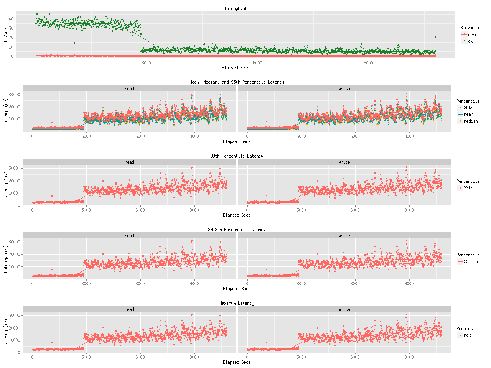

### Network Traffic
#### Chart of Each Nodes

* Gateway-1
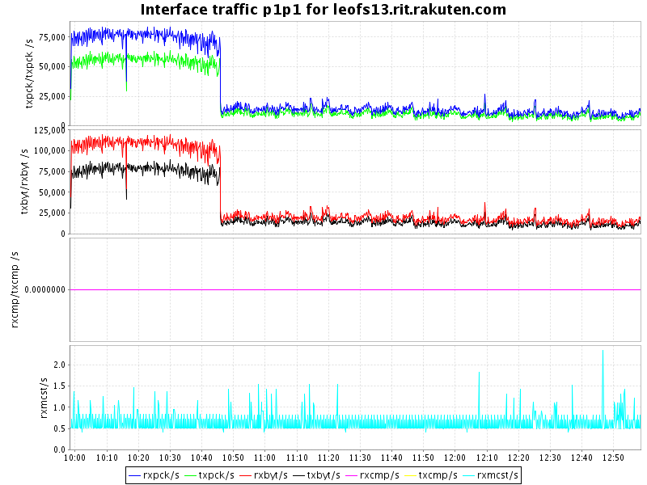

* Storage-1
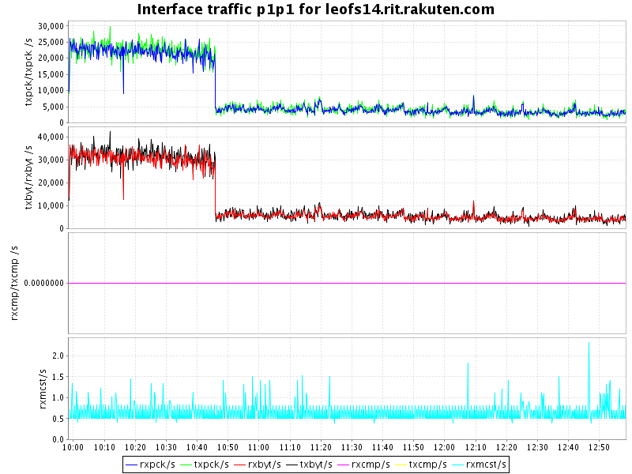

* Storage-2
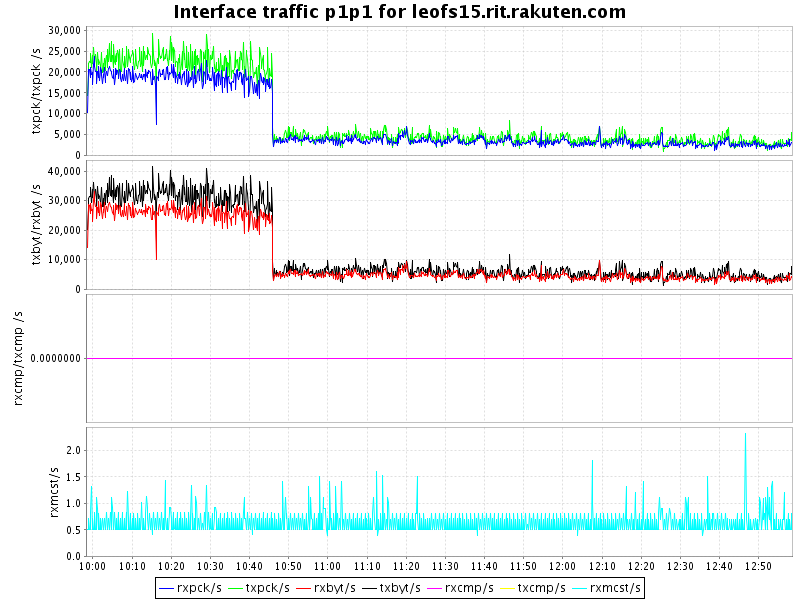

* Storage-3
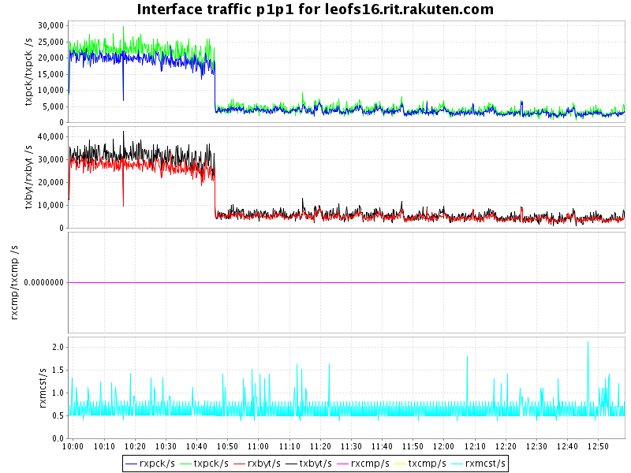

* Storage-4
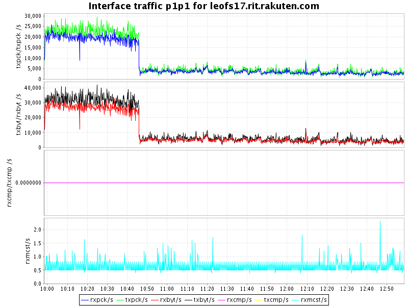

* Storage-5
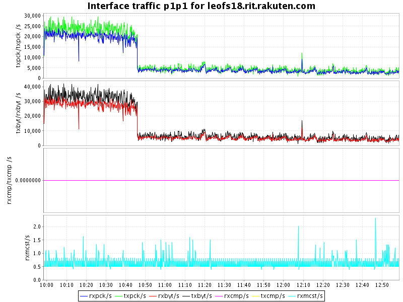


### Disk
#### Chart of Each Nodes (Storage)

* Storage-1
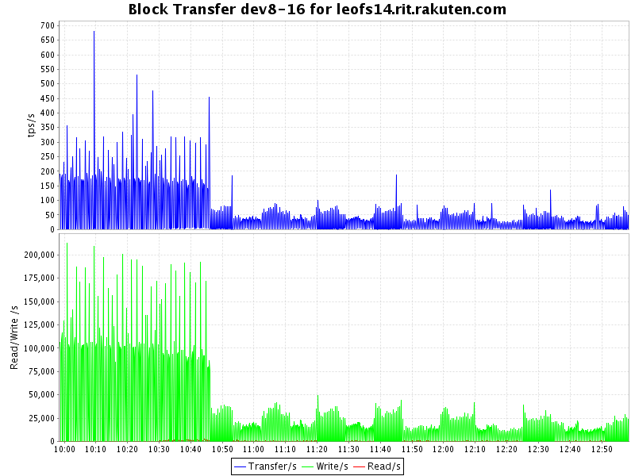
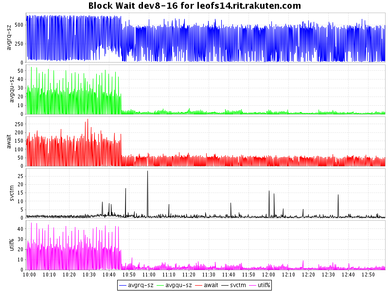

* Storage-2
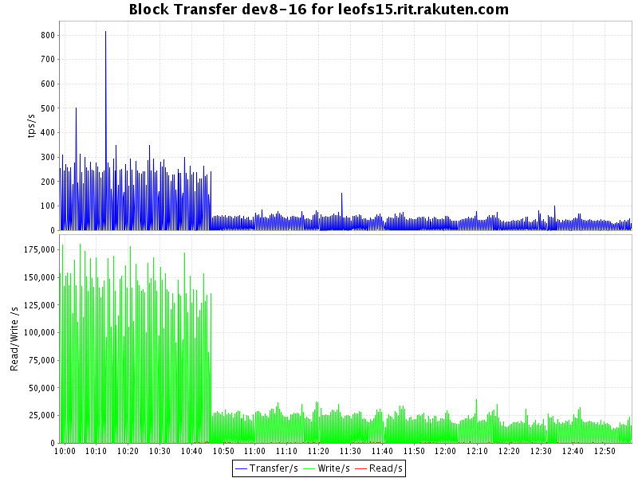
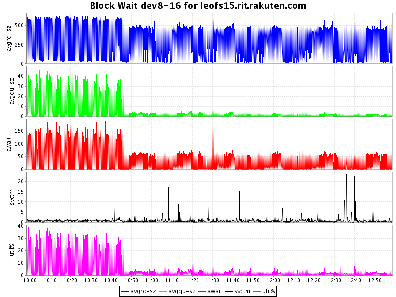

* Storage-3
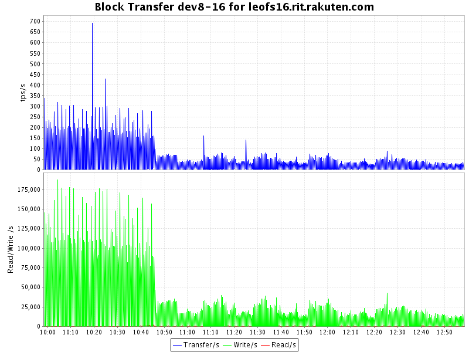
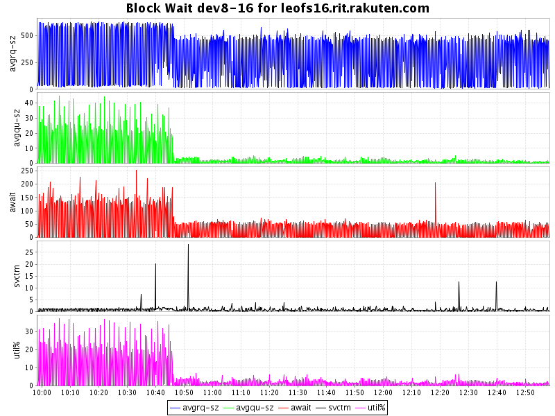

* Storage-4
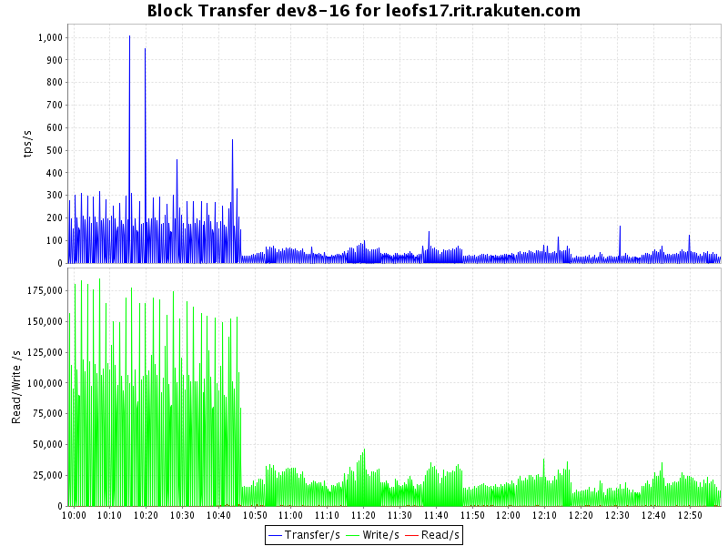
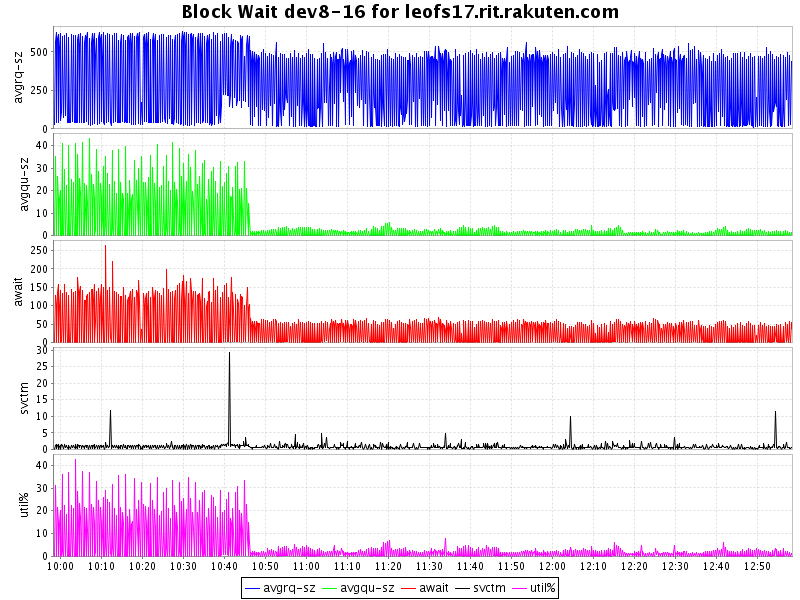

* Storage-5
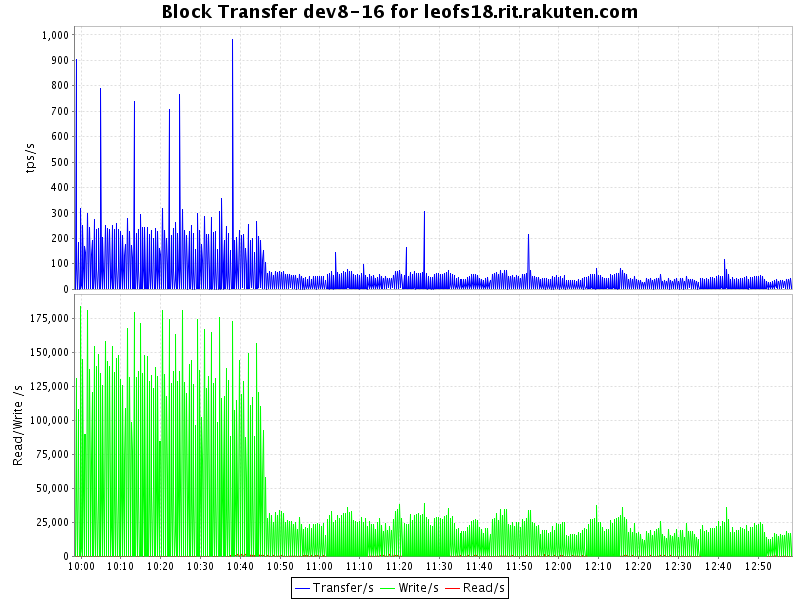
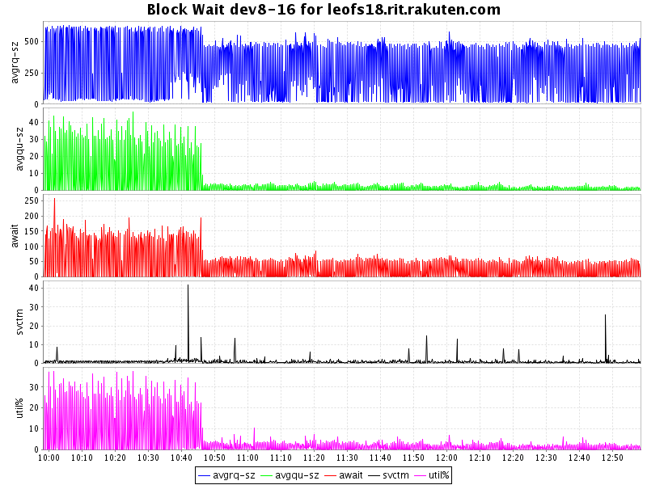


#### Summary

* Total of network traffic: 0.59 Gbps
* Itemized results:

   Node   |Read(MB/s)|Write(MB/s)|Total(MB/s)
----------|---------:|----------:|---------------:
storage_0 |      4.9 |       4.9 |       9.8
storage_1 |      4.7 |       4.9 |       9.6
storage_2 |      4.4 |       4.6 |       9.0
storage_3 |      4.5 |       4.7 |       9.2
storage_4 |      4.4 |       4.6 |       9.0
gateway_0 |     16.6 |      11.7 |      28.3
total     |     39.5 |      35.4 |      74.9

