## Benchmark LeoFS v1.2.2 Auto-Compaction Test

### Environment

* OS: CentOS release 6.5 (Final)
* Erlang/OTP: R16B03-1
* LeoFS: v1.2.2
* LeoFS cluster settings:

```
 [System Confiuration]
-------------------------------+----------
 Item                          | Value    
-------------------------------+----------
 Basic/Consistency level
-------------------------------+----------
                System version | 1.2.2
                    Cluster Id | leofs_1
                         DC Id | dc_1
                Total replicas | 3
           # of successes of R | 1
           # of successes of W | 2
           # of successes of D | 2
 # of DC-awareness replicas    | 0
                     ring size | 2^128
-------------------------------+----------
 Multi DC replication settings
-------------------------------+----------
         max # of joinable DCs | 2
            # of replicas a DC | 1
-------------------------------+----------
 Manager RING hash
-------------------------------+----------
             Current ring hash | a919e8cf
            Previous ring hash | a919e8cf
-------------------------------+----------

 [Node(s) state]
-------+-----------------------------+--------------+----------------+----------------+----------------------------
 type  |            node             |    state     |  current ring  |   prev ring    |          updated at         
-------+-----------------------------+--------------+----------------+----------------+----------------------------
  S    | leofs14@192.168.100.14      | running      | a919e8cf       | a919e8cf       | 2014-12-10 11:09:08 +0900
  S    | leofs15@192.168.100.15      | running      | a919e8cf       | a919e8cf       | 2014-12-10 11:09:08 +0900
  S    | leofs16@192.168.100.16      | running      | a919e8cf       | a919e8cf       | 2014-12-10 11:09:08 +0900
  S    | leofs17@192.168.100.17      | running      | a919e8cf       | a919e8cf       | 2014-12-10 11:09:08 +0900
  S    | leofs18@192.168.100.18      | running      | a919e8cf       | a919e8cf       | 2014-12-10 11:09:08 +0900
  G    | leofs13@192.168.100.13      | running      | a919e8cf       | a919e8cf       | 2014-12-10 11:09:15 +0900
-------+-----------------------------+--------------+----------------+----------------+----------------------------

```

* basho-bench Configuration:
    * Duration: 1612 minutes
    * # of concurrent processes: 64
    * # of keys: 100000
    * Value size groups(byte):
        *   1024..  10240: 24%
        *  10240.. 102400: 30%
        * 102400.. 819200: 30%
        * 819200..1572864: 16%
    * basho_bench driver: [basho_bench_driver_leofs.erl](https://github.com/leo-project/leofs/blob/develop/test/src/basho_bench_driver_leofs.erl)
    * Configuration file: [1m_r8w2_9999min.conf](20141210_110918/1m_r8w2_9999min.conf)

### OPS and Latency:

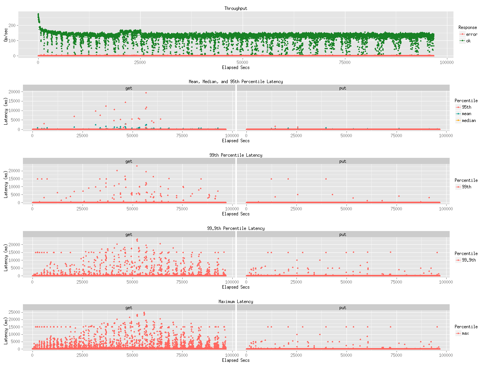

### Network Traffic
#### Chart of Each Nodes

* Gateway-1
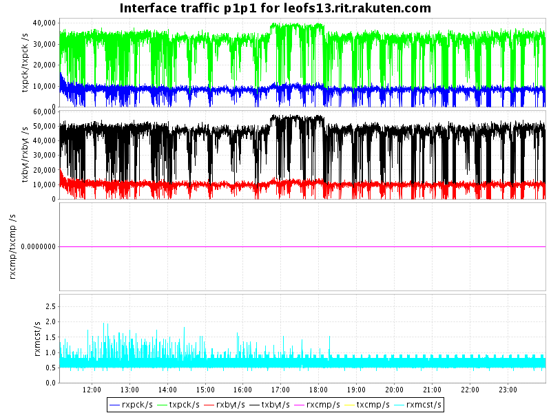

* Storage-1
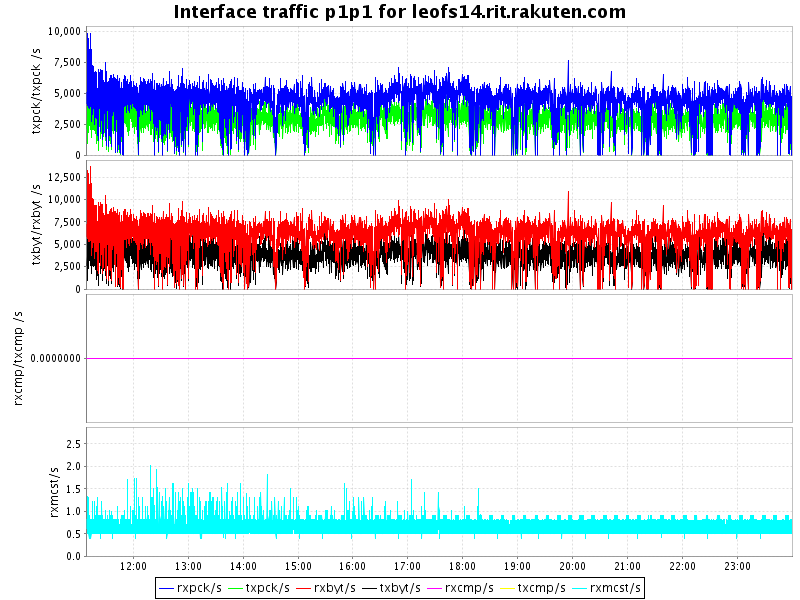

* Storage-2
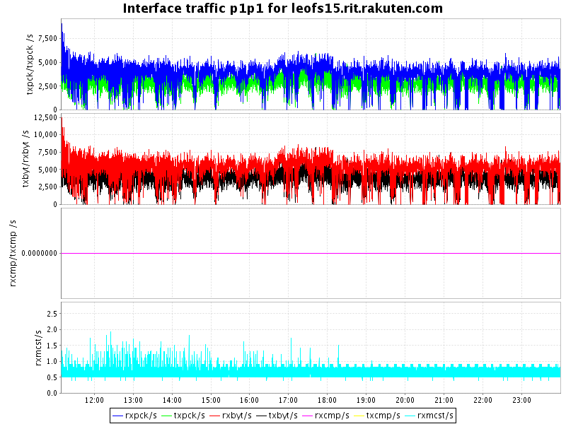

* Storage-3
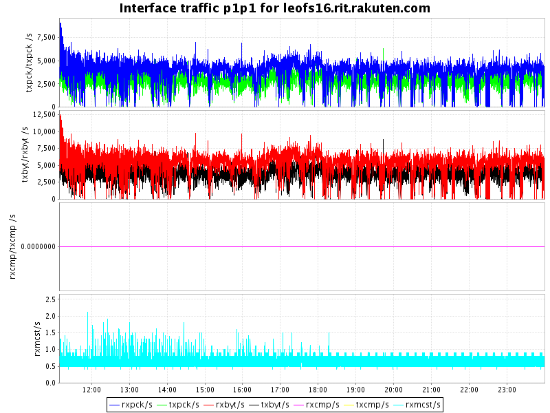

* Storage-4


* Storage-5
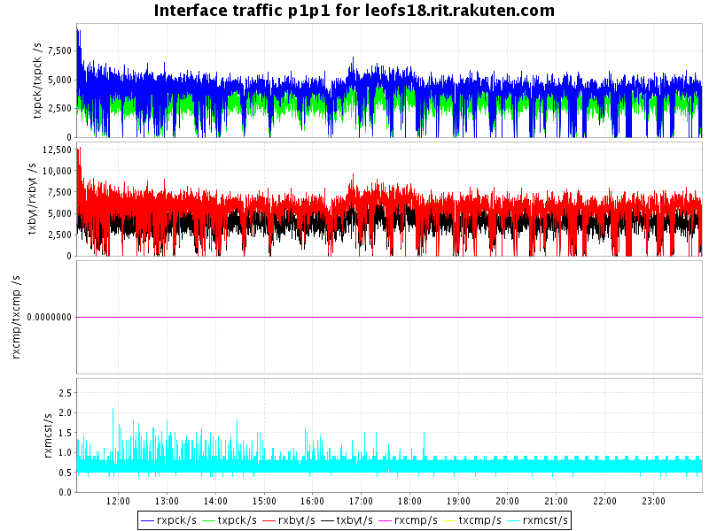


### Disk
#### Chart of Each Nodes (Storage)

* Storage-1
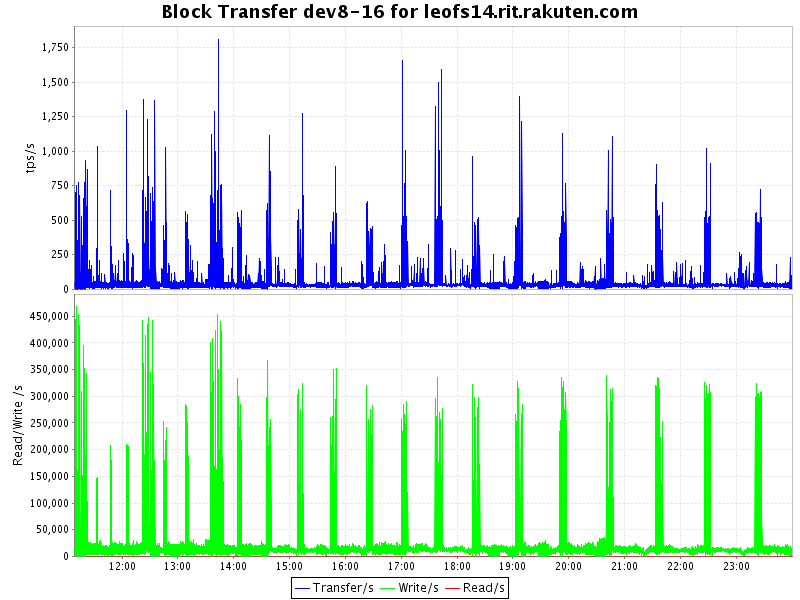
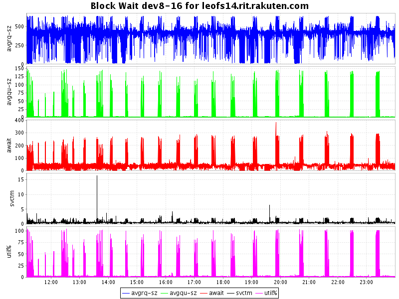

* Storage-2

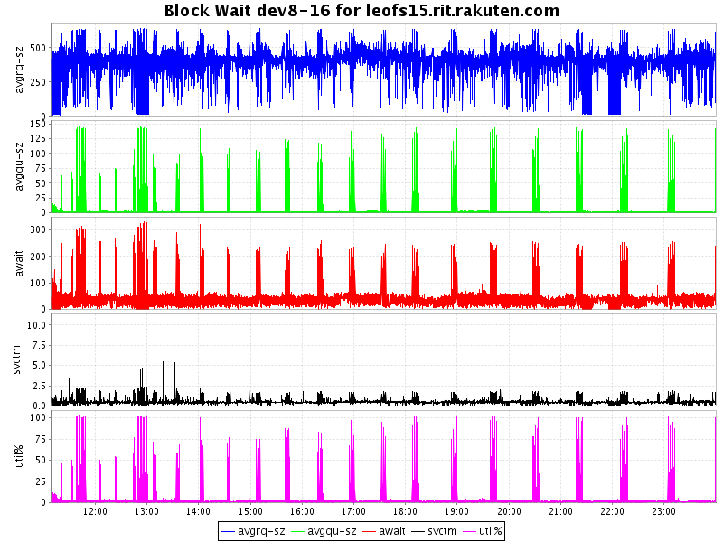

* Storage-3
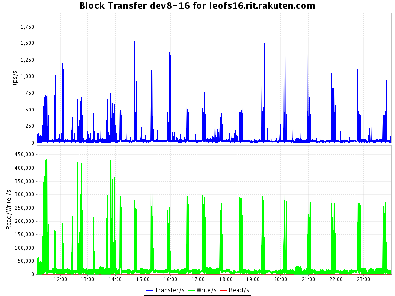
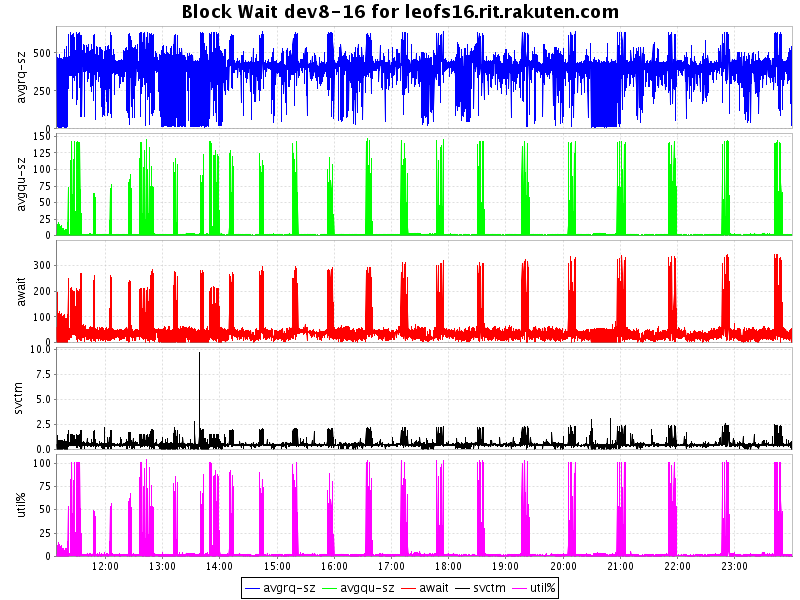

* Storage-4
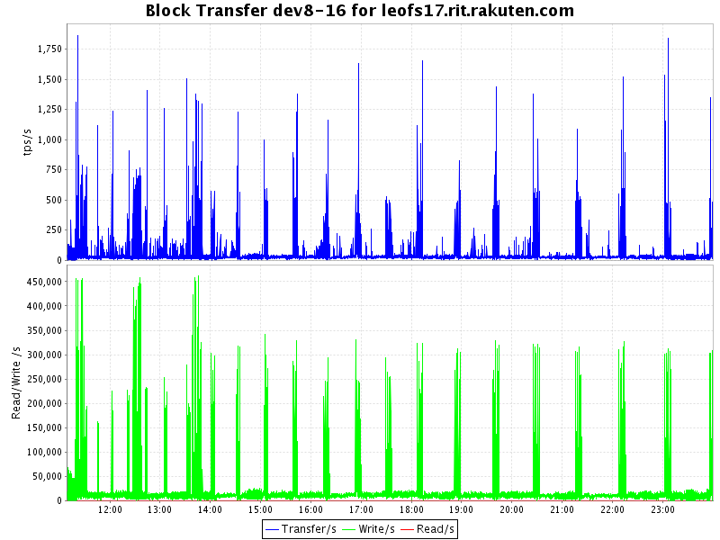
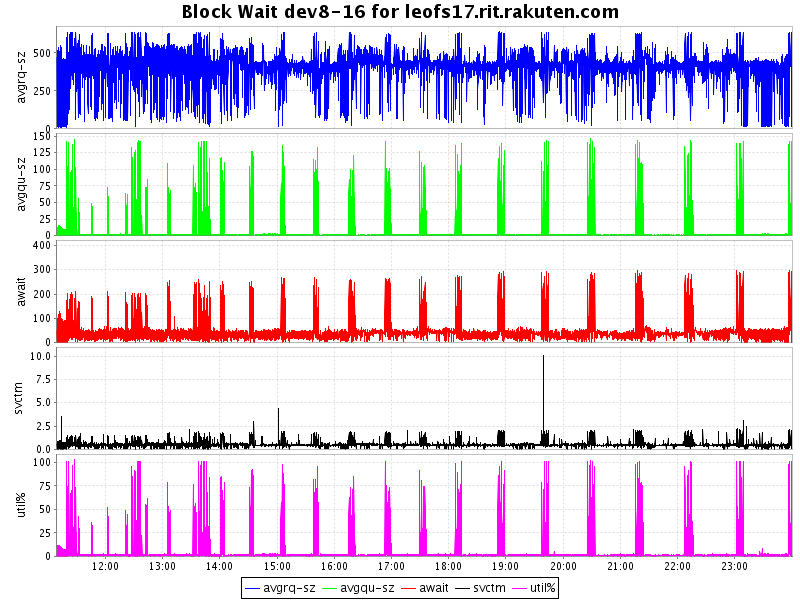

* Storage-5
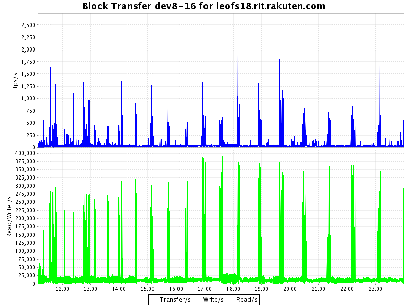
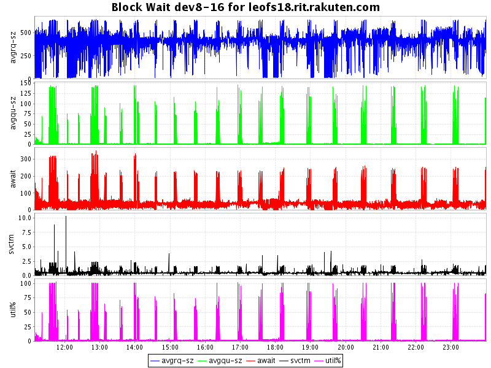

