## Benchmark LeoFS v1.2.11-dev3

### Purpose
We've checked LeoFS v1.2.11-dev3 w/watchdog + auto-compaction mechanism during 'recover-node command' to find issues.

### Environment

* OS: CentOS release 6.5 (Final)
* Erlang/OTP: 17.5
* LeoFS: v1.2.11-dev3
* LeoFS cluster settings:

```
 [System Confiuration]
-----------------------------------+----------
 Item                              | Value    
-----------------------------------+----------
 Basic/Consistency level
-----------------------------------+----------
                    system version | 1.2.10
                        cluster Id | leofs_1
                             DC Id | dc_1
                    Total replicas | 3
          number of successes of R | 1
          number of successes of W | 2
          number of successes of D | 2
 number of rack-awareness replicas | 0
                         ring size | 2^128
-----------------------------------+----------
 Multi DC replication settings
-----------------------------------+----------
        max number of joinable DCs | 2
           number of replicas a DC | 1
-----------------------------------+----------
 Manager RING hash
-----------------------------------+----------
                 current ring-hash | 2b468816
                previous ring-hash | 2b468816
-----------------------------------+----------

 [State of Node(s)]
-------+-----------------------------+--------------+----------------+----------------+----------------------------
 type  |            node             |    state     |  current ring  |   prev ring    |          updated at         
-------+-----------------------------+--------------+----------------+----------------+----------------------------
  S    | leofs14@192.168.100.14      | running      | 2b468816       | 2b468816       | 2015-06-18 15:51:53 +0900
  S    | leofs15@192.168.100.15      | running      | 2b468816       | 2b468816       | 2015-06-18 15:42:43 +0900
  S    | leofs16@192.168.100.16      | running      | 2b468816       | 2b468816       | 2015-06-18 15:42:43 +0900
  S    | leofs17@192.168.100.17      | running      | 2b468816       | 2b468816       | 2015-06-18 15:42:43 +0900
  S    | leofs18@192.168.100.18      | running      | 2b468816       | 2b468816       | 2015-06-18 15:42:43 +0900
  G    | leofs13@192.168.100.13      | running      | 2b468816       | 2b468816       | 2015-06-18 15:42:52 +0900
-------+-----------------------------+--------------+----------------+----------------+----------------------------

```

* basho-bench Configuration:
    * Duration: 60 minutes
    * Recover node time: 7.33 minutes
    * # of concurrent processes: 64
    * # of keys: 300000
    * Value size groups(byte):
        *   1024..  10240: 24%
        *  10241.. 102400: 30%
        * 102401.. 819200: 30%
        * 819201..1572864: 16%
    * basho_bench driver: [basho_bench_driver_leofs.erl](https://github.com/leo-project/leofs/blob/develop/test/src/basho_bench_driver_leofs.erl)
    * Configuration file: [1m_r29w1_60min.conf](20150618_155222/1m_r29w1_60min.conf)

* LeoFS Configuration:
    * Manager_0: [leo_manager_0.conf](conf/leo_manager_0.conf)
    * Manager_1: [leo_manager_1.conf](conf/leo_manager_1.conf)
    * Gateway  : [leo_gateway.conf](conf/leo_gateway.conf)
    * Storage  : [leo_storage.conf](conf/leo_storage.conf)

* 'du' status file: [du.log](du.log)

### OPS and Latency:

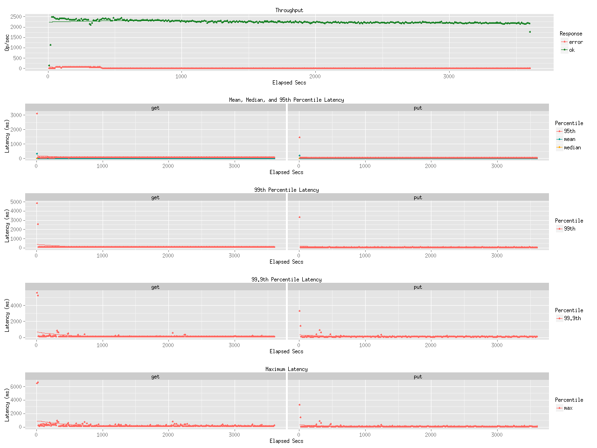

### Network Traffic
#### Chart of Every Nodes

* Gateway-1
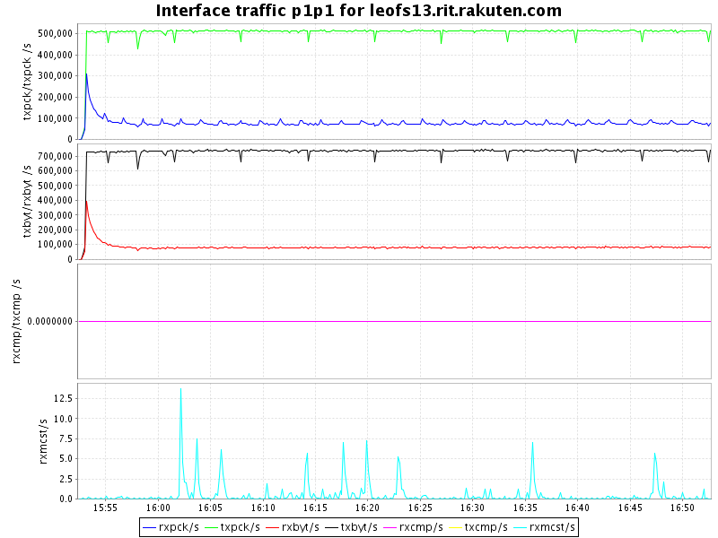

* Storage-1
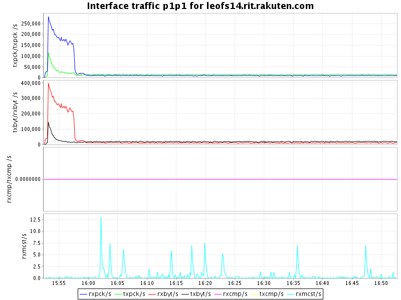

* Storage-2
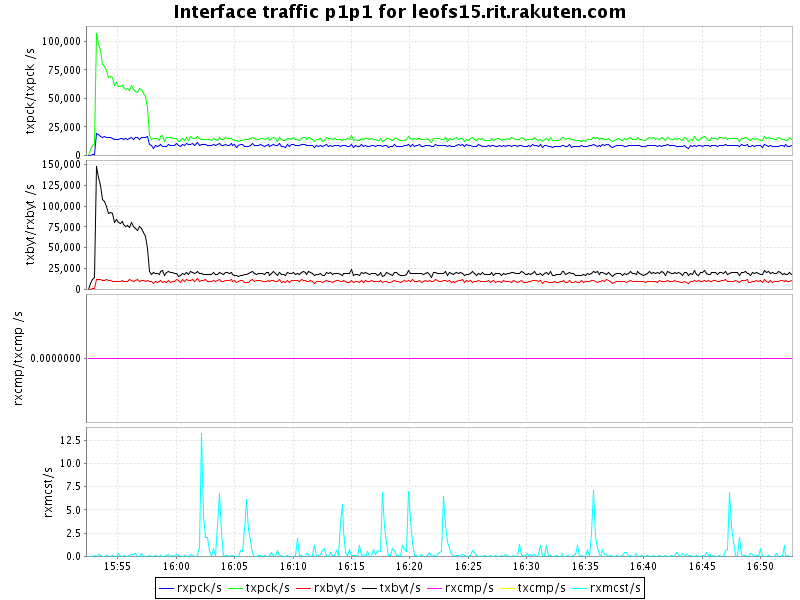

* Storage-3
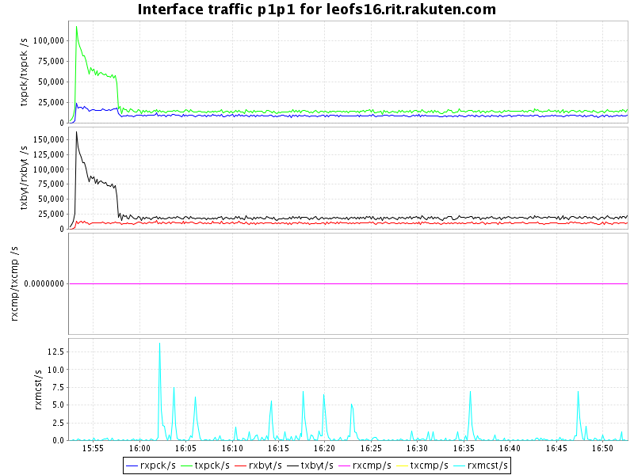

* Storage-4
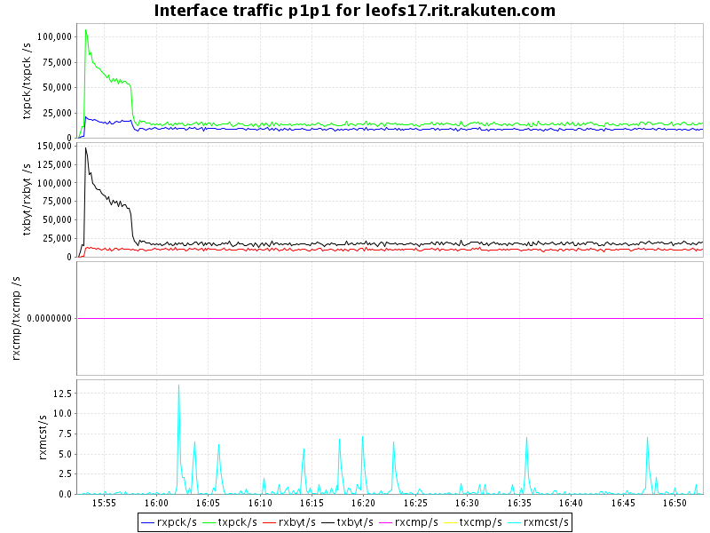

* Storage-5
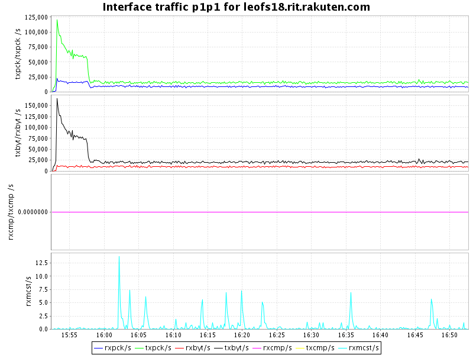


### Disk
#### Chart of Every Nodes (Storage)

* Storage-1
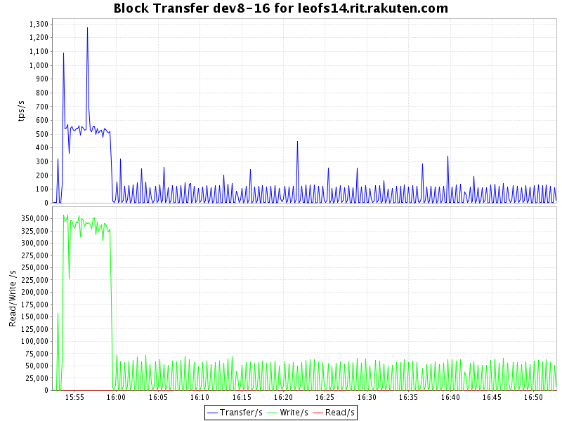
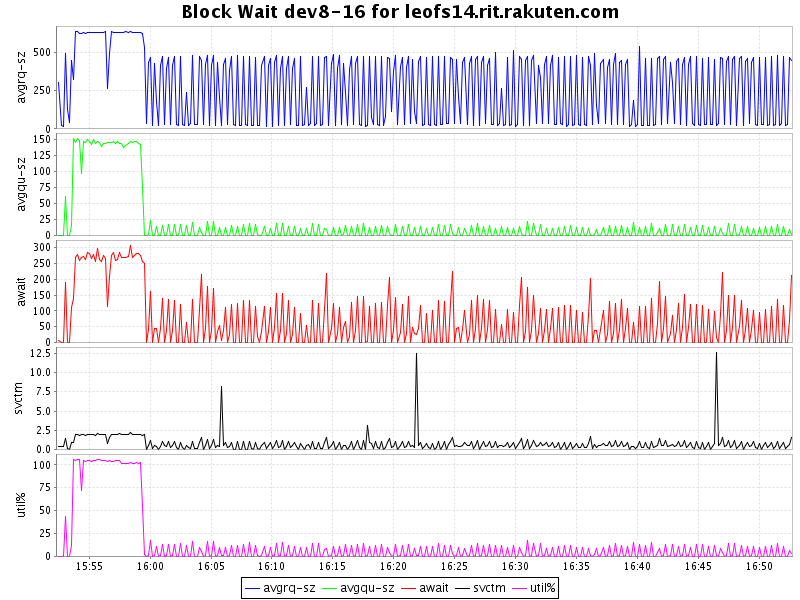

* Storage-2
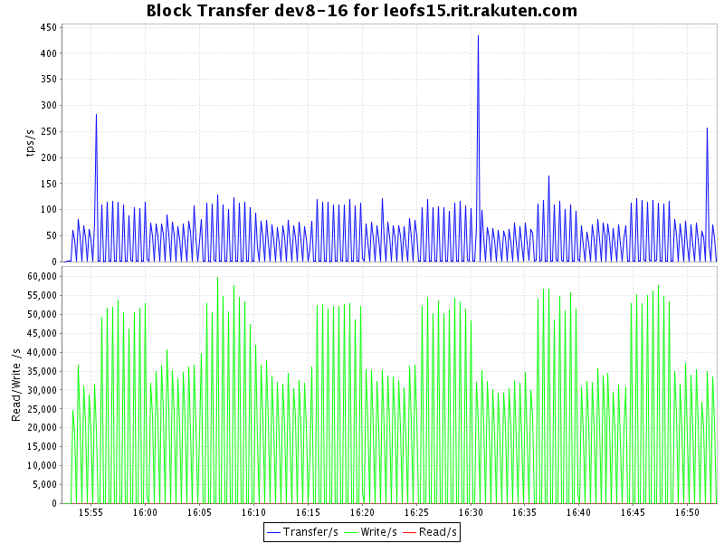
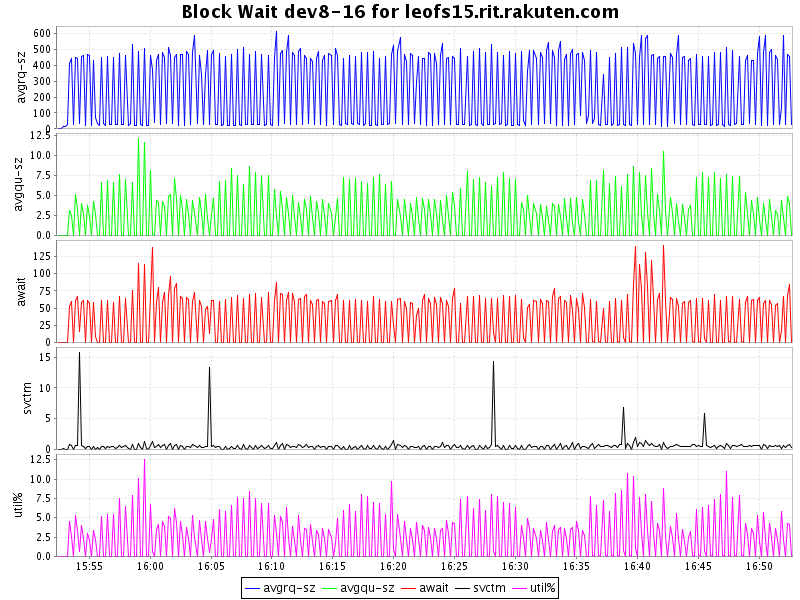

* Storage-3
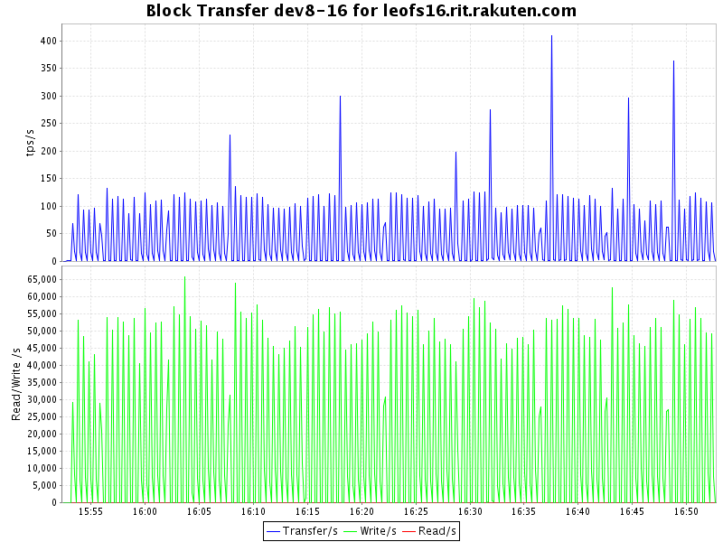
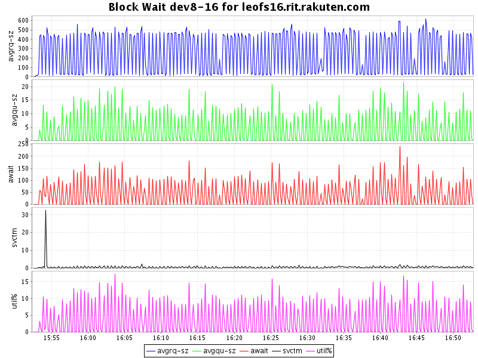

* Storage-4
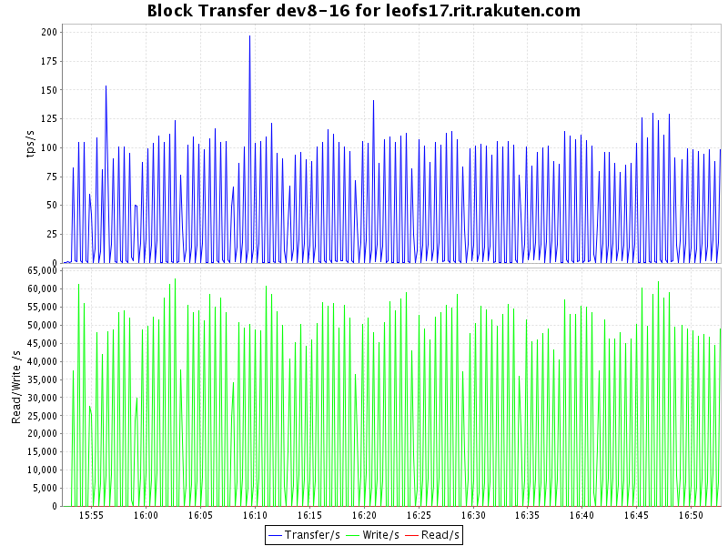
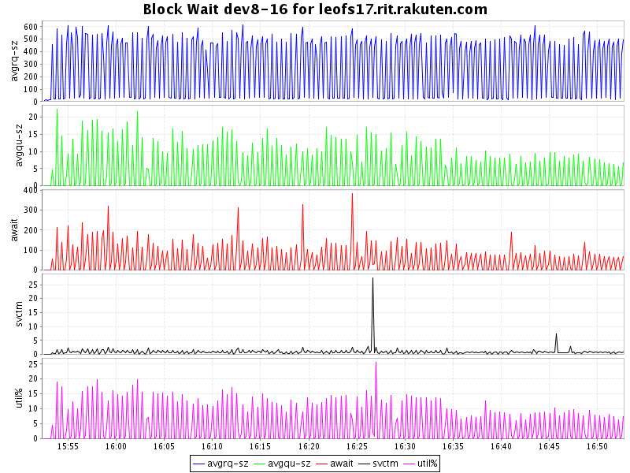

* Storage-5
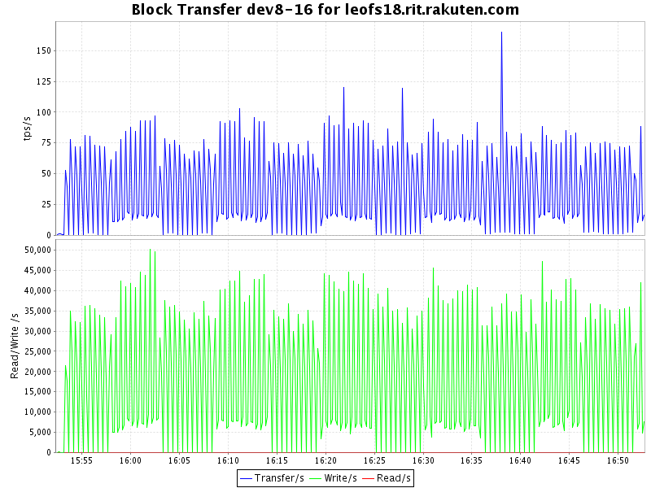
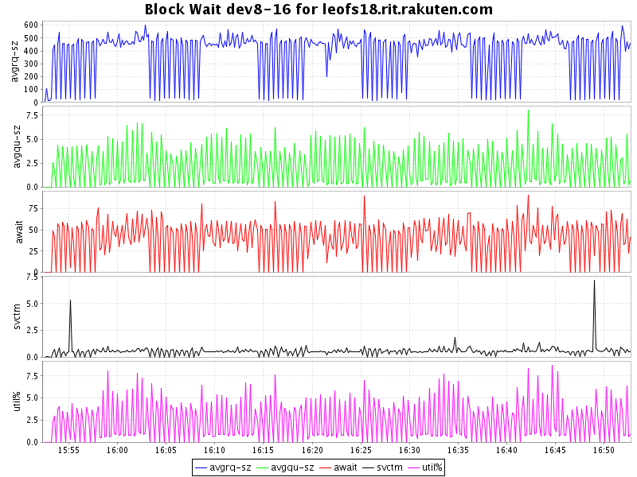

