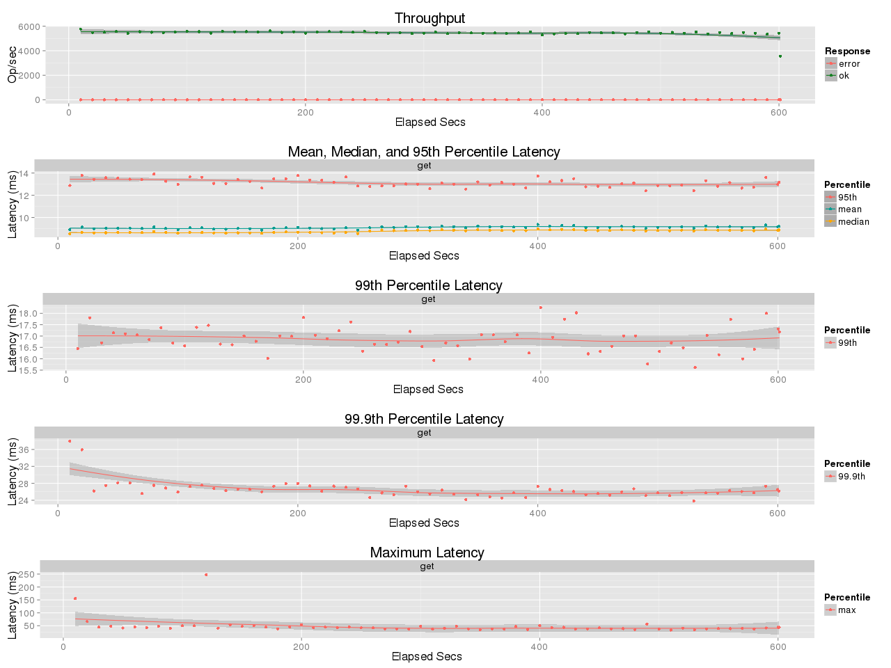
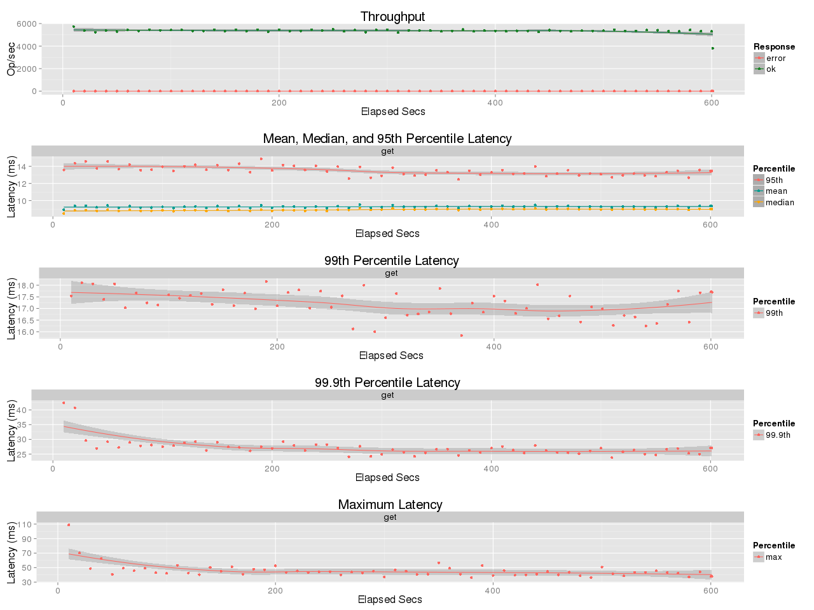
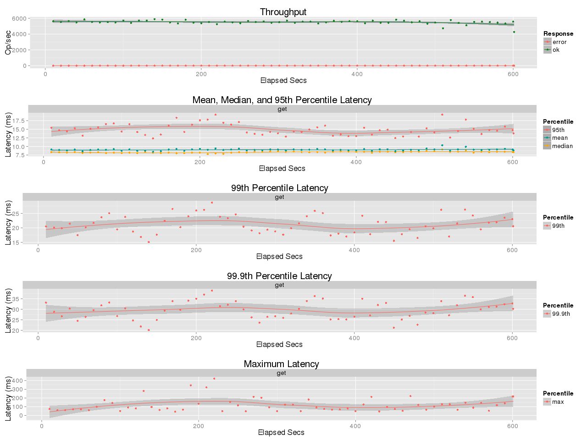
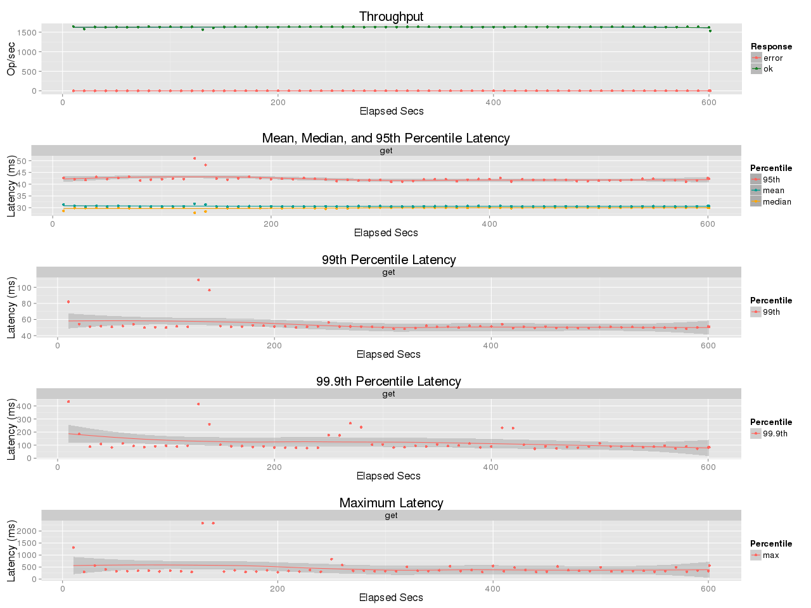
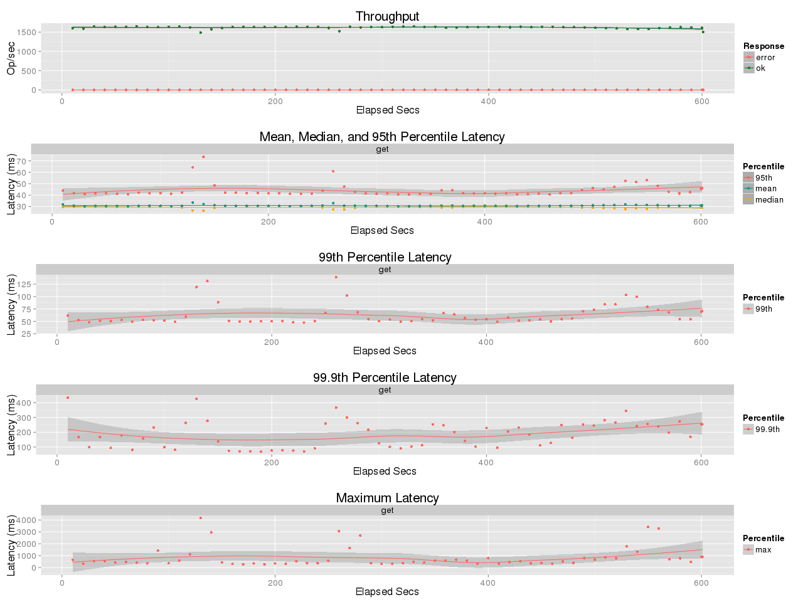
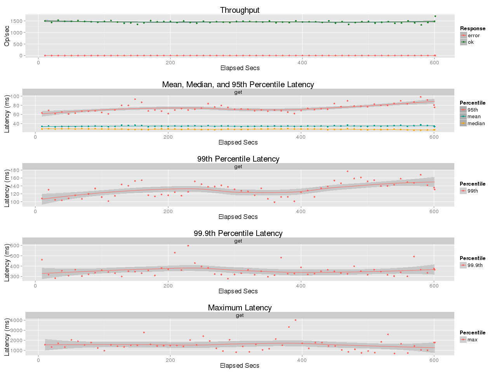
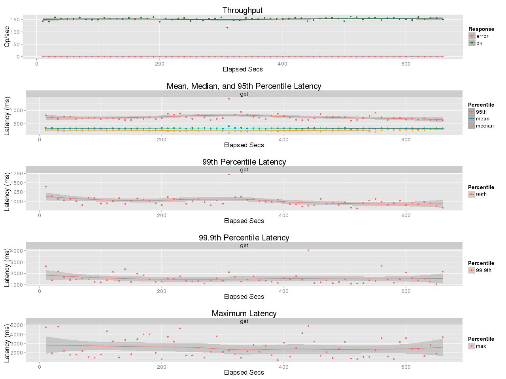
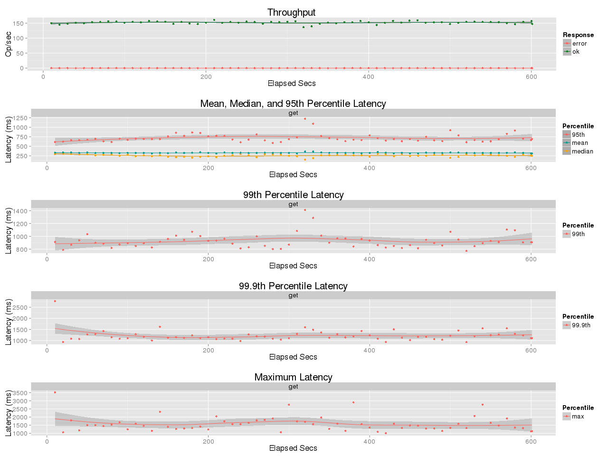
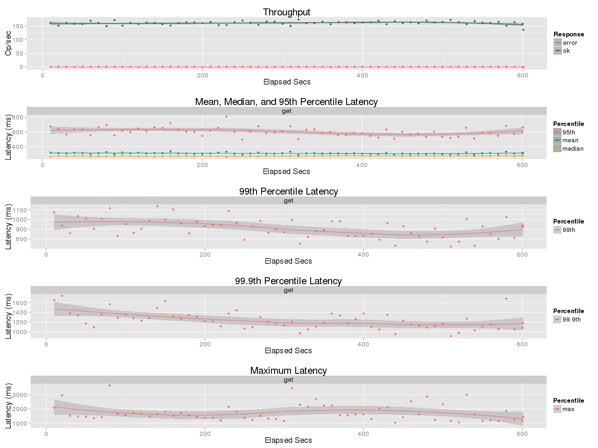

## Benchmark LeoFS 1.2.16-dev

### Purpose
Check if there is performance degradation with chunked transfer

## Test Cases
* def (without chunked send)
* chunked128K (chunked send with 128KB chunks)
* chunked4K (chunked send with 4KB chunks)

### Enviroment
* OS: CentOS release 6.5 (Final)
* Erlang/OTP: 17.5
* LeoFS: v1.2.16
* LeoFS cluster settings:
```
 [System Confiuration]
-----------------------------------+----------
 Item                              | Value    
-----------------------------------+----------
 Basic/Consistency level
-----------------------------------+----------
                    system version | 1.2.16
                        cluster Id | leofs_1
                             DC Id | dc_1
                    Total replicas | 2
          number of successes of R | 1
          number of successes of W | 1
          number of successes of D | 1
 number of rack-awareness replicas | 0
                         ring size | 2^128
-----------------------------------+----------
 Multi DC replication settings
-----------------------------------+----------
        max number of joinable DCs | 2
           number of replicas a DC | 1
-----------------------------------+----------
 Manager RING hash
-----------------------------------+----------
                 current ring-hash | 3d0294e7
                previous ring-hash | 3d0294e7
-----------------------------------+----------

 [State of Node(s)]
-------+---------------------------------+--------------+----------------+----------------+----------------------------
 type  |              node               |    state     |  current ring  |   prev ring    |          updated at         
-------+---------------------------------+--------------+----------------+----------------+----------------------------
  S    | storage_w_0@192.168.100.14      | running      | 3d0294e7       | 3d0294e7       | 2015-10-29 19:46:36 +0900
  S    | storage_w_1@192.168.100.15      | running      | 3d0294e7       | 3d0294e7       | 2015-10-29 19:46:36 +0900
  S    | storage_w_2@192.168.100.16      | running      | 3d0294e7       | 3d0294e7       | 2015-10-29 19:46:36 +0900
  S    | storage_w_3@192.168.100.17      | running      | 3d0294e7       | 3d0294e7       | 2015-10-29 19:46:36 +0900
  G    | gateway_w_0@192.168.100.13      | running      | 3d0294e7       | 3d0294e7       | 2015-10-29 19:46:42 +0900
-------+---------------------------------+--------------+----------------+----------------+----------------------------
```

* preparation
    * 10GB Data in total
    * fixed object size
        * 128KB / 512KB / 5MB
* basho-bench Configuration:
    * # of concurrent processes: 50
    * Duration: 10 mins
    * basho_bench driver: [basho_bench_driver_leofs.erl](https://github.com/leo-project/leofs/blob/master/test/src/basho_bench_driver_leofs.erl)

### OPS and Latency:
| def | chunked128K | chunked4K |
| --- | --- | --- |
|  |  |  |
|  |  |  |
|  |  |  |
