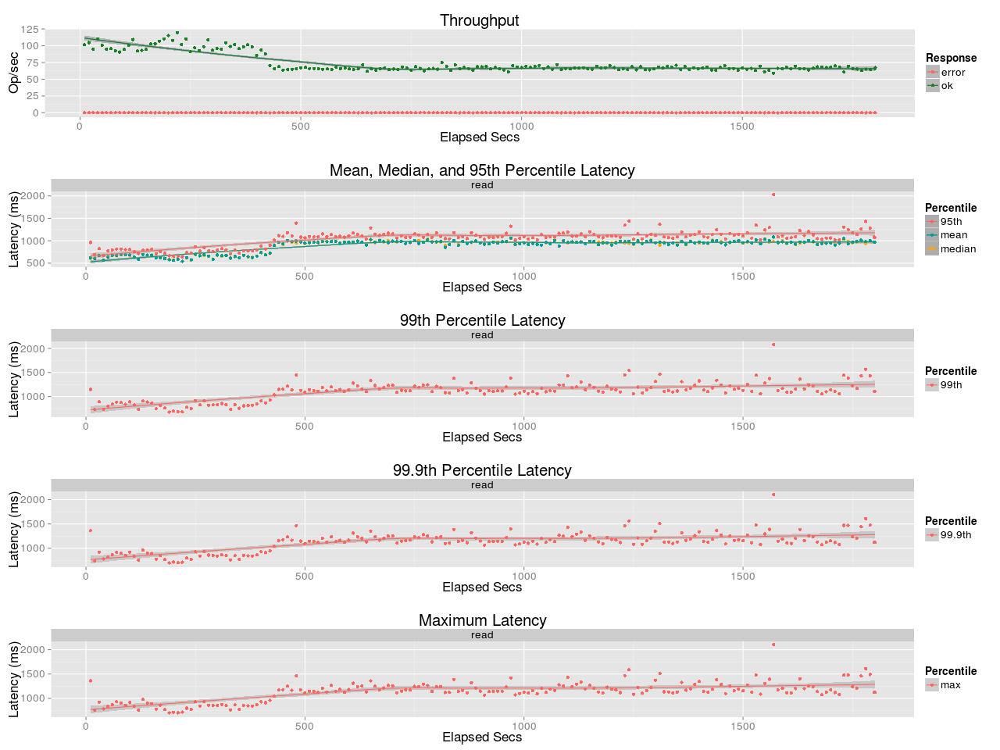
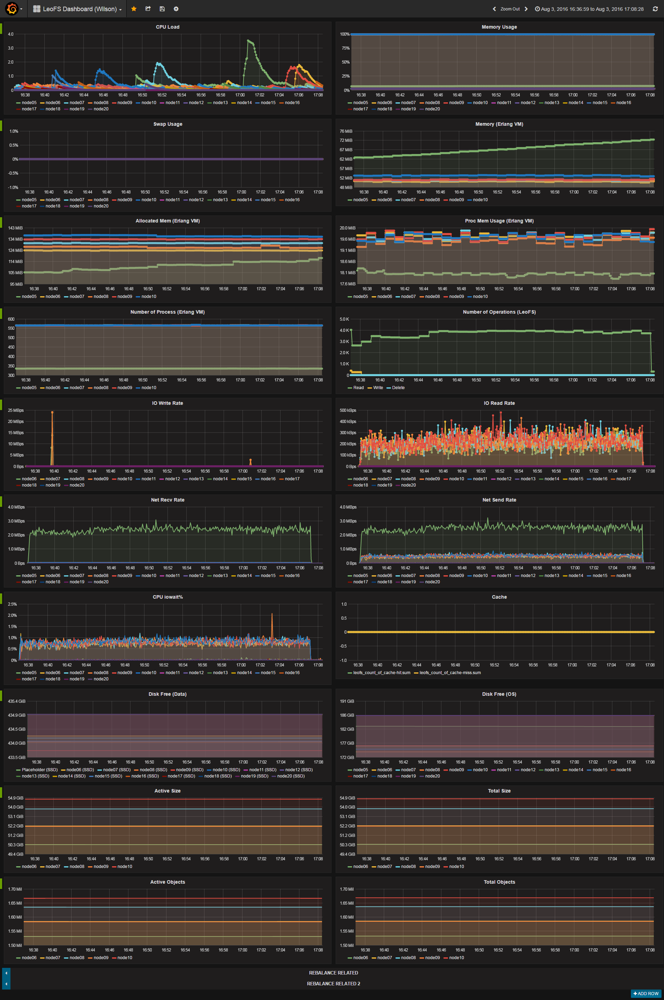

## Benchmark LeoFS 1.3.0 

### Purpose
We've checked NFS Performance of LeoFS 1.3.0

### Environment
* OS: Ubuntu Server 14.04.3
* Erlang/OTP: 17.5
* LeoFS: Master Branch (1.2.22-dev)
* CPU: Intel Xeon E5-2630 v3 @ 2.40GHz
* HDD (node[36~50]) : 4x ST2000LM003 (2TB 5400rpm 32MB) RAID-0 are mounted at `/data/`, Ext4
* SSD (node[36~50]) : 1x Crucial CT500BX100SSD1

```
 [System Confiuration]
-----------------------------------+----------
 Item                              | Value
-----------------------------------+----------
 Basic/Consistency level
-----------------------------------+----------
                    system version | 1.4.0-pre.3
                        cluster Id | leofs_1
                             DC Id | dc_1
                    Total replicas | 2
          number of successes of R | 1
          number of successes of W | 1
          number of successes of D | 1
 number of rack-awareness replicas | 0
                         ring size | 2^128
-----------------------------------+----------
 Multi DC replication settings
-----------------------------------+----------
        max number of joinable DCs | 2
           number of replicas a DC | 1
-----------------------------------+----------
 Manager RING hash
-----------------------------------+----------
                 current ring-hash | 59aa8ae7
                previous ring-hash | 59aa8ae7
-----------------------------------+----------

 [State of Node(s)]
-------+------------------------+--------------+----------------+----------------+----------------------------
 type  |          node          |    state     |  current ring  |   prev ring    |          updated at
-------+------------------------+--------------+----------------+----------------+----------------------------
  S    | S0@192.168.100.36      | running      | 59aa8ae7       | 59aa8ae7       | 2016-08-03 16:14:16 +0900
  S    | S1@192.168.100.37      | running      | 59aa8ae7       | 59aa8ae7       | 2016-08-03 16:14:16 +0900
  S    | S2@192.168.100.38      | running      | 59aa8ae7       | 59aa8ae7       | 2016-08-03 16:14:16 +0900
  S    | S3@192.168.100.39      | running      | 59aa8ae7       | 59aa8ae7       | 2016-08-03 16:14:16 +0900
  S    | S4@192.168.100.40      | running      | 59aa8ae7       | 59aa8ae7       | 2016-08-03 16:14:16 +0900
  G    | G0@192.168.100.35      | running      | 59aa8ae7       | 59aa8ae7       | 2016-08-03 16:23:05 +0900
-------+------------------------+--------------+----------------+----------------+----------------------------

```

* basho-bench Configuration:
    * Duration: 30 minutes
    * Total number of concurrent processes: 64
    * Total number of keys: 4000000
    * Value size groups(byte):
        *    4096..   8192: 15%
        *    8192..  16384: 25%
        *   16384..  32768: 23%
        *   32768..  65536: 22%
        *   65536.. 131072: 15%
    * basho_bench driver: [basho_bench_driver_file.erl](https://github.com/leo-project/basho_bench/blob/master/src/basho_bench_driver_file.erl)
    * Configuration file: [lfile_image_f4m_r100.conf](lfile_image_f4m_r100.conf)

### OPS and Latency


### Monitoring Results

