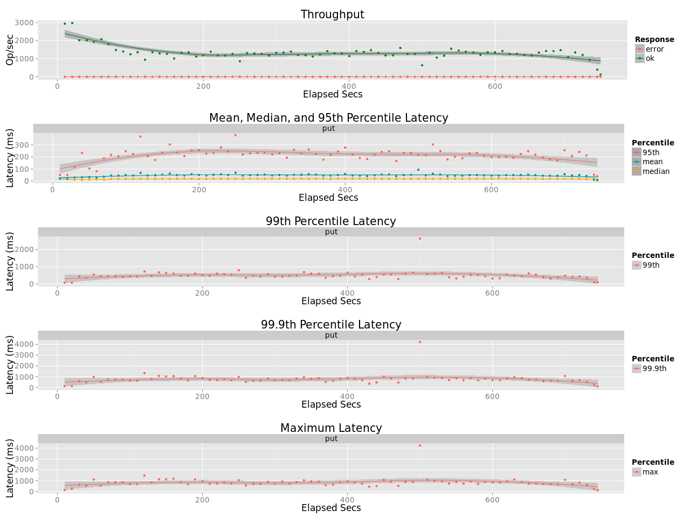
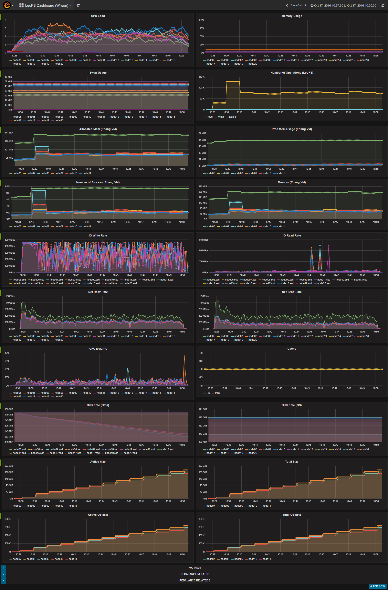
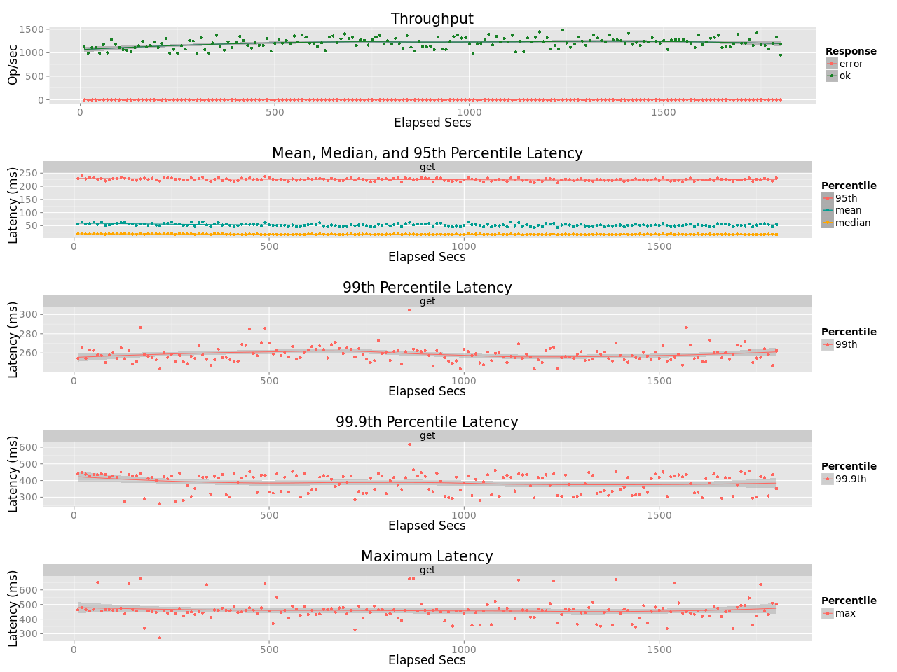
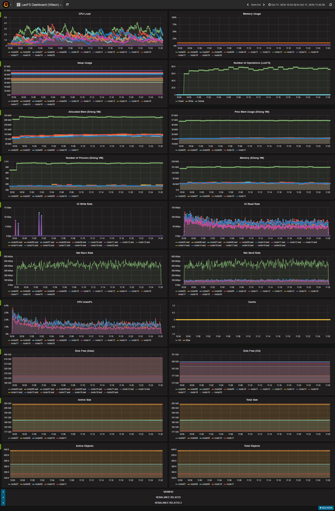

## Benchmark LeoFS v1.3.1-dev

### Purpose
We check the performance of LeoFS with OTP 17.5

### Environment

* OS: Ubuntu Server 14.04.3
* Erlang/OTP: 17.5
* LeoFS: 1.3.1-dev
* CPU: Intel Xeon E5-2630 v3 @ 2.40GHz
* HDD (node[36~50]) : 4x ST2000LM003 (2TB 5400rpm 32MB) RAID-0 are mounted at `/data/`, Ext4
* SSD (node[36~50]) : 1x Crucial CT500BX100SSD1 mounted at `/ssd/`, Ext4

```
 [System Confiuration]
-----------------------------------+----------
 Item                              | Value
-----------------------------------+----------
 Basic/Consistency level
-----------------------------------+----------
                    system version | 1.3.0
                        cluster Id | leofs_1
                             DC Id | dc_1
                    Total replicas | 3
          number of successes of R | 1
          number of successes of W | 2
          number of successes of D | 2
 number of rack-awareness replicas | 0
                         ring size | 2^128
-----------------------------------+----------
 Multi DC replication settings
-----------------------------------+----------
        max number of joinable DCs | 2
           number of replicas a DC | 1
-----------------------------------+----------
 Manager RING hash
-----------------------------------+----------
                 current ring-hash | 4adb34e4
                previous ring-hash | 4adb34e4
-----------------------------------+----------

 [State of Node(s)]
-------+------------------------+--------------+----------------+----------------+----------------------------
 type  |          node          |    state     |  current ring  |   prev ring    |          updated at
-------+------------------------+--------------+----------------+----------------+----------------------------
  S    | S1@192.168.100.37      | running      | 4adb34e4       | 4adb34e4       | 2016-10-17 10:36:25 +0900
  S    | S2@192.168.100.38      | running      | 4adb34e4       | 4adb34e4       | 2016-10-17 10:36:25 +0900
  S    | S3@192.168.100.39      | running      | 4adb34e4       | 4adb34e4       | 2016-10-17 10:36:25 +0900
  S    | S4@192.168.100.40      | running      | 4adb34e4       | 4adb34e4       | 2016-10-17 10:36:24 +0900
  S    | S5@192.168.100.41      | running      | 4adb34e4       | 4adb34e4       | 2016-10-17 10:36:25 +0900
  G    | G0@192.168.100.35      | running      | 4adb34e4       | 4adb34e4       | 2016-10-17 10:36:26 +0900
-------+------------------------+--------------+----------------+----------------+----------------------------

```

* basho-bench Configuration:
    * Duration: 30 minutes
    * # of concurrent processes: 64
    * # of keys: 1000000
    * Value size groups(byte):
        *     1024.. 10240: 24%
        *   10241.. 102400: 30%
        *  102401.. 819200: 30%
        *  819201..1572864: 16%
    * basho_bench driver: [basho_bench_driver_leofs.erl](https://github.com/leo-project/basho_bench/blob/master/src/basho_bench_driver_leofs.erl)
    * Configuration file: 
        * [leofs_1m_f1m_load.conf](load/leofs_1m_f1m_load.conf)
        * [leofs_1m_f1m_r100_30min.conf](read/leofs_1m_f1m_r100_30min.conf)

* LeoFS Configuration:
    * Manager_0: [leo_manager_0.conf](conf/G0/leo_manager.conf)
    * Gateway  : [leo_gateway.conf](conf/G0/leo_gateway.conf)
        * Disk Cache: 0
        * Mem Cache:  0
    * Storage  : [leo_storage.conf](conf/S0/leo_storage.conf)
        * Container Path: /ssd/avs

### Results:
* Load
    
    

* Read
    
    
