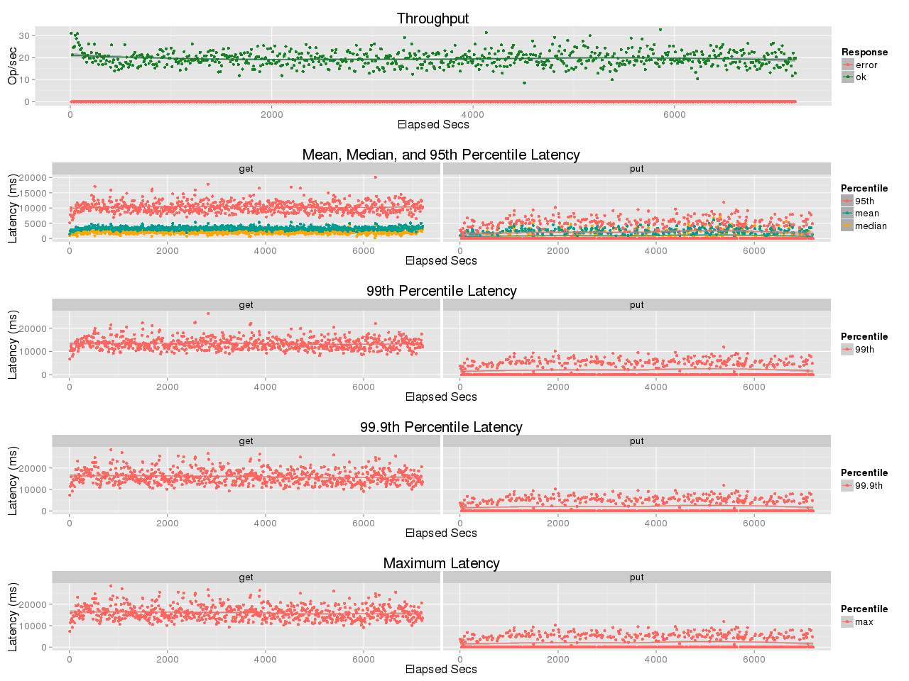

## Benchmark LeoFS v1.2.16

### Purpose
We've checked LeoFS v1.2.16 for performance

### Environment

* OS: CentOS release 6.5 (Final)
* Erlang/OTP: 17.5
* LeoFS: v1.2.16
* LeoFS cluster settings:


```
 [System Confiuration]
-----------------------------------+----------
 Item                              | Value    
-----------------------------------+----------
 Basic/Consistency level
-----------------------------------+----------
                    system version | 1.2.16
                        cluster Id | leofs_1
                             DC Id | dc_1
                    Total replicas | 3
          number of successes of R | 1
          number of successes of W | 2
          number of successes of D | 2
 number of rack-awareness replicas | 0
                         ring size | 2^128
-----------------------------------+----------
 Multi DC replication settings
-----------------------------------+----------
        max number of joinable DCs | 2
           number of replicas a DC | 1
-----------------------------------+----------
 Manager RING hash
-----------------------------------+----------
                 current ring-hash | e9dbf664
                previous ring-hash | e9dbf664
-----------------------------------+----------

 [State of Node(s)]
-------+---------------------------------+--------------+----------------+----------------+----------------------------
 type  |              node               |    state     |  current ring  |   prev ring    |          updated at         
-------+---------------------------------+--------------+----------------+----------------+----------------------------
  S    | storage_w_0@192.168.100.14      | running      | e9dbf664       | e9dbf664       | 2015-12-16 09:51:10 +0900
  S    | storage_w_1@192.168.100.15      | running      | e9dbf664       | e9dbf664       | 2015-12-16 09:51:10 +0900
  S    | storage_w_2@192.168.100.16      | running      | e9dbf664       | e9dbf664       | 2015-12-16 09:51:10 +0900
  S    | storage_w_3@192.168.100.17      | running      | e9dbf664       | e9dbf664       | 2015-12-16 09:51:10 +0900
  S    | storage_w_4@192.168.100.18      | running      | e9dbf664       | e9dbf664       | 2015-12-16 09:51:10 +0900
  G    | gateway_w_0@192.168.100.13      | running      | e9dbf664       | e9dbf664       | 2015-12-16 09:51:10 +0900
-------+---------------------------------+--------------+----------------+----------------+----------------------------
```

* basho-bench Configuration:
    * Duration: 120 minutes
    * # of concurrent processes: 64
    * # of keys: 100000
    * Value size groups(byte):
        *    16384..   65536: 50%
        * 10485760..15728640: 50%
    * basho_bench driver: [basho_bench_driver_leofs.erl](https://github.com/leo-project/basho_bench/blob/master/src/basho_bench_driver_leofs.erl)
    * Configuration file: [15m_r49w1_120min.conf](20151216_121025/15m_r49w1_120min.conf)

* LeoFS Configuration:
    * Manager_0: [leo_manager_0.conf](conf/leo_manager_0.conf)
    * Manager_1: [leo_manager_1.conf](conf/leo_manager_1.conf)
    * Gateway  : [leo_gateway.conf](conf/leo_gateway.conf)
    * Storage  : [leo_storage.conf](conf/leo_storage.conf)

### OPS and Latency:


