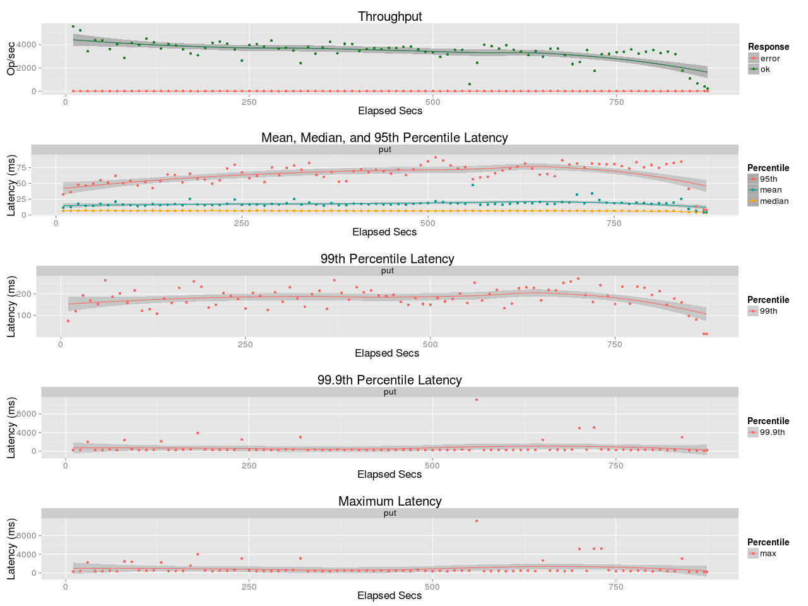
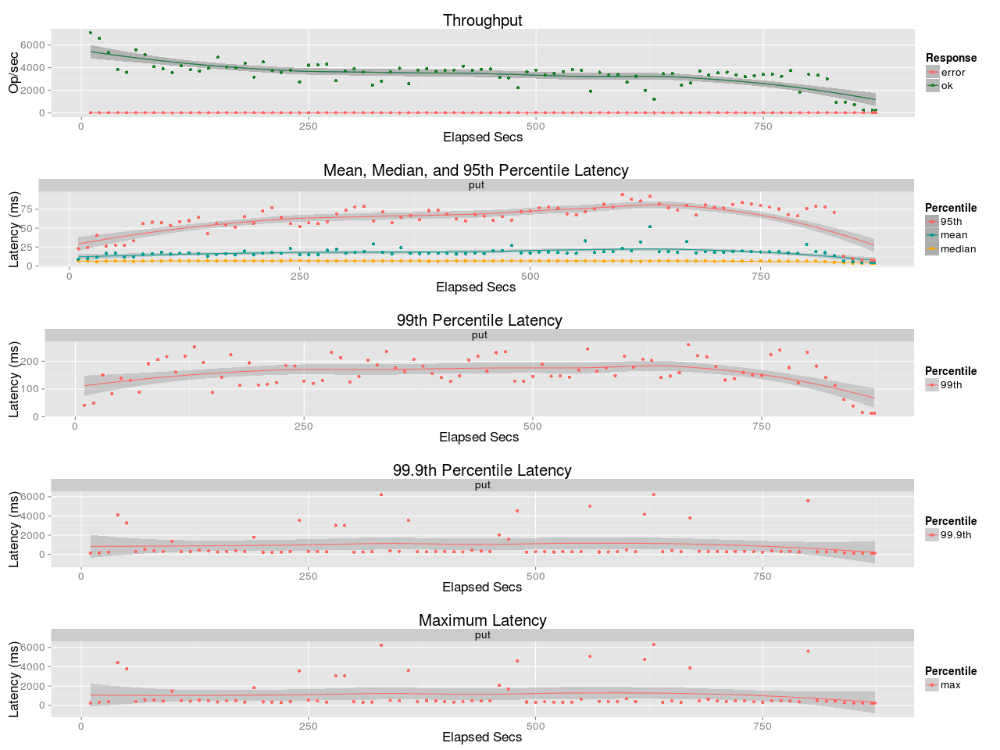
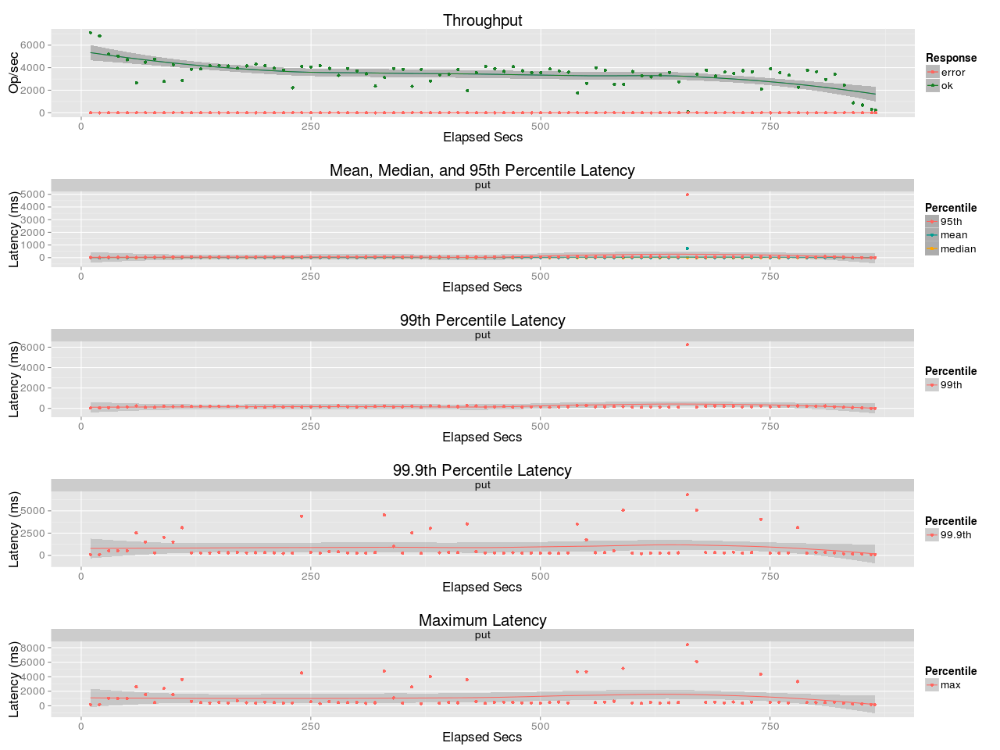
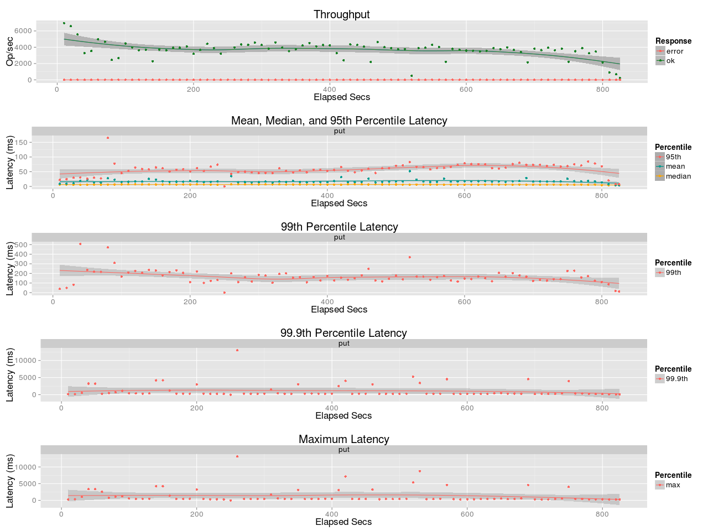
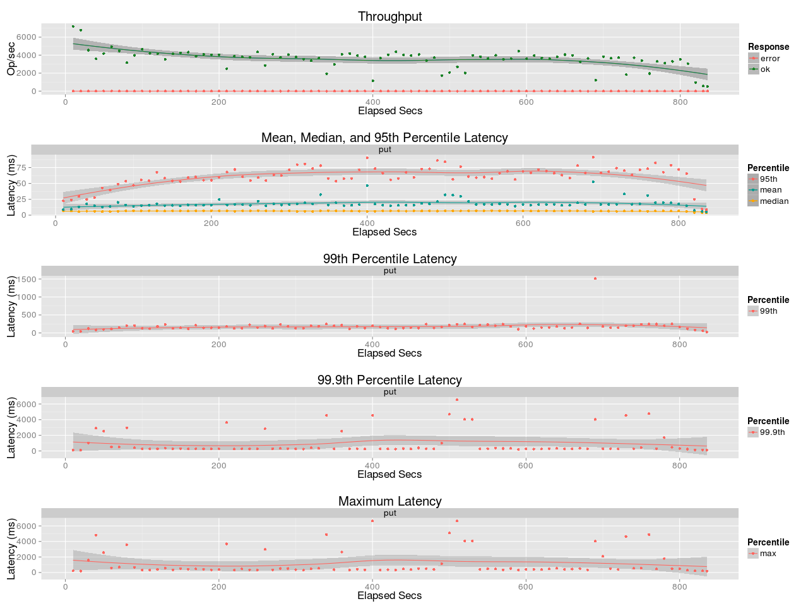

## Benchmark LeoFS v1.4.2-dev

### Purpose
We try to solve https://github.com/leo-project/leofs/issues/766.
In other words, we try to find out as smaller `large_object.reading_chunked_obj_len` default as possible to make timeout less likely to happen for narrow-bandwidth environment while keeping the performance (throughput/latency) as-is.

### Environment

* OS: Ubuntu Server 14.04.3
* Erlang/OTP: 20
* LeoFS: 1.4.2-dev
* CPU: Intel Xeon E5-2630 v3 @ 2.40GHz
* SSD (node[36~50]) : 1x Crucial CT500BX100SSD1 mounted at `/ssd/`, Ext4

```
 [System Confiuration]
-----------------------------------+----------
 Item                              | Value
-----------------------------------+----------
 Basic/Consistency level
-----------------------------------+----------
                    system version | 1.4.1
                        cluster Id | leofs_1
                             DC Id | dc_1
                    Total replicas | 3
          number of successes of R | 1
          number of successes of W | 2
          number of successes of D | 2
 number of rack-awareness replicas | 0
                         ring size | 2^128
-----------------------------------+----------
 Multi DC replication settings
-----------------------------------+----------
 [mdcr] max number of joinable DCs | 2
 [mdcr] total replicas per a DC    | 1
 [mdcr] number of successes of R   | 1
 [mdcr] number of successes of W   | 1
 [mdcr] number of successes of D   | 1
-----------------------------------+----------
 Manager RING hash
-----------------------------------+----------
                 current ring-hash | 4adb34e4
                previous ring-hash | 4adb34e4
-----------------------------------+----------

 [State of Node(s)]
-------+------------------------+--------------+----------------+----------------+----------------------------
 type  |          node          |    state     |  current ring  |   prev ring    |          updated at
-------+------------------------+--------------+----------------+----------------+----------------------------
  S    | S1@192.168.100.37      | running      | 4adb34e4       | 4adb34e4       | 2018-05-16 16:11:49 +0900
  S    | S2@192.168.100.38      | running      | 4adb34e4       | 4adb34e4       | 2018-05-16 16:11:49 +0900
  S    | S3@192.168.100.39      | running      | 4adb34e4       | 4adb34e4       | 2018-05-16 16:11:49 +0900
  S    | S4@192.168.100.40      | running      | 4adb34e4       | 4adb34e4       | 2018-05-16 16:11:49 +0900
  S    | S5@192.168.100.41      | running      | 4adb34e4       | 4adb34e4       | 2018-05-16 16:11:49 +0900
  G    | G0@192.168.100.35      | running      | 4adb34e4       | 4adb34e4       | 2018-05-16 16:11:50 +0900
-------+------------------------+--------------+----------------+----------------+----------------------------
```

* basho-bench Configuration:
    * no. of concurrent processes: 64
    * no. of keys: 3000000
    * Load
    * Value size groups(byte):
      ```
        *    4096..   32768: 69
        *   32768..   65536: 75
        *   65536..  131072: 95
        *  131072..  262144: 66
        *  262144..  524288: 26
        *  524288.. 1048576: 4
        * 1048576..10485760: 1
      ```
    * basho_bench driver: [basho_bench_driver_leofs.erl](https://github.com/leo-project/basho_bench/blob/master/src/basho_bench_driver_leofs.erl)
    * Configuration file: 
        * [reading_chunked_obj_len:5M](load/20180516_105046_5M/image2_f3m_load.conf)
        * [reading_chunked_obj_len:2M](load/20180516_122555_2M/image2_f3m_load.conf)
        * [reading_chunked_obj_len:1M](load/20180516_133720_1M/image2_f3m_load.conf)
        * [reading_chunked_obj_len:512K](load/20180516_144107_512K/image2_f3m_load.conf)
        * [reading_chunked_obj_len:256K](load/20180516_161324_256K/image2_f3m_load.conf)

### Loading
**OPS and Latency:5M**


**OPS and Latency:2M**


**OPS and Latency:1M**


**OPS and Latency:512K**


**OPS and Latency:256K**

