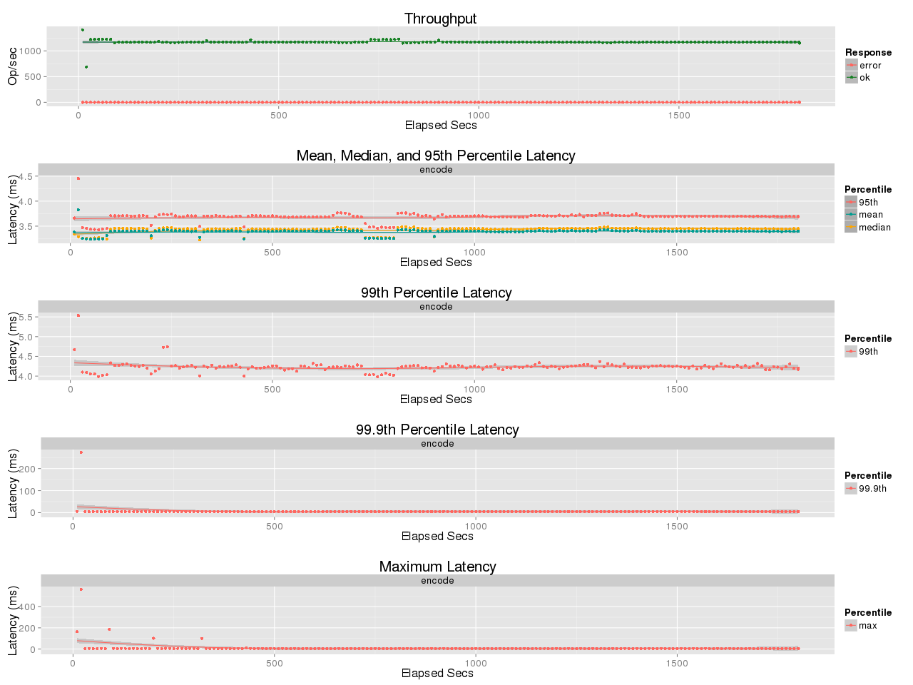

# Benchmark leo_erasure
## Purpose
Compare Encoding Throughput of RS (10,4,8) between ISA-L and JErasure

## Test Cases
* ISA-L (v2.14.0)
    * [https://01.org/intel®-storage-acceleration-library-open-source-version]()
* JErasure (2.0)
    * [https://github.com/leo-project/jerasure.git]()
* Encoding
    * Object size: 5MB
    * Coding: Reed-Solomon Code [K:10, M:4, W:8]
    * Concurrency: 4

## Environment
* Setup 1 Server (`ser`)
    * CPU: 2x Intel Xeon X5650
* Setip 2 Macbook Pro (`mbp`)
    * CPU: 1x i7-4870HQ
* Erlang: Erlang/OTP 17.5

## Benchmark results
### Macbook Pro
#### ISA-L

#### JErasure

### Server
#### ISA-L

#### JErasure

