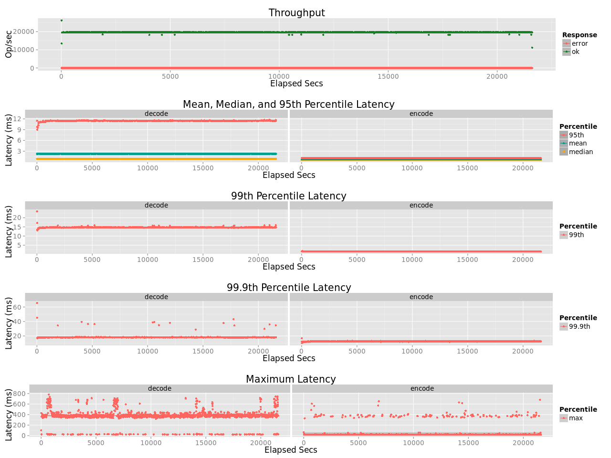
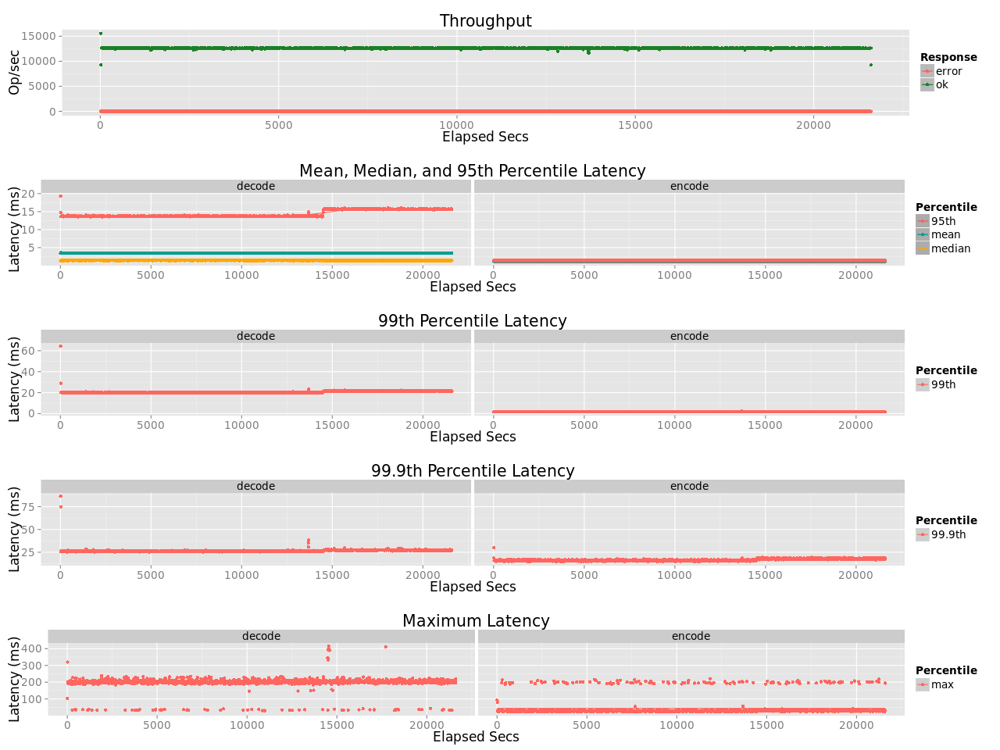
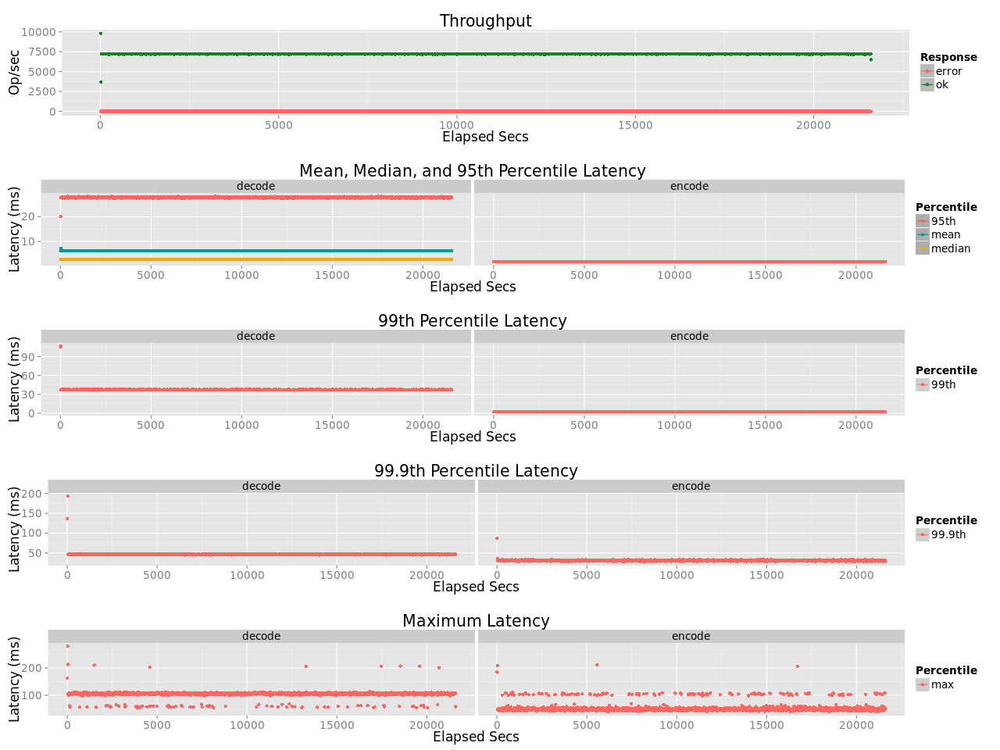
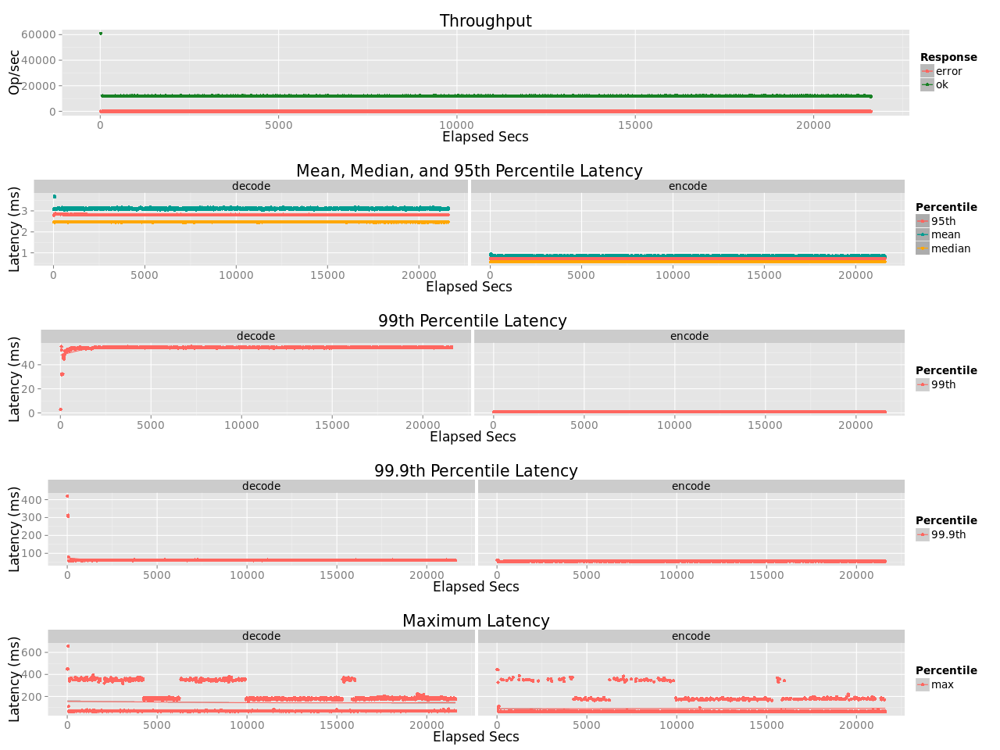

# Long Run Test of leo_erasure
## Purpose
Perform a long run test (6 hours) to verify the stability of the noalloc design

## Test Cases
* Test Parameters
    * Concurrency: 32
    * Coding: 
      *      `isars`: ISA-L Caucjy Reed-Solomon Code [K:10, M:4, W:8]
      *     `vandrs`: Vand Reed-Solomon Code [K:10, M:4, W:8]
      *   `cauchyrs`: Cauchy Reed-Solomon Code [K:10, M:4, W:8]
      * `liberation`: Liberation Code [K:10, M:2, W:11]
    * Object size: 1MB
    * Erasure: 1
    * R:W = 1:1

## Environment
* Server (`leofs-ubuntu1404-node01`)
    * CPU: Intel Xeon E5-2630 v3
* Erlang: Erlang/OTP 17.5
* OS: Ubuntu 14.04.3 LTS

## Benchmark results
### ISA-L RS Code (~20000 ops)

### Vand RS Code (~12500 ops)

### Cauchy RS Code (~7200 ops)

### Liberation Code (~12000 ops)

