## Benchmark LeoFS v1.2.11-dev10

### Purpose
We've checked LeoFS v1.2.11-dev10 w/watchdog + auto-compaction mechanism during 'recover-node command' to find issues.

### Environment

* OS: CentOS release 6.5 (Final)
* Erlang/OTP: 17.5
* LeoFS: v1.2.11-dev10
* LeoFS cluster settings:

```
 [System Confiuration]
-----------------------------------+----------
 Item                              | Value    
-----------------------------------+----------
 Basic/Consistency level
-----------------------------------+----------
                    system version | 1.2.11
                        cluster Id | leofs_1
                             DC Id | dc_1
                    Total replicas | 3
          number of successes of R | 1
          number of successes of W | 2
          number of successes of D | 2
 number of rack-awareness replicas | 0
                         ring size | 2^128
-----------------------------------+----------
 Multi DC replication settings
-----------------------------------+----------
        max number of joinable DCs | 2
           number of replicas a DC | 1
-----------------------------------+----------
 Manager RING hash
-----------------------------------+----------
                 current ring-hash | 2b468816
                previous ring-hash | 2b468816
-----------------------------------+----------

 [State of Node(s)]
-------+-----------------------------+--------------+----------------+----------------+----------------------------
 type  |            node             |    state     |  current ring  |   prev ring    |          updated at         
-------+-----------------------------+--------------+----------------+----------------+----------------------------
  S    | leofs14@192.168.100.14      | running      | 2b468816       | 2b468816       | 2015-06-26 15:27:22 +0900
  S    | leofs15@192.168.100.15      | running      | 2b468816       | 2b468816       | 2015-06-26 15:19:26 +0900
  S    | leofs16@192.168.100.16      | running      | 2b468816       | 2b468816       | 2015-06-26 15:19:25 +0900
  S    | leofs17@192.168.100.17      | running      | 2b468816       | 2b468816       | 2015-06-26 15:19:25 +0900
  S    | leofs18@192.168.100.18      | running      | 2b468816       | 2b468816       | 2015-06-26 15:19:25 +0900
  G    | leofs13@192.168.100.13      | running      | 2b468816       | 2b468816       | 2015-06-26 15:19:34 +0900
-------+-----------------------------+--------------+----------------+----------------+----------------------------

```

* basho-bench Configuration:
    * Duration: 120 minutes
    * Recover node time: 10.01 minutes
    * # of concurrent processes: 64
    * # of keys: 300000
    * Value size groups(byte):
        *   1024..  10240: 24%
        *  10241.. 102400: 30%
        * 102401.. 819200: 30%
        * 819201..1572864: 16%
    * basho_bench driver: [basho_bench_driver_leofs.erl](https://github.com/leo-project/leofs/blob/develop/test/src/basho_bench_driver_leofs.erl)
    * Configuration file: [1m_r29w1_120min.conf](20150626_152748/1m_r29w1_120min.conf)

* LeoFS Configuration:
    * Manager_0: [leo_manager_0.conf](conf/leo_manager_0.conf)
    * Manager_1: [leo_manager_1.conf](conf/leo_manager_1.conf)
    * Gateway  : [leo_gateway.conf](conf/leo_gateway.conf)
    * Storage  : [leo_storage.conf](conf/leo_storage.conf)

* 'du' status file: [du.log](du.log)

### OPS and Latency:

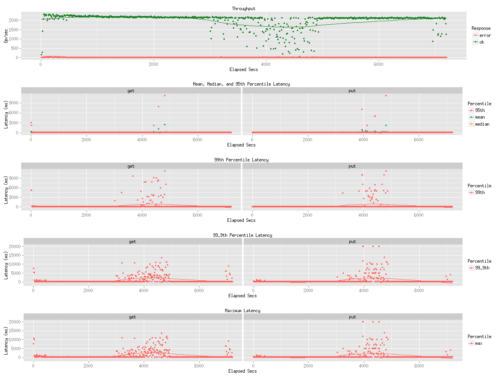

### Network Traffic
#### Chart of Every Nodes

* Gateway-1
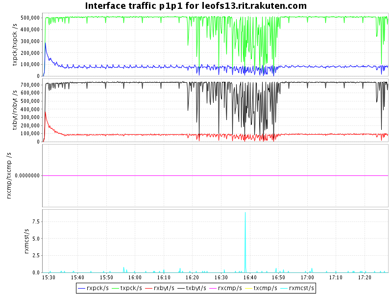

* Storage-1
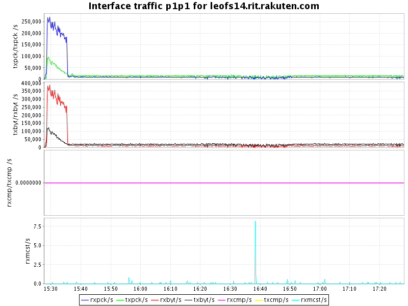

* Storage-2
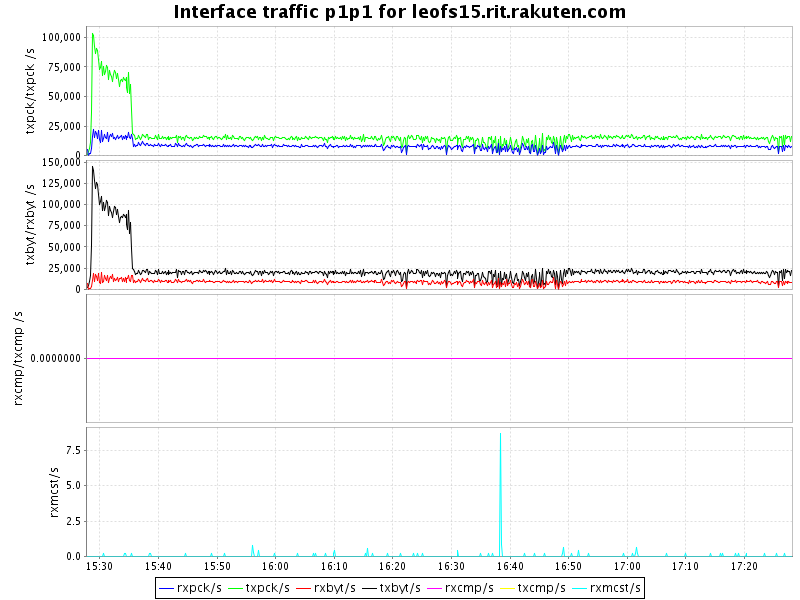

* Storage-3
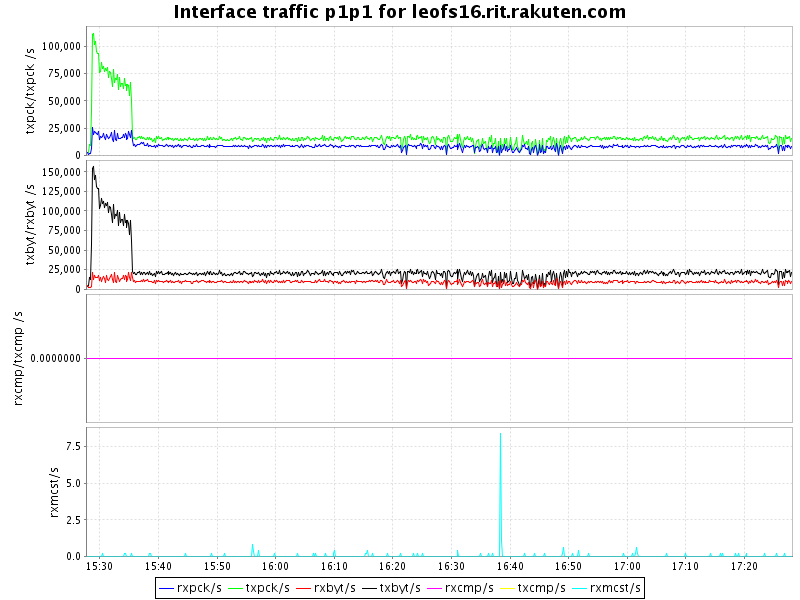

* Storage-4
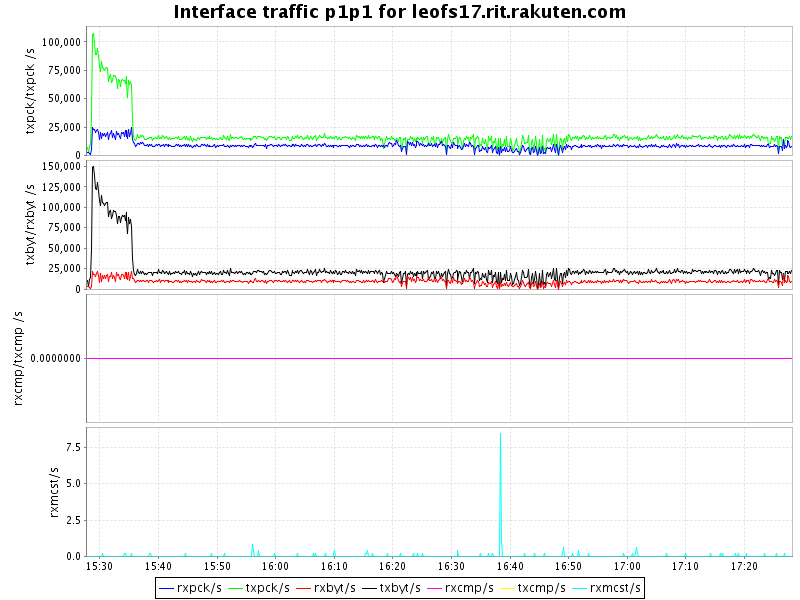

* Storage-5
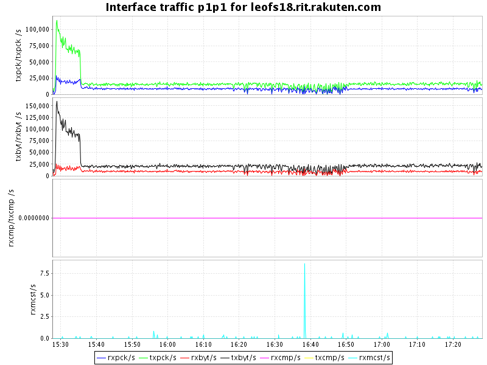


### Disk
#### Chart of Every Nodes (Storage)

* Storage-1
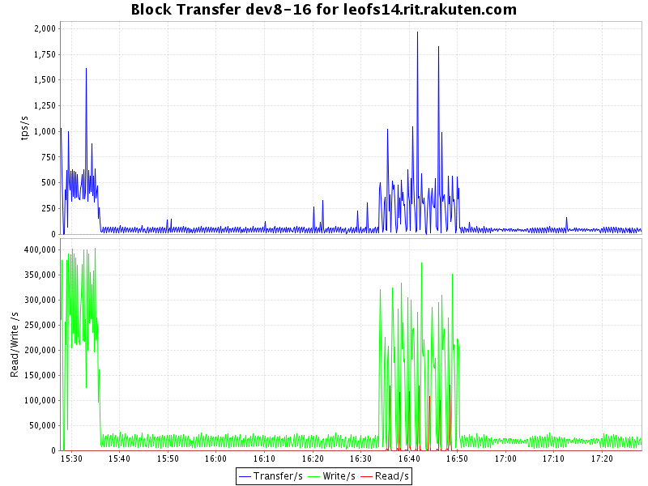
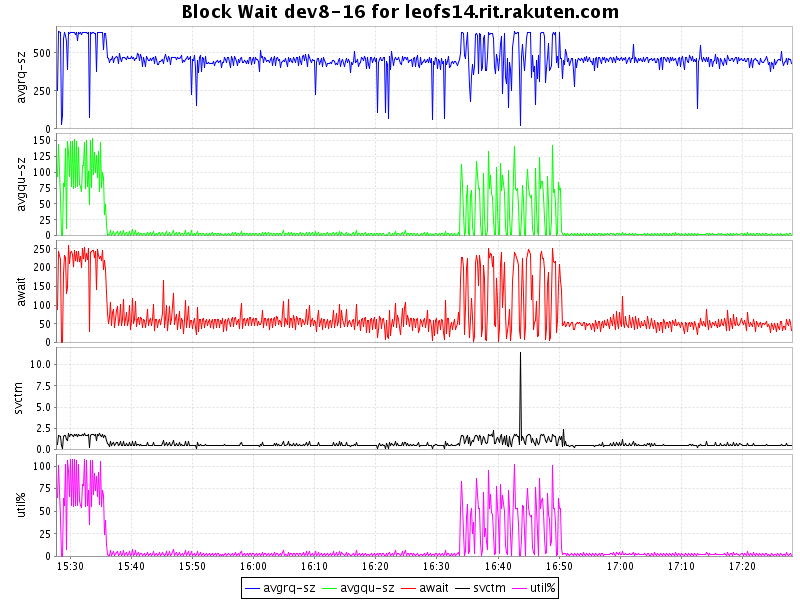

* Storage-2
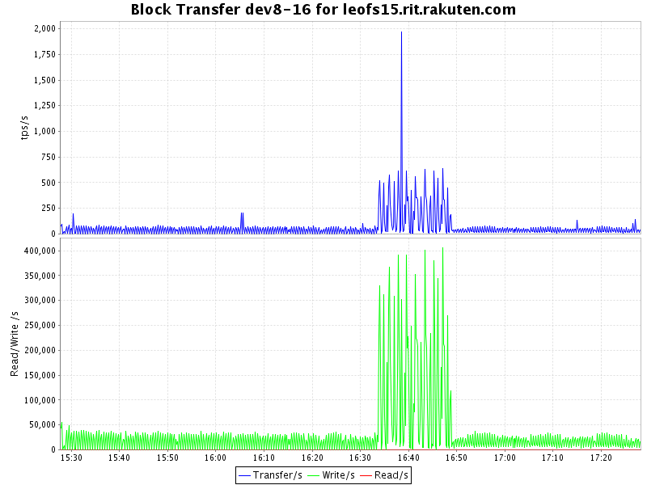
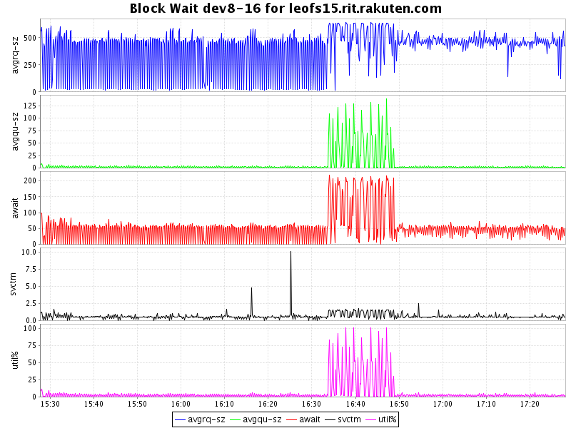

* Storage-3
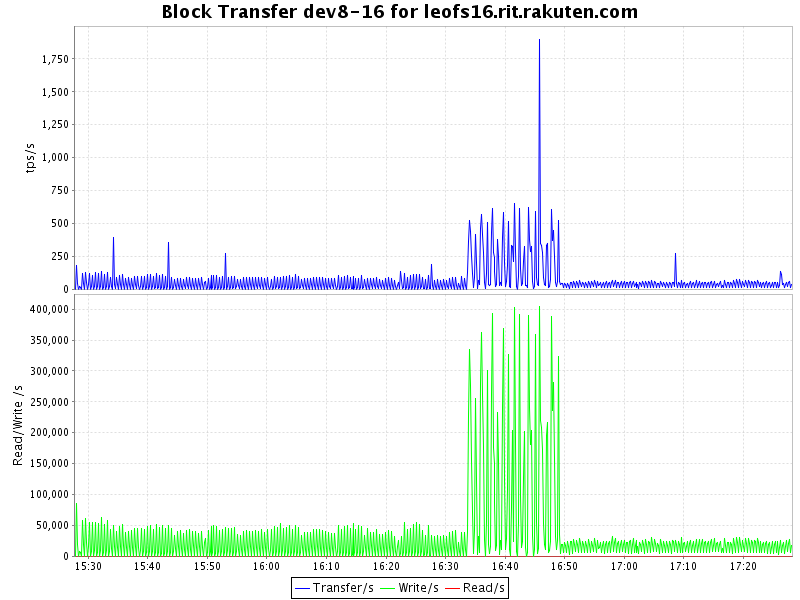
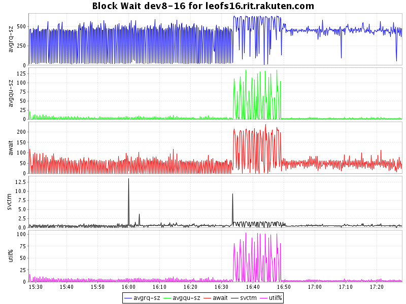

* Storage-4
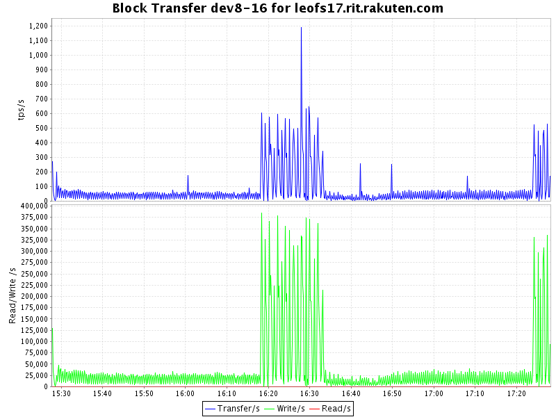
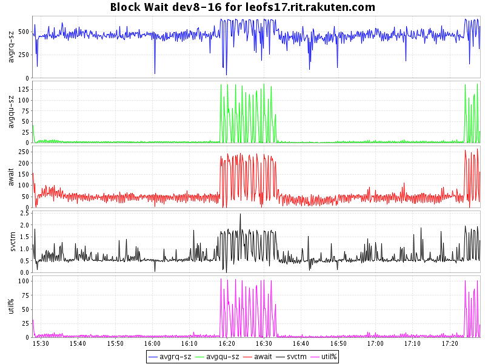

* Storage-5
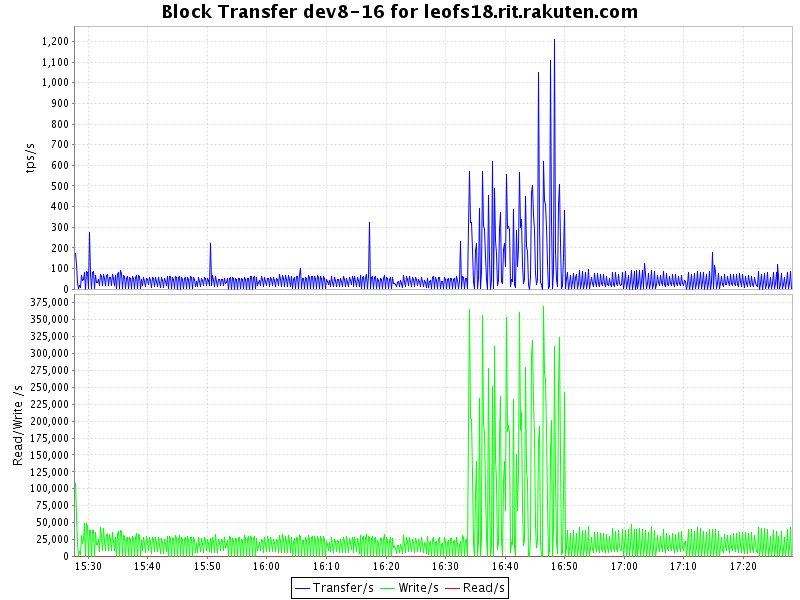
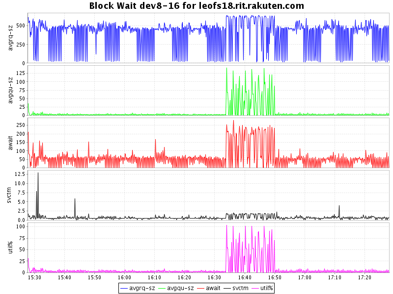


## Compaction Report Summary

### Compaction's order
* storage_3: 2015-06-26 16:17:40 +0900 - 2015-06-26 16:33:06 +0900 (15'26")
* duplicated
    * storage_0: 2015-06-26 16:33:11 +0900 - 2015-06-26 16:50:19 +0900 (17'08")
    * storage_1: 2015-06-26 16:33:11 +0900 - 2015-06-26 16:48:21 +0900 (15'10")
    * storage_2: 2015-06-26 16:33:11 +0900 - 2015-06-26 16:48:59 +0900 (15'48")
* storage_4: 2015-06-26 16:33:11 +0900 - 2015-06-26 16:49:40 +0900 (16'29")


### storage_0:
* 2015-06-26 16:33:11 +0900 - 2015-06-26 16:50:19 +0900 (17'08")
```
[0]:
{file_path,"/data/object/0.avs_63602523191"}.
{avs_ver,<<"LeoFS AVS-2.4">>}.
{num_of_active_objs,22628}.
{size_of_active_objs,7828870865}.
{total_num_of_objs,22628}.
{total_size_of_objs,7828870865}.
{start_datetime,"2015-06-26 16:33:11 +0900"}.
{end_datetime,"2015-06-26 16:35:42 +0900"}.
{errors,[]}.
{duration,151}.
{result,success}.

[7]:
{file_path,"/data/object/7.avs_63602524093"}.
{avs_ver,<<"LeoFS AVS-2.4">>}.
{num_of_active_objs,22834}.
{size_of_active_objs,7804364222}.
{total_num_of_objs,22834}.
{total_size_of_objs,7804364222}.
{start_datetime,"2015-06-26 16:48:13 +0900"}.
{end_datetime,"2015-06-26 16:50:19 +0900"}.
{errors,[]}.
{duration,126}.
{result,success}.
```

### storage_1:
* 2015-06-26 16:33:11 +0900 - 2015-06-26 16:48:21 +0900 (15'10")
```
[0]
{file_path,"/data/object/0.avs_63602523191"}.
{avs_ver,<<"LeoFS AVS-2.4">>}.
{num_of_active_objs,19578}.
{size_of_active_objs,6799125373}.
{total_num_of_objs,19578}.
{total_size_of_objs,6799125373}.
{start_datetime,"2015-06-26 16:33:11 +0900"}.
{end_datetime,"2015-06-26 16:35:06 +0900"}.
{errors,[]}.
{duration,115}.
{result,success}.

[7]
{file_path,"/data/object/7.avs_63602523984"}.
{avs_ver,<<"LeoFS AVS-2.4">>}.
{num_of_active_objs,19635}.
{size_of_active_objs,6833610815}.
{total_num_of_objs,19635}.
{total_size_of_objs,6833610815}.
{start_datetime,"2015-06-26 16:46:24 +0900"}.
{end_datetime,"2015-06-26 16:48:21 +0900"}.
{errors,[]}.
{duration,117}.
{result,success}.
```

### storage_2:
* 2015-06-26 16:33:11 +0900 - 2015-06-26 16:48:59 +0900 (15'48")
```
[0]
{file_path,"/data/object/0.avs_63602523191"}.
{avs_ver,<<"LeoFS AVS-2.4">>}.
{num_of_active_objs,20440}.
{size_of_active_objs,6958834806}.
{total_num_of_objs,20440}.
{total_size_of_objs,6958834806}.
{start_datetime,"2015-06-26 16:33:11 +0900"}.
{end_datetime,"2015-06-26 16:35:06 +0900"}.
{errors,[]}.
{duration,115}.
{result,success}.

[7]
{file_path,"/data/object/7.avs_63602524023"}.
{avs_ver,<<"LeoFS AVS-2.4">>}.
{num_of_active_objs,20441}.
{size_of_active_objs,7064906023}.
{total_num_of_objs,20441}.
{total_size_of_objs,7064906023}.
{start_datetime,"2015-06-26 16:47:03 +0900"}.
{end_datetime,"2015-06-26 16:48:59 +0900"}.
{errors,[]}.
{duration,116}.
{result,success}.
```
### storage_3:
* 2015-06-26 16:17:40 +0900 - 2015-06-26 16:33:06 +0900 (15'26")
```
[0]
{file_path,"/data/object/0.avs_63602522260"}.
{avs_ver,<<"LeoFS AVS-2.4">>}.
{num_of_active_objs,20025}.
{size_of_active_objs,6928106848}.
{total_num_of_objs,20025}.
{total_size_of_objs,6928106848}.
{start_datetime,"2015-06-26 16:17:40 +0900"}.
{end_datetime,"2015-06-26 16:19:35 +0900"}.
{errors,[]}.
{duration,115}.
{result,success}.

[7]
{file_path,"/data/object/7.avs_63602523065"}.
{avs_ver,<<"LeoFS AVS-2.4">>}.
{num_of_active_objs,20063}.
{size_of_active_objs,6962600037}.
{total_num_of_objs,20063}.
{total_size_of_objs,6962600037}.
{start_datetime,"2015-06-26 16:31:05 +0900"}.
{end_datetime,"2015-06-26 16:33:06 +0900"}.
{errors,[]}.
{duration,121}.
{result,success}.
```

### storage_3:
* 2015-06-26 16:33:11 +0900 - 2015-06-26 16:49:40 +0900 (16'29")
```
[0]
{file_path,"/data/object/0.avs_63602523191"}.
{avs_ver,<<"LeoFS AVS-2.4">>}.
{num_of_active_objs,20523}.
{size_of_active_objs,7128210306}.
{total_num_of_objs,20523}.
{total_size_of_objs,7128210306}.
{start_datetime,"2015-06-26 16:33:11 +0900"}.
{end_datetime,"2015-06-26 16:35:24 +0900"}.
{errors,[]}.
{duration,133}.
{result,success}.

[7]
{file_path,"/data/object/7.avs_63602524055"}.
{avs_ver,<<"LeoFS AVS-2.4">>}.
{num_of_active_objs,20486}.
{size_of_active_objs,7076148591}.
{total_num_of_objs,20486}.
{total_size_of_objs,7076148591}.
{start_datetime,"2015-06-26 16:47:35 +0900"}.
{end_datetime,"2015-06-26 16:49:40 +0900"}.
{errors,[]}.
{duration,125}.
{result,success}.
```
