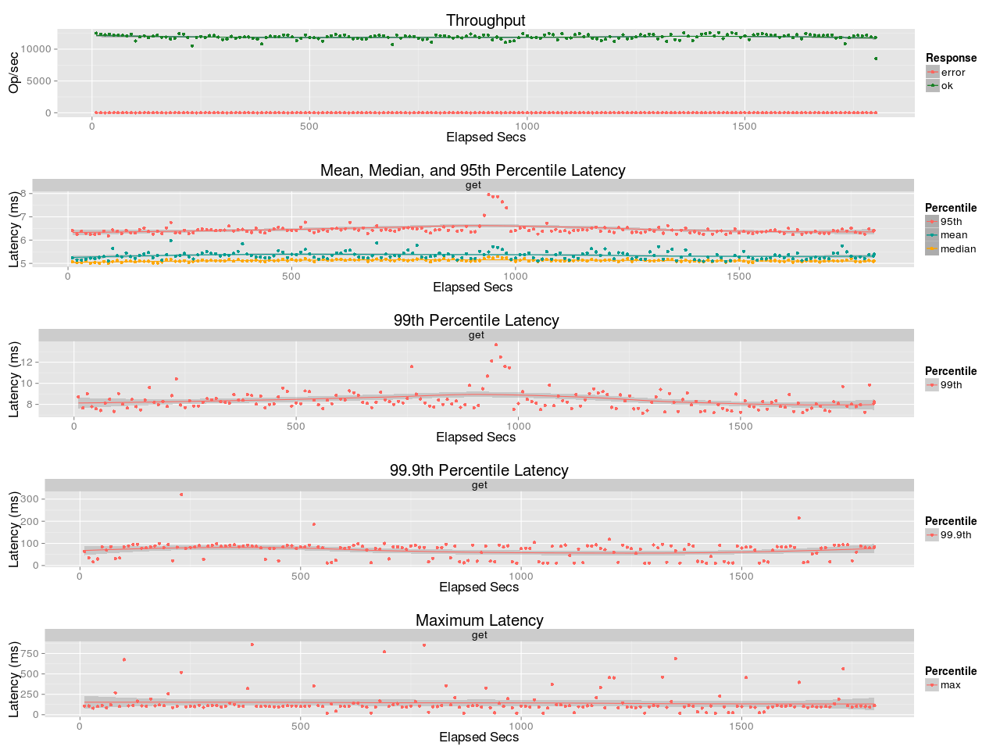
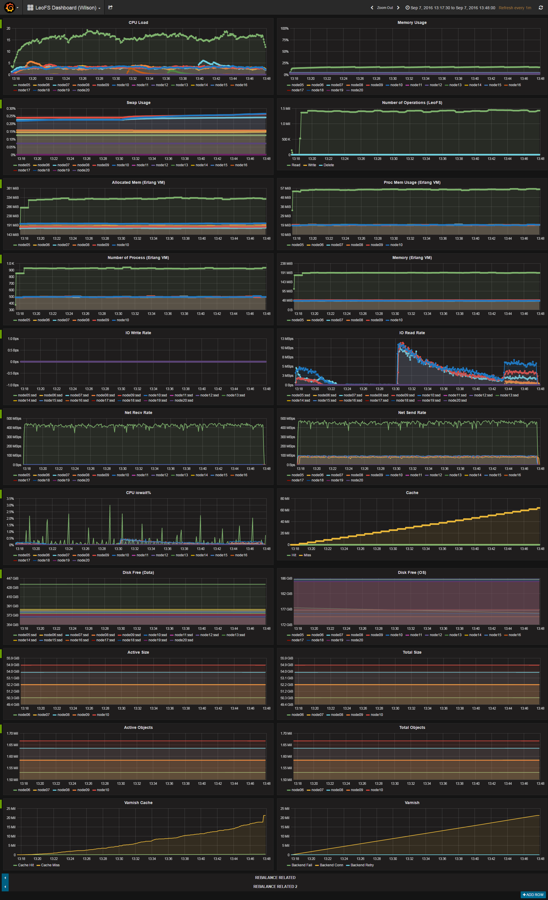

## Benchmark LeoFS v1.2.18

### Purpose
We check Varnish with LeoFS (Enable KeepAlive)

### Environment

* OS: Ubuntu Server 14.04.3
* Erlang/OTP: 17.5
* LeoFS: 1.2.18
* CPU: Intel Xeon E5-2630 v3 @ 2.40GHz
* HDD (node[36~50]) : 4x ST2000LM003 (2TB 5400rpm 32MB) RAID-0 are mounted at `/data/`, Ext4
* SSD (node[36~50]) : 1x Crucial CT500BX100SSD1 mounted at `/ssd/`, Ext4

```
 [System Confiuration]
-----------------------------------+----------
 Item                              | Value
-----------------------------------+----------
 Basic/Consistency level
-----------------------------------+----------
                    system version | 1.2.18
                        cluster Id | leofs_1
                             DC Id | dc_1
                    Total replicas | 2
          number of successes of R | 1
          number of successes of W | 1
          number of successes of D | 1
 number of rack-awareness replicas | 0
                         ring size | 2^128
-----------------------------------+----------
 Multi DC replication settings
-----------------------------------+----------
        max number of joinable DCs | 2
           number of replicas a DC | 1
-----------------------------------+----------
 Manager RING hash
-----------------------------------+----------
                 current ring-hash | 59aa8ae7
                previous ring-hash | 59aa8ae7
-----------------------------------+----------

 [State of Node(s)]
-------+------------------------+--------------+----------------+----------------+----------------------------
 type  |          node          |    state     |  current ring  |   prev ring    |          updated at
-------+------------------------+--------------+----------------+----------------+----------------------------
  S    | S0@192.168.100.36      | running      | 59aa8ae7       | 59aa8ae7       | 2016-09-07 09:48:48 +0900
  S    | S1@192.168.100.37      | running      | 59aa8ae7       | 59aa8ae7       | 2016-09-07 09:48:48 +0900
  S    | S2@192.168.100.38      | running      | 59aa8ae7       | 59aa8ae7       | 2016-09-07 09:48:48 +0900
  S    | S3@192.168.100.39      | running      | 59aa8ae7       | 59aa8ae7       | 2016-09-07 09:48:49 +0900
  S    | S4@192.168.100.40      | running      | 59aa8ae7       | 59aa8ae7       | 2016-09-07 09:48:48 +0900
  G    | G0@192.168.100.35      | running      | 59aa8ae7       | 59aa8ae7       | 2016-09-07 09:48:51 +0900
-------+------------------------+--------------+----------------+----------------+----------------------------

```

* basho-bench Configuration:
    * Duration: 30 minutes
    * # of concurrent processes: 64
    * # of keys: 4000000
    * R/W: 100/0
    * Value size groups(byte):
        *    4096..   8192: 15%
        *    8192..  16384: 25%
        *   16384..  32768: 23%
        *   32768..  65536: 22%
        *   65536.. 131072: 15%
    * basho_bench driver: [basho_bench_driver_http_raw.erl](https://github.com/leo-project/basho_bench/blob/master/src/basho_bench_driver_http_raw.erl)
    * Configuration file: [image_f4m_r100_30min.conf](image_f4m_r100_30min.conf)

* LeoFS Configuration:
    * Manager_0: [leo_manager_0.conf](conf/G0/leo_manager.conf)
    * Gateway  : [leo_gateway.conf](conf/G0/leo_gateway.conf)
        * Cache: 256MB (Mem) + 500MB (HDD)
        * max_keepalive: 4096
    * Storage  : [leo_storage.conf](conf/S0/leo_storage.conf)

* Varnish Configuration:
    * Setup: 4.1.2
    * Co-located with GW at 192.168.100.35
    * Cache: Memory, 2GB
    * Configuration: 
        * [default/varnish](varnish.conf)
        * [default.vcl](default.vcl)

* OS TCP Setting:
    ```
    $ sysctl net.ipv4.tcp_tw_reuse
    net.ipv4.tcp_tw_reuse = 1
    $ sysctl net.ipv4.tcp_fin_timeout
    net.ipv4.tcp_fin_timeout = 25
    ```

### Connection Monitor
```
$ watch -n 1 "netstat | grep localhost | awk '{print \$6}' | sort | uniq -c | tr -d \"\\n\" | awk '{print strftime(\"%Y-%m-%d %H:%M:%S\"); print $1}' | tee --append netstat.log"
    134 ESTABLISHED    128 TIME_WAIT
```
[netstat.log](netstat.log)

### OPS and Latency:



### Monitoring Results:


