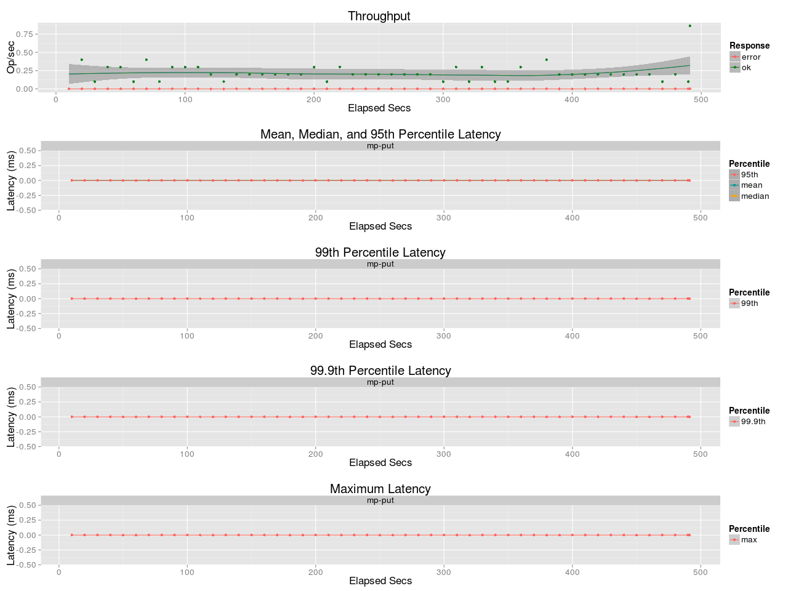
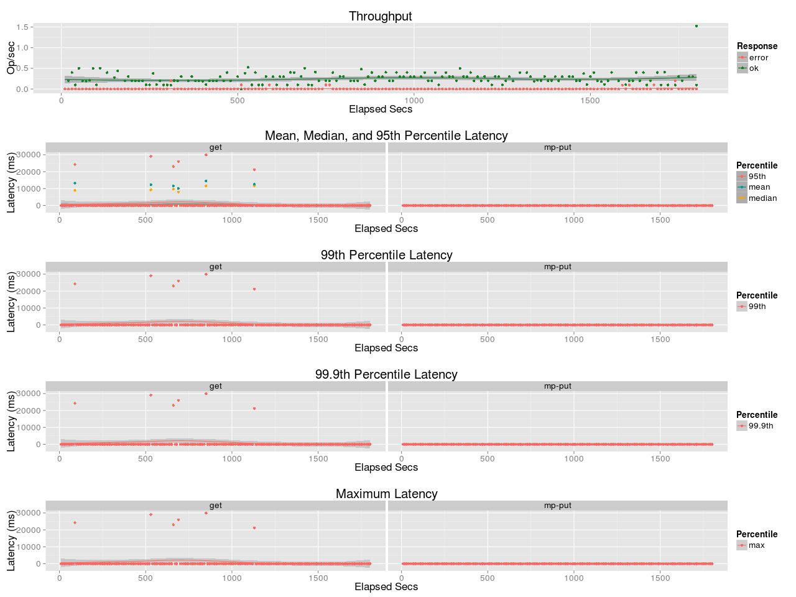
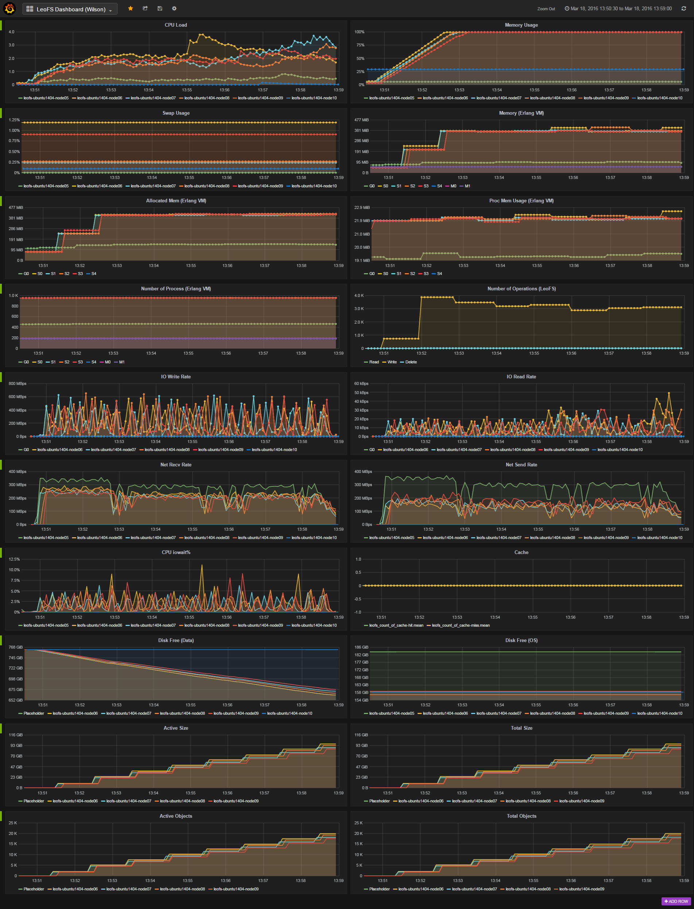
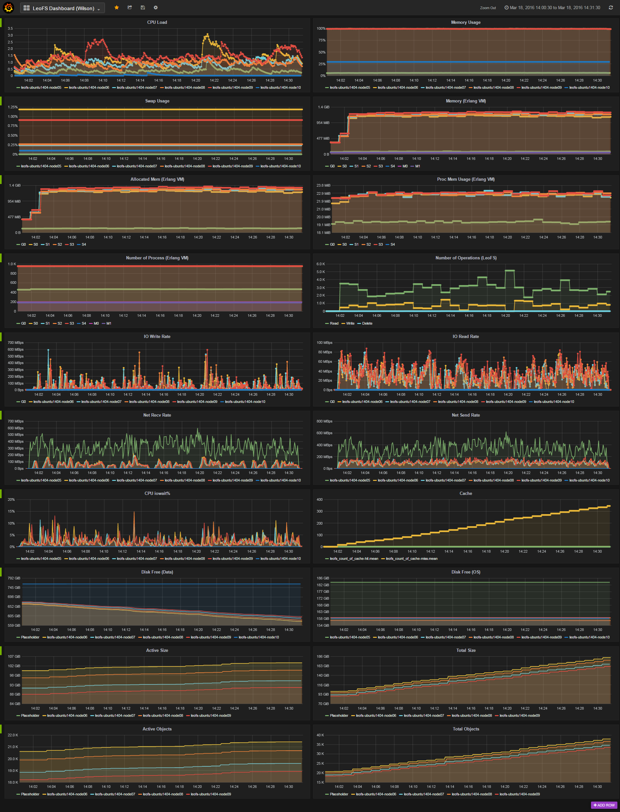

## Benchmark LeoFS v1.2.20-dev

### Purpose
We check the performance of LeoFS 1.2.20-dev 

### Environment

* OS: Ubuntu Server 14.04.3
* Erlang/OTP: 17.5
* LeoFS: 1.2.20-dev
* CPU: Intel Xeon E5-2630 v3 @ 2.40GHz
* RAM: DDR4-1866MHz 8GB * 4
* HDD (node[36~39]) : 6x 15k rpm HDD RAID-0 are mounted at `/data/`, Ext4

```
 [System Confiuration]
-----------------------------------+----------
 Item                              | Value
-----------------------------------+----------
 Basic/Consistency level
-----------------------------------+----------
                    system version | 1.2.20
                        cluster Id | leofs_1
                             DC Id | dc_1
                    Total replicas | 3
          number of successes of R | 1
          number of successes of W | 2
          number of successes of D | 2
 number of rack-awareness replicas | 0
                         ring size | 2^128
-----------------------------------+----------
 Multi DC replication settings
-----------------------------------+----------
        max number of joinable DCs | 2
           number of replicas a DC | 1
-----------------------------------+----------
 Manager RING hash
-----------------------------------+----------
                 current ring-hash | 08a77a5f
                previous ring-hash | 08a77a5f
-----------------------------------+----------

 [State of Node(s)]
-------+------------------------+--------------+----------------+----------------+----------------------------
 type  |          node          |    state     |  current ring  |   prev ring    |          updated at
-------+------------------------+--------------+----------------+----------------+----------------------------
  S    | S0@192.168.100.36      | running      | 08a77a5f       | 08a77a5f       | 2016-03-15 09:13:01 +0900
  S    | S1@192.168.100.37      | running      | 08a77a5f       | 08a77a5f       | 2016-03-15 09:13:01 +0900
  S    | S2@192.168.100.38      | running      | 08a77a5f       | 08a77a5f       | 2016-03-15 09:13:01 +0900
  S    | S3@192.168.100.39      | running      | 08a77a5f       | 08a77a5f       | 2016-03-15 09:13:01 +0900
  G    | G0@192.168.100.35      | running      | 08a77a5f       | 08a77a5f       | 2016-03-15 09:13:12 +0900
-------+------------------------+--------------+----------------+----------------+----------------------------

```

* basho-bench Configuration:
    * Duration: 30 minutes
    * # of concurrent processes: 4
    * # of keys: 100
    * Value size groups(byte):
        * 1073741824.. 1610612736: 100%
    * basho_bench driver: [basho_bench_driver_leofs.erl](https://github.com/leo-project/basho_bench/blob/1.4/src/basho_bench_driver_leofs.erl)
    * Configuration file: [mp_1g_f100_r8w2.conf](mp_1g_f100_r8w2.conf)

* LeoFS Configuration:
    * Manager_0: [leo_manager_0.conf](conf/leo_manager_0.conf)
    * Manager_1: [leo_manager_1.conf](conf/leo_manager_1.conf)
    * Gateway  : [leo_gateway.conf](conf/leo_gateway_0.conf)
    * Storage  : [leo_storage.conf](conf/leo_storage_0.conf)
      * AVS 64

### OPS and Latency:

**Load**

**Read**
**R80W20**


### Monitoring Results:

**Load**

**Read**
**R80W20**

