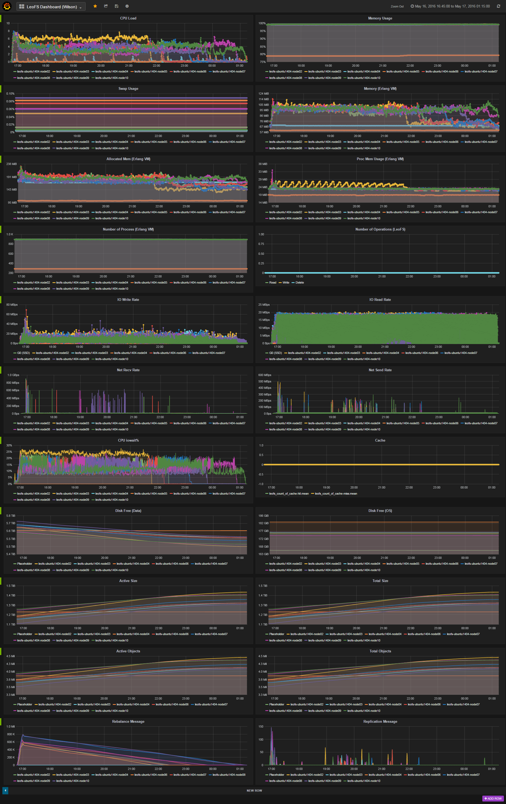

## Benchmark LeoFS v1.2.22-dev Rebalance (Detach)

### Purpose
We check the Rebalance Performance of LeoFS after a node detach

### Environment

* OS: Ubuntu Server 14.04.3
* Erlang/OTP: 17.5
* LeoFS: 1.2.22-dev
* CPU: Intel Xeon E5-2630 v3 @ 2.40GHz
* HDD (node[32~34, 36~39]) : 4x ST2000LM003 (2TB 5400rpm 32MB) RAID-0 are mounted at `/data/`, Ext4

```
 [System Confiuration]
-----------------------------------+----------
 Item                              | Value    
-----------------------------------+----------
 Basic/Consistency level
-----------------------------------+----------
                    system version | 1.2.21
                        cluster Id | leofs_1
                             DC Id | dc_1
                    Total replicas | 3
          number of successes of R | 1
          number of successes of W | 2
          number of successes of D | 2
 number of rack-awareness replicas | 0
                         ring size | 2^128
-----------------------------------+----------
 Multi DC replication settings
-----------------------------------+----------
        max number of joinable DCs | 2
           number of replicas a DC | 1
-----------------------------------+----------
 Manager RING hash
-----------------------------------+----------
                 current ring-hash | f8d0e9f6
                previous ring-hash | f8d0e9f6
-----------------------------------+----------

 [State of Node(s)]
-------+------------------------+--------------+----------------+----------------+----------------------------
 type  |          node          |    state     |  current ring  |   prev ring    |          updated at         
-------+------------------------+--------------+----------------+----------------+----------------------------
  S    | S0@192.168.100.36      | running      | f8d0e9f6       | f8d0e9f6       | 2016-05-16 13:59:35 +0900
  S    | S1@192.168.100.37      | running      | f8d0e9f6       | f8d0e9f6       | 2016-05-16 13:59:35 +0900
  S    | S2@192.168.100.38      | running      | f8d0e9f6       | f8d0e9f6       | 2016-05-16 13:59:35 +0900
  S    | S3@192.168.100.39      | running      | f8d0e9f6       | f8d0e9f6       | 2016-05-16 13:59:35 +0900
  S    | S4@192.168.100.40      | running      | f8d0e9f6       | f8d0e9f6       | 2016-05-16 13:59:35 +0900
  S    | S5@192.168.100.32      | running      | f8d0e9f6       | f8d0e9f6       | 2016-05-16 13:59:35 +0900
  S    | S6@192.168.100.33      | running      | f8d0e9f6       | f8d0e9f6       | 2016-05-16 13:59:35 +0900
  G    | G0@192.168.100.35      | running      | f8d0e9f6       | f8d0e9f6       | 2016-05-16 13:59:46 +0900
-------+------------------------+--------------+----------------+----------------+----------------------------


```

* basho-bench Configuration:
    * # of concurrent processes: 64
    * # of keys: 10000000
    * R/W: 100/0
    * Value size groups(byte):
        *    1024..  10240: 24%
        *   10241.. 102400: 30%
        *  102401.. 819200: 30%
        *  819201..1572864: 16%
    * basho_bench driver: [basho_bench_driver_leofs.erl](https://github.com/leo-project/basho_bench/blob/master/src/basho_bench_driver_leofs.erl)
    * Configuration file: [leofs_1m_f10m_load.conf](leofs_1m_f10m_load.conf)

* LeoFS Configuration:
    * Manager_0: [leo_manager_0.conf](conf/leo_manager_0.conf)
    * Manager_1: [leo_manager_1.conf](conf/leo_manager_1.conf)
    * Gateway  : [leo_gateway.conf](conf/leo_gateway_0.conf)
      * No Cache
    * Storage  : [leo_storage.conf](conf/leo_storage_0.conf)

* Test Procedure
    * Load 10,000,000 Objects (350KB Average)
    * Detach 1 Node (leofs-adm detach S7@192.168.100.34)
    * Rebalance (leofs-adm rebalance)

### Monitoring Results:

- Duration of time: 8.5 hours


