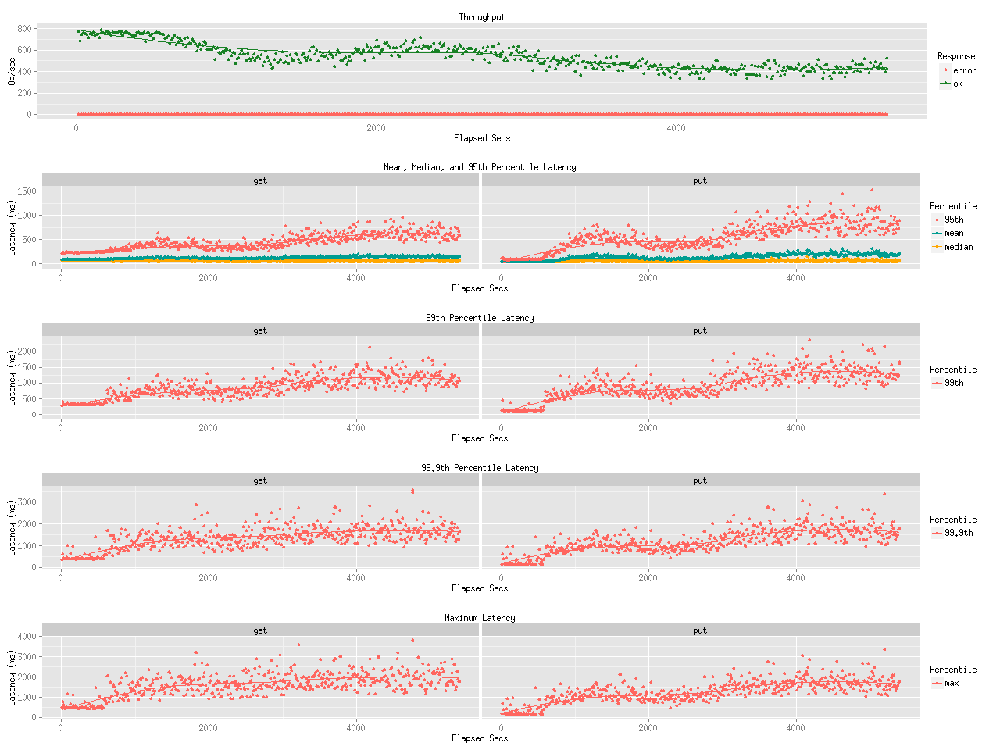

Title
=====

Benchmark result for leofs-1.0.2 on 10Gbps

Env
===

* bacho_bench (benchmarker)
    * Configuration:
        * key_generator:
            * type: pareto_int
            * max key: 1MB:10000
        * value_generator:
            * type: exponential_bin
            * min-size: 8192
            * mean-size: 1048576
        * [see more](tests/)

* LeoFS
    * OS: CentOS release 6.5 (Final)
    * Kernel: Linux leofs12.rit.rakuten.com 2.6.32-431.el6.x86_64 #1 SMP Fri Nov 22 03:15:09 UTC 2013 x86_64 x86_64 x86_64 GNU/Linux
    * Erlang: R16B03-1
    * LeoFS:  1.0.2

* LeoFS cluster settings

```
[System config]
                System version : 1.0.2
                    Cluster Id : leofs_1
                         DC Id : dc_1
                Total replicas : 3
           # of successes of R : 1
           # of successes of W : 2
           # of successes of D : 2
 # of DC-awareness replicas    : 0
                     ring size : 2^128
             Current ring hash : d02a43c0
                Prev ring hash : d02a43c0
[Multi DC replication settings]
         max # of joinable DCs : 2
            # of replicas a DC : 1

[Node(s) state]
-------+-----------------------------+--------------+----------------+----------------+----------------------------
 type  |            node             |    state     |  current ring  |   prev ring    |          updated at
-------+-----------------------------+--------------+----------------+----------------+----------------------------
  S    | leofs14@192.168.100.14      | running      | d02a43c0       | d02a43c0       | 2014-05-27 14:54:44 +0900
  S    | leofs15@192.168.100.15      | running      | d02a43c0       | d02a43c0       | 2014-05-27 14:54:44 +0900
  S    | leofs16@192.168.100.16      | running      | d02a43c0       | d02a43c0       | 2014-05-27 14:54:44 +0900
  S    | leofs17@192.168.100.17      | running      | d02a43c0       | d02a43c0       | 2014-05-27 14:54:44 +0900
  S    | leofs18@192.168.100.18      | running      | d02a43c0       | d02a43c0       | 2014-05-27 14:54:44 +0900
  G    | leofs13@192.168.100.13      | running      | d02a43c0       | d02a43c0       | 2014-05-27 14:55:07 +0900
```

Result
======
* Read:Write = 9:1 with 1M (90 minutes)

* Read:Write = 9:1 with 1M (90 minutes) min: 100KB max: 1.5MB

* Read:Write = 9:1 with 1M (90 minutes) min: 100KB max: 1.5MB (New Logic)


Conclusion
==========
We have been keeping the same performance with the new version LeoFS.
