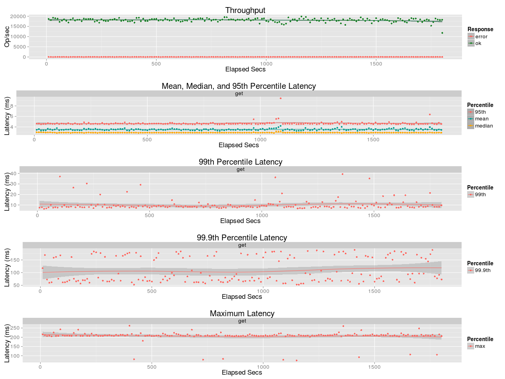
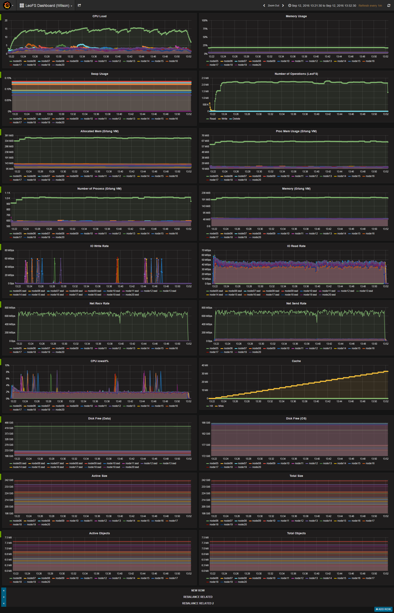

## Benchmark LeoFS v1.3.0

### Purpose
We check Performance with LeoFS

### Environment

* OS: Ubuntu Server 14.04.3
* Erlang/OTP: 17.5
* LeoFS: 1.3.0
* CPU: Intel Xeon E5-2630 v3 @ 2.40GHz
* HDD (node[36~50]) : 4x ST2000LM003 (2TB 5400rpm 32MB) RAID-0 are mounted at `/data/`, Ext4
* SSD (node[36~50]) : 1x Crucial CT500BX100SSD1 mounted at `/ssd/`, Ext4

```
 [System Confiuration]
-----------------------------------+----------
 Item                              | Value
-----------------------------------+----------
 Basic/Consistency level
-----------------------------------+----------
                    system version | 1.3.0
                        cluster Id | leofs_1
                             DC Id | dc_1
                    Total replicas | 2
          number of successes of R | 1
          number of successes of W | 1
          number of successes of D | 1
 number of rack-awareness replicas | 0
                         ring size | 2^128
-----------------------------------+----------
 Multi DC replication settings
-----------------------------------+----------
        max number of joinable DCs | 2
           number of replicas a DC | 1
-----------------------------------+----------
 Manager RING hash
-----------------------------------+----------
                 current ring-hash | 1e11048b
                previous ring-hash | 1e11048b
-----------------------------------+----------

 [State of Node(s)]
-------+-------------------------+--------------+----------------+----------------+----------------------------
 type  |          node           |    state     |  current ring  |   prev ring    |          updated at
-------+-------------------------+--------------+----------------+----------------+----------------------------
  S    | S0@192.168.100.36       | running      | 1e11048b       | 1e11048b       | 2016-09-12 11:19:49 +0900
  S    | S10@192.168.100.46      | running      | 1e11048b       | 1e11048b       | 2016-09-12 11:19:49 +0900
  S    | S11@192.168.100.47      | running      | 1e11048b       | 1e11048b       | 2016-09-12 11:19:49 +0900
  S    | S12@192.168.100.48      | running      | 1e11048b       | 1e11048b       | 2016-09-12 11:19:49 +0900
  S    | S13@192.168.100.49      | running      | 1e11048b       | 1e11048b       | 2016-09-12 11:19:49 +0900
  S    | S14@192.168.100.50      | running      | 1e11048b       | 1e11048b       | 2016-09-12 11:19:49 +0900
  S    | S1@192.168.100.37       | running      | 1e11048b       | 1e11048b       | 2016-09-12 11:19:49 +0900
  S    | S2@192.168.100.38       | running      | 1e11048b       | 1e11048b       | 2016-09-12 11:19:49 +0900
  S    | S3@192.168.100.39       | running      | 1e11048b       | 1e11048b       | 2016-09-12 11:19:49 +0900
  S    | S4@192.168.100.40       | running      | 1e11048b       | 1e11048b       | 2016-09-12 11:19:49 +0900
  S    | S5@192.168.100.41       | running      | 1e11048b       | 1e11048b       | 2016-09-12 11:19:49 +0900
  S    | S6@192.168.100.42       | running      | 1e11048b       | 1e11048b       | 2016-09-12 11:19:49 +0900
  S    | S7@192.168.100.43       | running      | 1e11048b       | 1e11048b       | 2016-09-12 11:19:49 +0900
  S    | S8@192.168.100.44       | running      | 1e11048b       | 1e11048b       | 2016-09-12 11:19:49 +0900
  S    | S9@192.168.100.45       | running      | 1e11048b       | 1e11048b       | 2016-09-12 11:19:49 +0900
  G    | G0@192.168.100.35       | running      | 1e11048b       | 1e11048b       | 2016-09-12 11:19:51 +0900
-------+-------------------------+--------------+----------------+----------------+----------------------------

```

* basho-bench Configuration:
    * Duration: 30 minutes
    * # of concurrent processes: 64
    * # of keys: 50000000
    * R/W: 100/0
    * Value size groups(byte):
        *    4096..   8192: 15%
        *    8192..  16384: 25%
        *   16384..  32768: 23%
        *   32768..  65536: 22%
        *   65536.. 131072: 15%
    * basho_bench driver: [basho_bench_driver_leofs.erl](https://github.com/leo-project/basho_bench/blob/master/src/basho_bench_driver_leofs.erl)
    * Configuration file: [image_f10m_r100_30min.conf](image_f10m_r100_30min.conf)

* LeoFS Configuration:
    * Manager_0: [leo_manager_0.conf](conf/G0/leo_manager.conf)
    * Gateway  : [leo_gateway.conf](conf/G0/leo_gateway.conf)
    * Storage  : [leo_storage.conf](conf/S0/leo_storage.conf)

### OPS and Latency:



### Monitoring Results:


