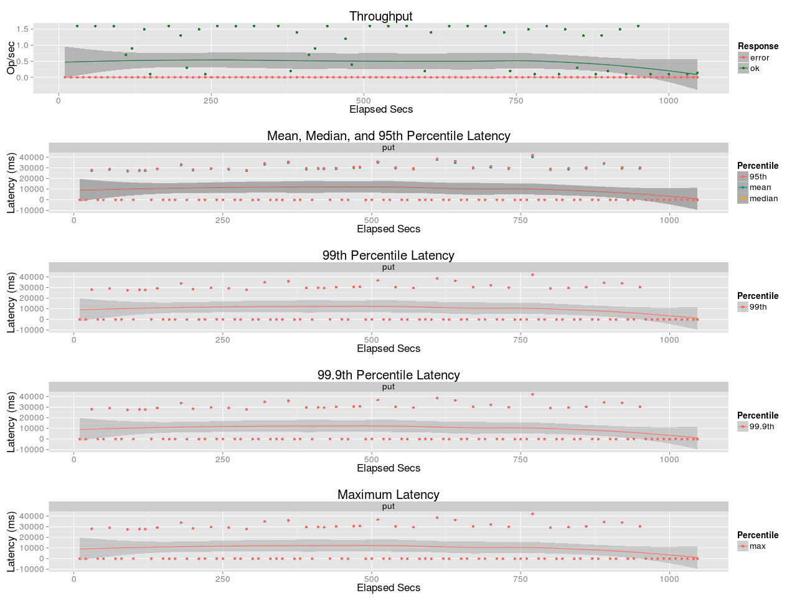
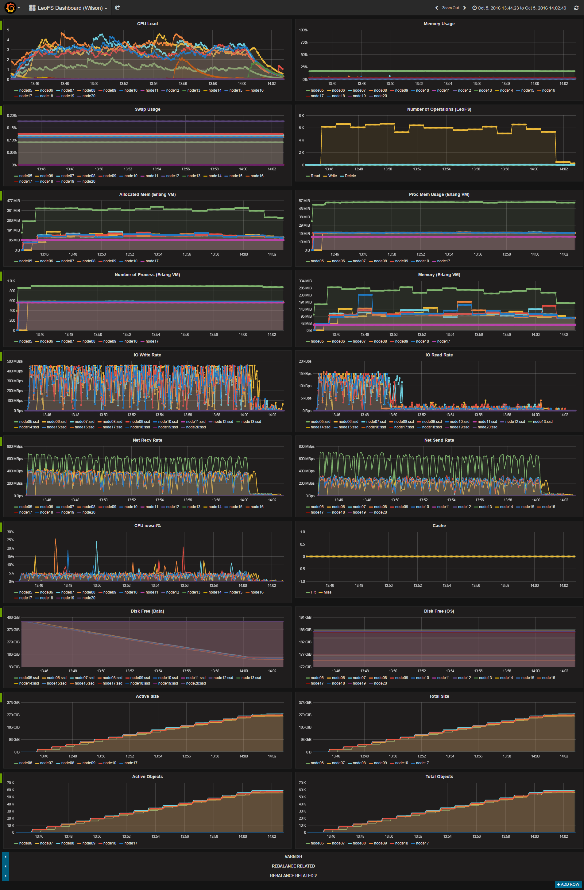
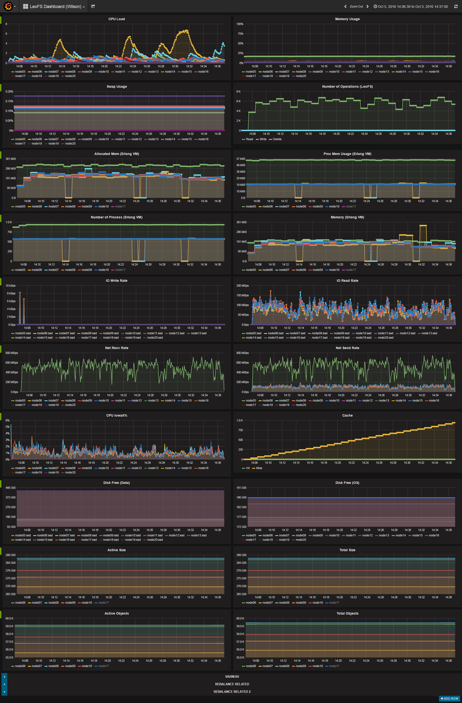

## Benchmark LeoFS v1.3.0

### Purpose
We check Read/Write Performance of Large File with LeoFS using S3cmd

### Issues
* https://github.com/leo-project/notes/issues/17

### Summary
- Put/Get 1GB Files with S3Cmd
    - Parallelly spawn 20 instances
    - Base File is served through memdisk `/dev/shm/`
- During Loading Phase, the throughput is bounded by Disk I/O rate
    - 450MB/s * 5 (nodes) / 3 (replicas) = 800MB/s
- During Reading Phase, the throughput is going up and down wildly
    - Average around 500MB/s, Up to 700MB/s, Down to 200MB/s

### Next Action
- Check if problem persists in single thread
- Detailed breakdown of latency in each processes

### Environment

* OS: Ubuntu Server 14.04.3
* Erlang/OTP: 17.5
* LeoFS: 1.3.0
* CPU: Intel Xeon E5-2630 v3 @ 2.40GHz
* HDD (node[36~50]) : 4x ST2000LM003 (2TB 5400rpm 32MB) RAID-0 are mounted at `/data/`, Ext4
* SSD (node[36~50]) : 1x Crucial CT500BX100SSD1 mounted at `/ssd/`, Ext4

```
 [System Confiuration]
-----------------------------------+----------
 Item                              | Value
-----------------------------------+----------
 Basic/Consistency level
-----------------------------------+----------
                    system version | 1.3.0
                        cluster Id | leofs_1
                             DC Id | dc_1
                    Total replicas | 3
          number of successes of R | 1
          number of successes of W | 2
          number of successes of D | 2
 number of rack-awareness replicas | 0
                         ring size | 2^128
-----------------------------------+----------
 Multi DC replication settings
-----------------------------------+----------
        max number of joinable DCs | 2
           number of replicas a DC | 1
-----------------------------------+----------
 Manager RING hash
-----------------------------------+----------
                 current ring-hash | 2c7f39ec
                previous ring-hash | 2c7f39ec
-----------------------------------+----------

 [State of Node(s)]
-------+------------------------+--------------+----------------+----------------+----------------------------
 type  |          node          |    state     |  current ring  |   prev ring    |          updated at
-------+------------------------+--------------+----------------+----------------+----------------------------
  S    | S0@192.168.100.36      | running      | 2c7f39ec       | 2c7f39ec       | 2016-10-05 13:43:51 +0900
  S    | S1@192.168.100.37      | running      | 2c7f39ec       | 2c7f39ec       | 2016-10-05 13:43:51 +0900
  S    | S2@192.168.100.38      | running      | 2c7f39ec       | 2c7f39ec       | 2016-10-05 13:43:51 +0900
  S    | S3@192.168.100.39      | running      | 2c7f39ec       | 2c7f39ec       | 2016-10-05 13:43:26 +0900
  S    | S4@192.168.100.40      | running      | 2c7f39ec       | 2c7f39ec       | 2016-10-05 13:43:51 +0900
  G    | G0@192.168.100.35      | running      | 2c7f39ec       | 2c7f39ec       | 2016-10-05 13:43:54 +0900
-------+------------------------+--------------+----------------+----------------+----------------------------


```

* Test Configuration:
    * Tool: s3cmd-1.6.1
    * Object Size: 1 GB
    * Number of Objects: 500
    * Number of Threads: 20
    * Multipart Upload Part Size: 5 MiB

* basho-bench Configuration:
    * Duration: 30 minutes
    * # of concurrent processes: 16
    * # of keys: 500
    * basho_bench driver: [basho_bench_driver_s3cmd.erl](https://github.com/windkit/basho_bench/blob/s3cmd/src/basho_bench_driver_s3cmd.erl)
    * Configuration file: 
        * [s3cmd_1g_500_load.conf](load/s3cmd_1g_500_load.conf)
        * [s3cmd_1g_500_read.conf](read/s3cmd_1g_500_read.conf)

* LeoFS Configuration:
    * Manager_0: [leo_manager_0.conf](conf/G0/leo_manager.conf)
    * Gateway  : [leo_gateway.conf](conf/G0/leo_gateway.conf)
        * Disk Cache: 0
        * Mem Cache: 256 MB
    * Storage  : [leo_storage.conf](conf/S0/leo_storage.conf)
        * Container Path: /ssd

### Monitoring Results:

* Loading
    
    

* Reading
    
    
