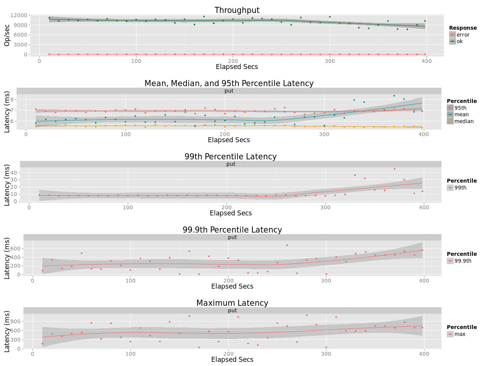

## Benchmark LeoFS v1.3.2

### Purpose
We check the performance of LeoFS 1.3.2.1 with PCIe SSD

### Issue
* https://github.com/leo-project/notes/issues/18

### Environment

* OS: Ubuntu Server 14.04.3
* Erlang/OTP: 17.5
* LeoFS: 1.3.2.1
* CPU: Intel Xeon E5-2630 v3 @ 2.40GHz
* HDD (node[36~50]) : 4x ST2000LM003 (2TB 5400rpm 32MB) RAID-0 are mounted at `/data/`, Ext4
* NVMe (node[34]) : 1x INTEL SSD 750 SSDPEDMW400G4R5 mounted at `/nvme/`, Ext4
* SSD (node[36~50]) : 1x Crucial CT500BX100SSD1 mounted at `/ssd/`, Ext4

```
 [System Confiuration]
-----------------------------------+----------
 Item                              | Value
-----------------------------------+----------
 Basic/Consistency level
-----------------------------------+----------
                    system version | 1.3.2
                        cluster Id | leofs_1
                             DC Id | dc_1
                    Total replicas | 1
          number of successes of R | 1
          number of successes of W | 1
          number of successes of D | 1
 number of rack-awareness replicas | 0
                         ring size | 2^128
-----------------------------------+----------
 Multi DC replication settings
-----------------------------------+----------
        max number of joinable DCs | 2
           number of replicas a DC | 1
-----------------------------------+----------
 Manager RING hash
-----------------------------------+----------
                 current ring-hash | 852545eb
                previous ring-hash | 852545eb
-----------------------------------+----------

 [State of Node(s)]
-------+------------------------+--------------+----------------+----------------+----------------------------
 type  |          node          |    state     |  current ring  |   prev ring    |          updated at
-------+------------------------+--------------+----------------+----------------+----------------------------
  S    | S1@192.168.100.34      | running      | 852545eb       | 852545eb       | 2017-05-25 16:18:03 +0900
  G    | G0@192.168.100.35      | running      | 852545eb       | 852545eb       | 2017-05-25 16:18:03 +0900
-------+------------------------+--------------+----------------+----------------+----------------------------

```

* basho-bench Configuration:
    * Duration: 30 minutes
    * no. of concurrent processes: 64
    * no. of keys: 4000000
    * R/W: 95/5
    * Value size groups(byte):
        *    4096..   8192: 15%
        *    8192..  16384: 25%
        *   16384..  32768: 23%
        *   32768..  65536: 22%
        *   65536.. 131072: 15%
    * basho_bench driver: [basho_bench_driver_leofs.erl](https://github.com/leo-project/basho_bench/blob/1.4/src/basho_bench_driver_leofs.erl)
    * Configuration file: 
        * [load/image_f4m_load.conf](ssd_load/image_f4m_load.conf)
        * [read/image_f4m_r100_30min.conf](ssd_read/image_f4m_r100_30min.conf)

* LeoFS Configuration:
    * Manager_0: [leo_manager_0.conf](conf/G0/leo_manager.conf)
    * Gateway  : [leo_gateway.conf](conf/G0/leo_gateway.conf)
        * Disk Cache: 0
        * Mem Cache:  0
    * Storage  : [leo_storage.conf](conf/S0/leo_storage.conf)
        * Container Path: /nvme/avs

### Loading (NVMe)
**OPS and Latency:**

**Monitoring Results:**


### Loading (SSD)
**OPS and Latency:**

**Monitoring Results:**


### Read (NVMe)
**OPS and Latency:**

**Monitoring Results:**


### Read (SSD)
**OPS and Latency:**

**Monitoring Results:**

