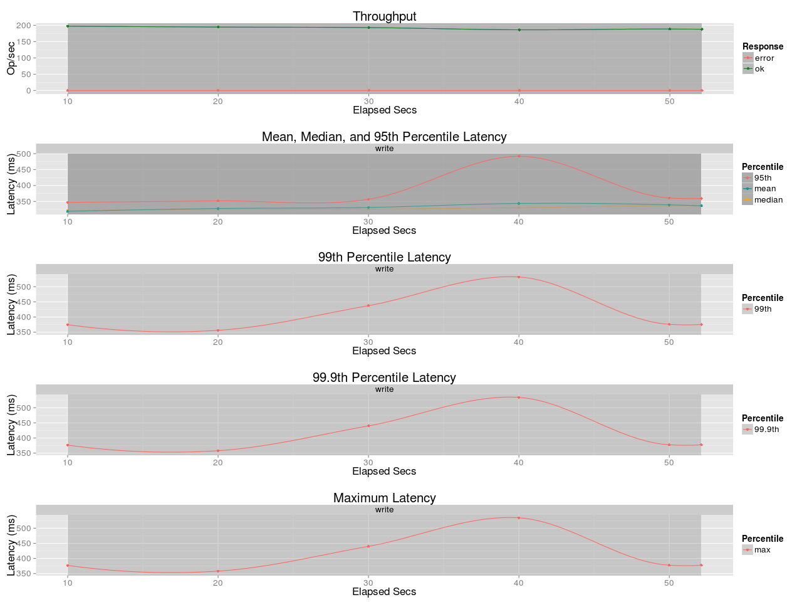
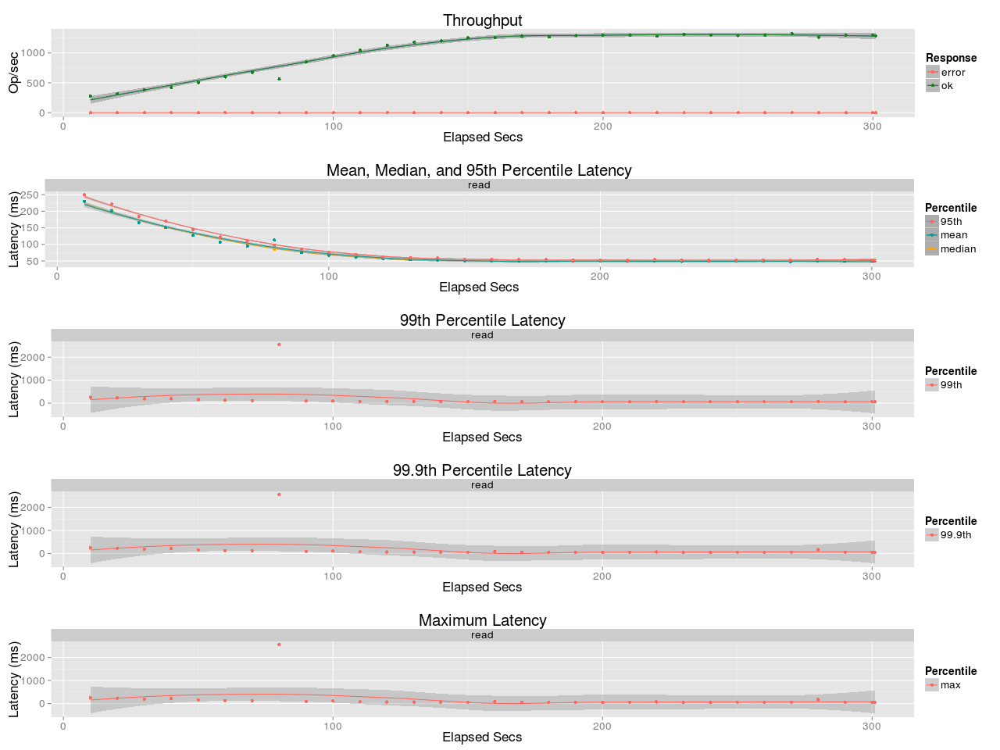
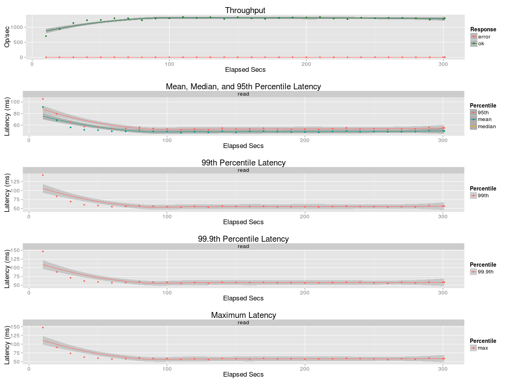

## Benchmark LeoFS v1.4.0-pre.3

### Purpose
Compare the NFS Performance of LeoFS 1.4.0-dev, GlusterFS, `nfs-kernel-server`

### Environment

* OS: Ubuntu Server 14.04.3
* Erlang/OTP: 17.5
* LeoFS: v1.4.0-pre.3-dev
* CPU: Intel Xeon E5-2630 v3 @ 2.40GHz
* HDD (node[36~40]) : 6x 15k rpm HDD RAID-0 are mounted at `/data/`, Ext4

```
 [System Confiuration]
-----------------------------------+----------
 Item                              | Value
-----------------------------------+----------
 Basic/Consistency level
-----------------------------------+----------
                    system version | 1.4.0-pre.3
                        cluster Id | leofs_1
                             DC Id | dc_1
                    Total replicas | 2
          number of successes of R | 1
          number of successes of W | 1
          number of successes of D | 1
 number of rack-awareness replicas | 0
                         ring size | 2^128
-----------------------------------+----------
 Multi DC replication settings
-----------------------------------+----------
        max number of joinable DCs | 2
           number of replicas a DC | 1
-----------------------------------+----------
 Manager RING hash
-----------------------------------+----------
                 current ring-hash | d2879e1f
                previous ring-hash | d2879e1f
-----------------------------------+----------

 [State of Node(s)]
-------+------------------------+--------------+----------------+----------------+----------------------------
 type  |          node          |    state     |  current ring  |   prev ring    |          updated at
-------+------------------------+--------------+----------------+----------------+----------------------------
  S    | S0@192.168.100.36      | running      | d2879e1f       | d2879e1f       | 2016-03-03 16:37:36 +0900
  S    | S1@192.168.100.37      | running      | d2879e1f       | d2879e1f       | 2016-03-03 16:37:36 +0900
  S    | S2@192.168.100.38      | running      | d2879e1f       | d2879e1f       | 2016-03-03 16:37:36 +0900
  S    | S3@192.168.100.39      | running      | d2879e1f       | d2879e1f       | 2016-03-03 16:37:36 +0900
  G    | G0@192.168.100.35      | running      | d2879e1f       | d2879e1f       | 2016-03-03 16:37:47 +0900
-------+------------------------+--------------+----------------+----------------+----------------------------
```

* basho-bench Configuration:
    * Duration: 5 minutes
    * # of concurrent processes: 64
    * # of keys: 10000 (20 directories x 500 objects)
    * Object Size: 128KB
    * basho_bench driver: [basho_bench_driver_layered_file.erl](https://github.com/windkit/basho_bench/blob/layered_file/src/basho_bench_driver_layered_file.erl)
    * Configuration file:
        * Load: [leofs/load/lfile_128k_load.conf)
        * Read: [leofs/read/lfile_dir20_f500_r100.conf)

* LeoFS Configuration:
    * Setup
        * Manager_0: [leo_manager_0.conf](conf/leo_manager_0.conf)
        * Manager_1: [leo_manager_1.conf](conf/leo_manager_1.conf)
        * Gateway  : [leo_gateway.conf](conf/leo_gateway_0.conf)
        * Storage[0~3] : [leo_storage.conf](conf/leo_storage_0.conf)
    * Mount Option
    ```bash
    $ sudo mount -t nfs -o vers=3,nolock 192.168.100.35:/test /mnt/leofs
    ```

* GlusterFS Configuration:
    * Setup
    ```bash
    $ sudo gluster volume create test-volume replica 2 transport tcp 192.168.100.36:/data/gluster/gv0 192.168.100.37:/data/gluster/gv0 192.168.100.38:/data/gluster/gv0 192.168.100.39:/data/gluster/gv0
    $ sudo gluster volume set test-volume nfs.disable off
    $ sudo gluster volume start test-volume
    ```
    * NFS-Ganesha Conf: [gluster_nfs4/export.conf]
    * Mount Option
    ```bash
    $ sudo mount -t nfs -o vers=3,nolock 192.168.100.40:/test-volume /mnt/leofs
    $ sudo mount -t glusterfs 192.168.100.40:/test-volume /mnt/leofs
    $ sudo mount -t nfs -o vers=4 192.168.100.40:/test-volume_pseudo /mnt/leofs
    ```

* `nfs-kernel-server` Configuration:
    * Setup
    ```bash
    ## /etc/exports
    /data/leofs/nfs *(rw,sync,no_subtree_check)
    ```
    * Mount Option
    ```bash
    $ sudo mount -t nfs -o vers=3,nolock 192.168.100.39:/data/leofs/nfs /mnt/leofs
    ```

### OPS and Latency:
#### Load
* LeoFS


* GlusterFS


* GlusterFS (Native Client)


* GlusterFS (NFS-Ganesha)


* `nfs-kernel-server`


#### Read
* LeoFS


* GlusterFS


* GlusterFS (Native Client)


* GlusterFS (NFS-Ganesha)


* `nfs-kernel-server`

