## Benchmark LeoFS v1.4.0-pre.3

### Purpose
We'va checked LeoFS 1.4.0-pre3 with erasure coding (ISA-L, RS {K=10, M=4}).

### Environment

* OS: Ubuntu Server 14.04.3
* Erlang/OTP: 17.5
* LeoFS: v1.4.0-pre.3
* LeoFS cluster settings:
* CPU: Intel Xeon E5-2630 v3 @ 2.40GHz

```
 [System Confiuration]
-----------------------------------+----------
 Item                              | Value    
-----------------------------------+----------
 Basic/Consistency level
-----------------------------------+----------
                    system version | 1.4.0-pre.3
                        cluster Id | leofs_1
                             DC Id | dc_1
                    Total replicas | 3
          number of successes of R | 1
          number of successes of W | 2
          number of successes of D | 2
 number of rack-awareness replicas | 0
                         ring size | 2^128
-----------------------------------+----------
 Multi DC replication settings
-----------------------------------+----------
        max number of joinable DCs | 2
           number of replicas a DC | 1
-----------------------------------+----------
 Manager RING hash
-----------------------------------+----------
                 current ring-hash | a92faf9f
                previous ring-hash | a92faf9f
-----------------------------------+----------

 [State of Node(s)]
-------+-------------------------------+--------------+----------------+----------------+----------------------------
 type  |             node              |    state     |  current ring  |   prev ring    |          updated at         
-------+-------------------------------+--------------+----------------+----------------+----------------------------
  S    |    node01@192.168.100.31      | running      | a92faf9f       | a92faf9f       | 2015-12-22 21:56:14 +0900
  S    |    node02@192.168.100.32      | running      | a92faf9f       | a92faf9f       | 2015-12-22 21:56:14 +0900
  S    |    node03@192.168.100.33      | running      | a92faf9f       | a92faf9f       | 2015-12-22 21:56:14 +0900
  S    |    node04@192.168.100.34      | running      | a92faf9f       | a92faf9f       | 2015-12-22 21:56:14 +0900
  S    |    node05@192.168.100.35      | running      | a92faf9f       | a92faf9f       | 2015-12-22 21:56:14 +0900
  G    |    node12@192.168.100.42      | running      | a92faf9f       | a92faf9f       | 2015-12-22 21:56:20 +0900
-------+-------------------------------+--------------+----------------+----------------+----------------------------


```

* basho-bench Configuration:
    * Duration: 60 minutes
    * # of concurrent processes: 32
    * # of keys: 100000
    * Value size groups(byte):
        *    16384..   65536: 50%
        * 10485760..15728640: 50%
    * basho_bench driver: [basho_bench_driver_leofs.erl](https://github.com/leo-project/basho_bench/blob/master/src/basho_bench_driver_leofs.erl)
    * Configuration file: [15m_r49w1_60min.conf](20151222_201741/15m_r49w1_60min.conf)

* LeoFS Configuration:
    * Manager_0: [leo_manager_0.conf](conf/leo_manager_0.conf)
    * Manager_1: [leo_manager_1.conf](conf/leo_manager_1.conf)
    * Gateway  : [leo_gateway.conf](conf/leo_gateway.conf)
    * Storage  : [leo_storage.conf](conf/leo_storage.conf)

### OPS and Latency:

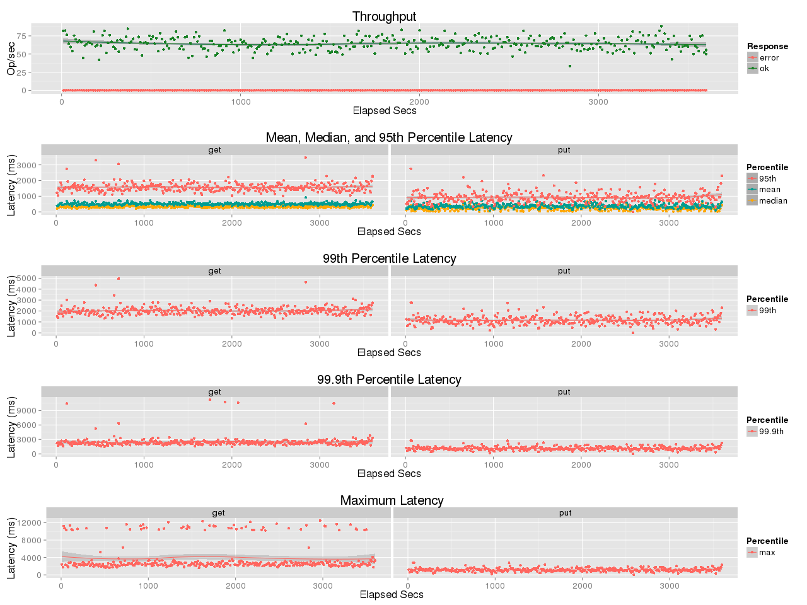

### Network Traffic
#### Chart of Every Node

* Gateway-1
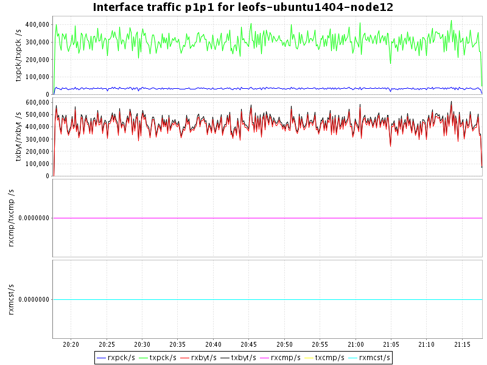

* Storage-1


* Storage-2
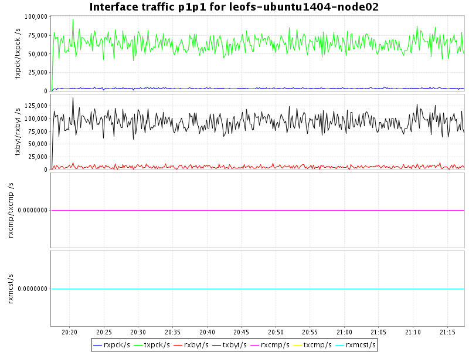

* Storage-3


* Storage-4
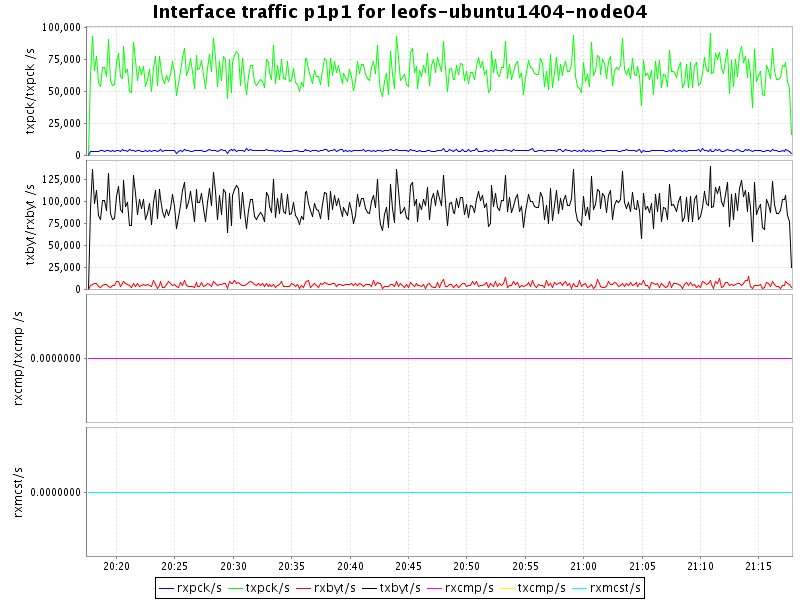

* Storage-5


### Disk
#### Chart of Every Node (Storage)

* Storage-1


* Storage-2

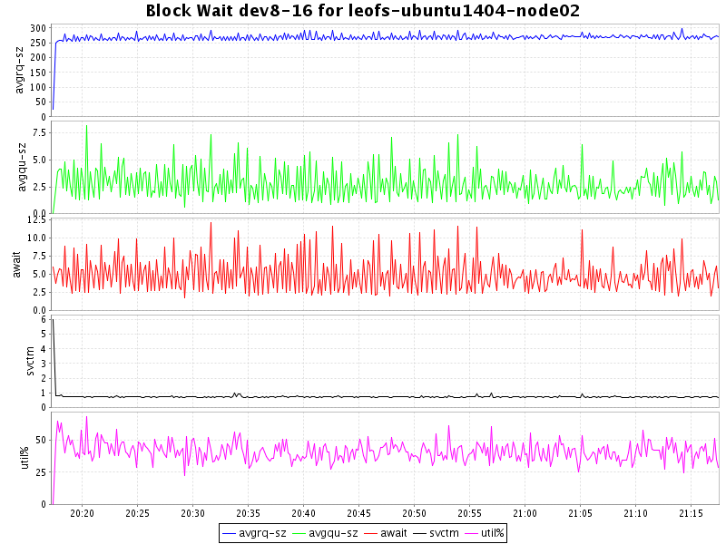

* Storage-3

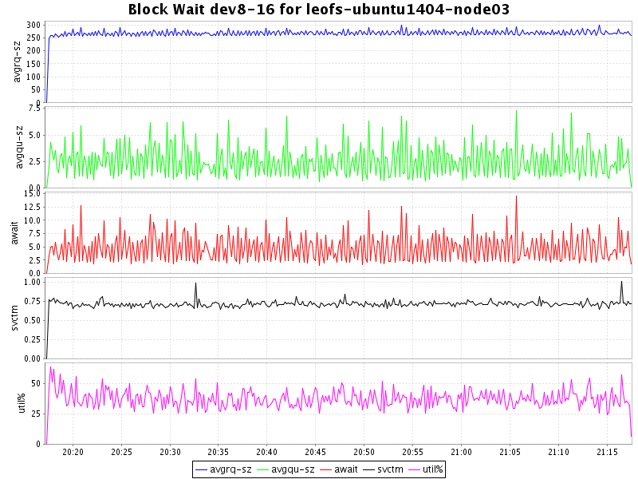

* Storage-4
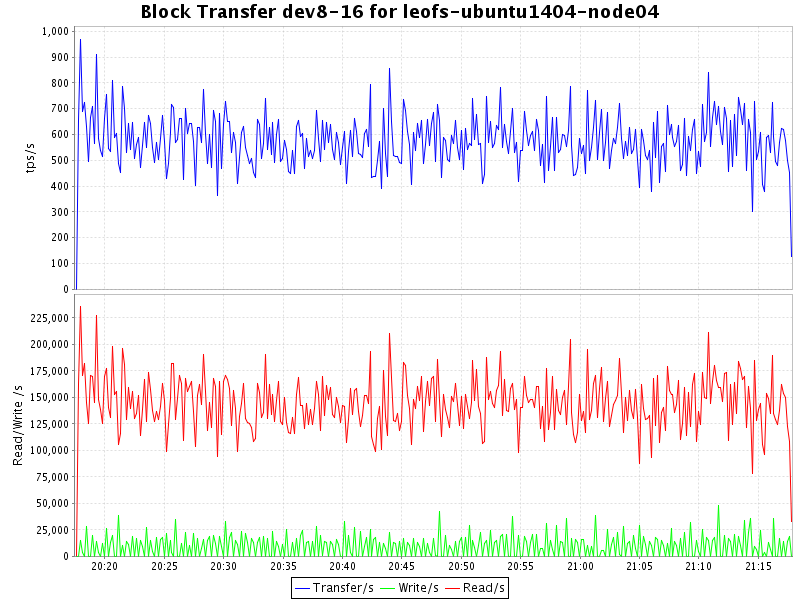
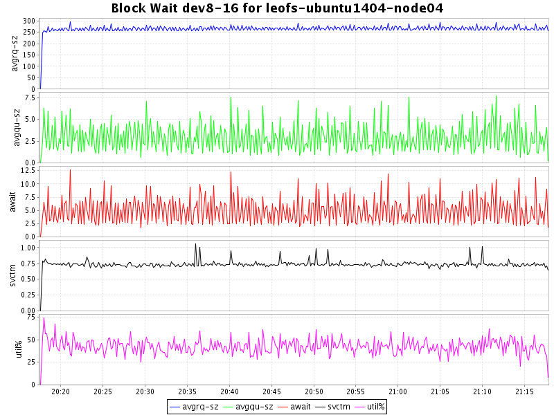

* Storage-5
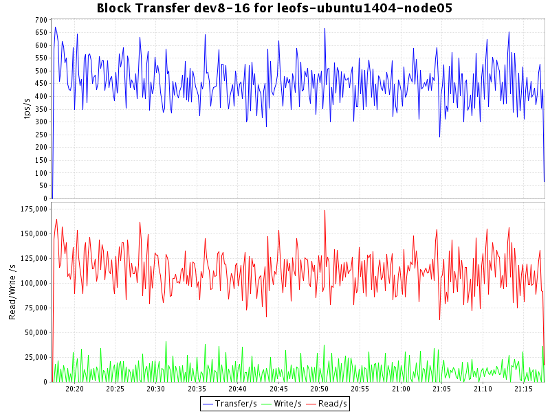
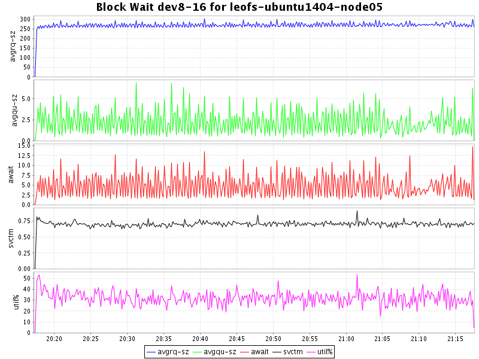


### CPU
#### Chart of Every Node

* Storage-1


* Storage-2


* Storage-3
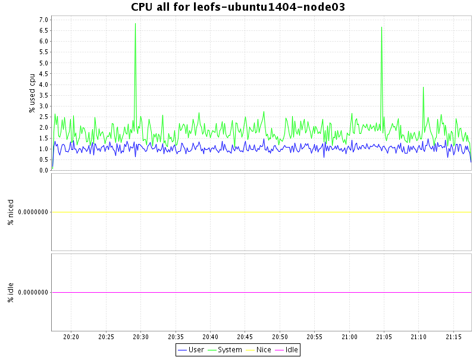

* Storage-4
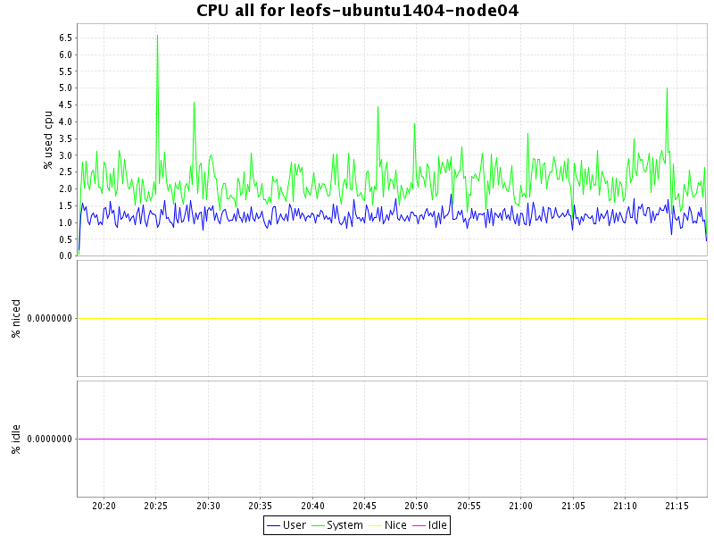

* Storage-5
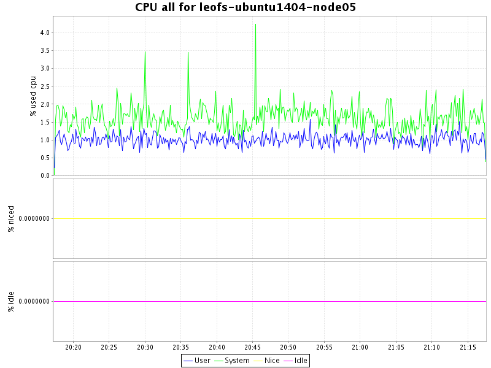

* Gateway-1
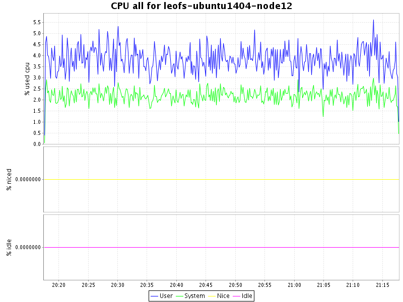


### Load
#### Chart of Every Node

* Storage-1


* Storage-2
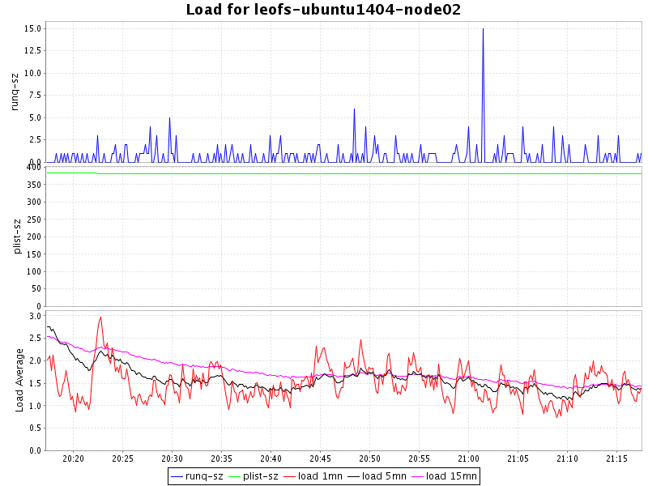

* Storage-3


* Storage-4
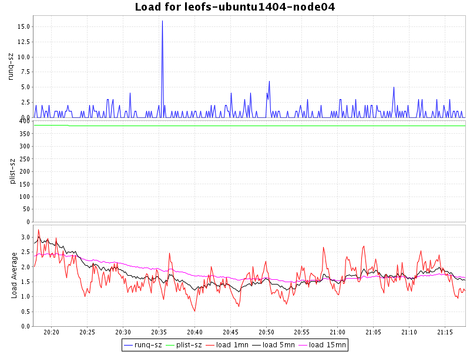

* Storage-5


* Gateway-1


