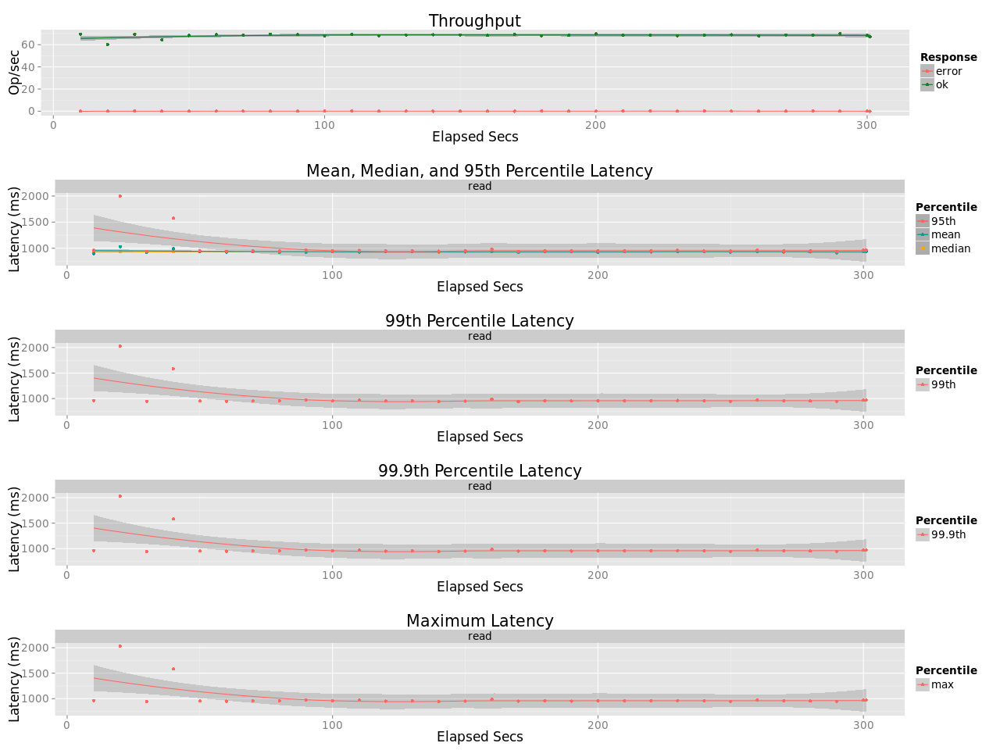

## Benchmark LeoFS v1.4.0-pre.3

### Purpose
We've checked NFS Performance of LeoFS 1.4.0-pre3-dev 

### Environment

* OS: Ubuntu Server 14.04.3
* Erlang/OTP: 17.5
* LeoFS: v1.4.0-pre.3-dev
* LeoFS cluster settings:
* CPU: Intel Xeon E5-2630 v3 @ 2.40GHz

```
 [System Confiuration]
-----------------------------------+----------
 Item                              | Value    
-----------------------------------+----------
 Basic/Consistency level
-----------------------------------+----------
                    system version | 1.4.0-pre.3
                        cluster Id | leofs_1
                             DC Id | dc_1
                    Total replicas | 2
          number of successes of R | 1
          number of successes of W | 1
          number of successes of D | 1
 number of rack-awareness replicas | 0
                         ring size | 2^128
-----------------------------------+----------
 Multi DC replication settings
-----------------------------------+----------
        max number of joinable DCs | 2
           number of replicas a DC | 1
-----------------------------------+----------
 Manager RING hash
-----------------------------------+----------
                 current ring-hash | d2879e1f
                previous ring-hash | d2879e1f
-----------------------------------+----------

 [State of Node(s)]
-------+------------------------+--------------+----------------+----------------+----------------------------
 type  |          node          |    state     |  current ring  |   prev ring    |          updated at         
-------+------------------------+--------------+----------------+----------------+----------------------------
  S    | S0@192.168.100.36      | running      | d2879e1f       | d2879e1f       | 2016-02-29 14:21:39 +0900
  S    | S1@192.168.100.37      | running      | d2879e1f       | d2879e1f       | 2016-02-29 14:21:39 +0900
  S    | S2@192.168.100.38      | running      | d2879e1f       | d2879e1f       | 2016-02-29 14:21:39 +0900
  S    | S3@192.168.100.39      | running      | d2879e1f       | d2879e1f       | 2016-02-29 14:21:39 +0900
  G    | G0@192.168.100.35      | running      | d2879e1f       | d2879e1f       | 2016-02-29 14:21:51 +0900
-------+------------------------+--------------+----------------+----------------+----------------------------

```

* basho-bench Configuration:
    * Duration: 5 minutes
    * # of concurrent processes: 64
    * # of keys: 10000 (20 directories x 500 objects)
    * Object Size: 128KB
    * basho_bench driver: [basho_bench_driver_layered_file.erl](https://github.com/windkit/basho_bench/blob/layered_file/src/basho_bench_driver_layered_file.erl)
    * Configuration file:
        * Load: [leofs/load/lfile_128k_load.conf)
        * Read: [leofs/read/lfile_dir20_f500_r100.conf)

* LeoFS Configuration:
    * Manager_0: [leo_manager_0.conf](conf/leo_manager_0.conf)
    * Manager_1: [leo_manager_1.conf](conf/leo_manager_1.conf)
    * Gateway  : [leo_gateway.conf](conf/leo_gateway_0.conf)
    * Storage  : [leo_storage.conf](conf/leo_storage_0.conf)

### OPS and Latency:
#### Load


#### Read

