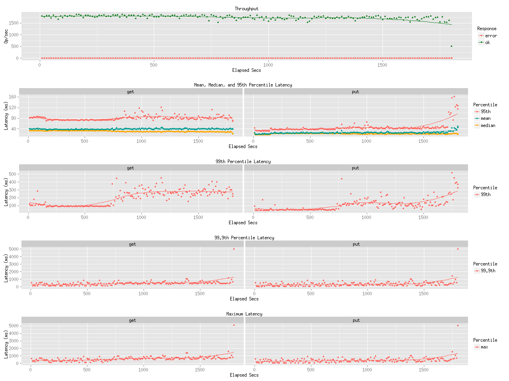

Title
=====

Benchmark result for leofs-1.0.1rc on 10Gbps

Env
===

* bacho_bench (benchmarker)
    * Configuration:
        * key_generator:
            * type: pareto_int
            * max key: 100000
        * value_generator:
            * type: exponential_bin
            * min-size: 8192
            * mean-size: 131072 - 1048576
        * [see more](tests/)

* LeoFS
    * OS: CentOS release 6.5 (Final)
    * Kernel: Linux leofs12.rit.rakuten.com 2.6.32-431.el6.x86_64 #1 SMP Fri Nov 22 03:15:09 UTC 2013 x86_64 x86_64 x86_64 GNU/Linux
    * Erlang: R16B03-1
    * LeoFS:  1.0.1rc

* LeoFS cluster settings

```
    [System config]
                    System version : 1.0.1
                        Cluster Id : leofs_1
                             DC Id : dc_1
                    Total replicas : 3
               # of successes of R : 1
               # of successes of W : 2
               # of successes of D : 2
    # of DC-awareness replicas    : 1
    # of Rack-awareness replicas  : 0
                         ring size : 2^128
                 Current ring hash : e66e265a
                    Prev ring hash : e66e265a
    
    [Node(s) state]
    -------+-------------------------------+--------------+----------------+----------------+----------------------------
     type  |             node              |    state     |  current ring  |   prev ring    |          updated at         
    -------+-------------------------------+--------------+----------------+----------------+----------------------------
      S    | storage_0@192.168.100.14      | running      | e592c9bc       | e592c9bc       | 2014-05-02 17:36:35 +0900
      S    | storage_0@192.168.100.15      | running      | e592c9bc       | e592c9bc       | 2014-05-02 17:36:35 +0900
      S    | storage_0@192.168.100.16      | running      | e592c9bc       | e592c9bc       | 2014-05-02 17:36:35 +0900
      S    | storage_0@192.168.100.17      | running      | e592c9bc       | e592c9bc       | 2014-05-02 17:36:35 +0900
      S    | storage_0@192.168.100.18      | running      | e592c9bc       | e592c9bc       | 2014-05-02 17:36:35 +0900
      G    | gateway_0@192.168.100.13      | running      | e592c9bc       | e592c9bc       | 2014-05-02 17:36:36 +0900
```

Result
======
* Bulk Load with 128K

* Read:Write = 8:2 with 128K

* Bulk Load with 512K

* Read:Write = 8:2 with 512K

* Bulk Load with 1M

* Read:Write = 8:2 with 1M


Conclusion
==========
We have been keeping the same performance with the new version LeoFS.
