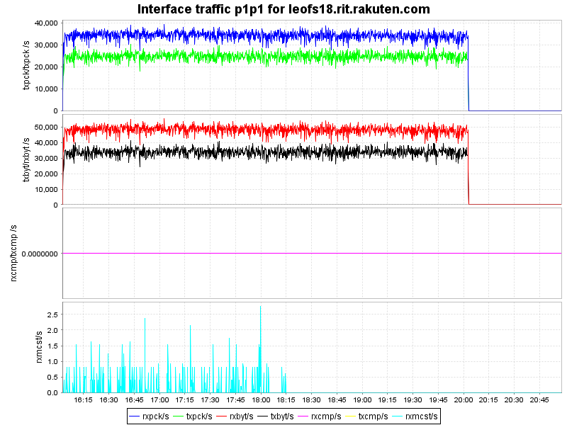

## Benchmark LeoFS v1.0.2 on June 2nd

### Environment

* OS: CentOS release 6.5 (Final)
* Erlang/OTP: R16B03-1
* LeoFS: v1.0.2
* LeoFS cluster settings:

```
[System config]
                System version : 1.0.2
                    Cluster Id : leofs_1
                         DC Id : dc_1
                Total replicas : 3
           # of successes of R : 1
           # of successes of W : 2
           # of successes of D : 2
 # of DC-awareness replicas    : 0
                     ring size : 2^128
             Current ring hash : d02a43c0
                Prev ring hash : d02a43c0
[Multi DC replication settings]
         max # of joinable DCs : 2
            # of replicas a DC : 1

[Node(s) state]
-------+-----------------------------+--------------+----------------+----------------+----------------------------
 type  |            node             |    state     |  current ring  |   prev ring    |          updated at
-------+-----------------------------+--------------+----------------+----------------+----------------------------
  S    | leofs14@192.168.100.14      | running      | d02a43c0       | d02a43c0       | 2014-05-27 14:54:44 +0900
  S    | leofs15@192.168.100.15      | running      | d02a43c0       | d02a43c0       | 2014-05-27 14:54:44 +0900
  S    | leofs16@192.168.100.16      | running      | d02a43c0       | d02a43c0       | 2014-05-27 14:54:44 +0900
  S    | leofs17@192.168.100.17      | running      | d02a43c0       | d02a43c0       | 2014-05-27 14:54:44 +0900
  S    | leofs18@192.168.100.18      | running      | d02a43c0       | d02a43c0       | 2014-05-27 14:54:44 +0900
  G    | leofs13@192.168.100.13      | running      | d02a43c0       | d02a43c0       | 2014-05-27 14:55:07 +0900
```

* basho-bench Configuration:
    * Duration: 4hours
    * # of concurrent processes: 64
    * # of keys
    * Value size groups(byte):
        *   1024..10240:   24%
        *  10241..102400:  30%
        * 102401..819200:  30%
        * 819201.. 1572864:16%
    * basho_bench driver: [basho_bench_driver_leofs.erl](https://github.com/leo-project/leofs/blob/develop/test/src/basho_bench_driver_leofs.erl)
    * Configuration file: [1m_r9w1_240min.conf](https://github.com/leo-project/notes/blob/master/leofs/benchmark/leofs/20140602/tests/1m_r9w1_240min_avs4/20140602_100434/1m_r9w1_240min.conf)

### OPS and Latency:


### Network Traffic
#### Chart of Each Nodes

* Gateway


* Storage-1


* Storage-2


* Storage-3


* Storage-4


* Storage-5


#### Symmary

* Total of network traffic: 5.64Gbps
* Itemized results:

   Node   |Read(MB/s)|Write(MB/s)|Total(MB/s)
----------|---------:|----------:|---------------:
storage_0 |       31 |        20 |       51
storage_1 |       27 |        19 |       46
storage_2 |       26 |        19 |       45
storage_3 |       27 |        19 |       46
storage_4 |       27 |        20 |       47
gateway_0 |       48 |       440 |      488
total     |      186 |       537 |      723

* basho-bench Configuration:
    * Duration: 4hours
    * # of concurrent processes: 64
    * # of keys
    * Value size groups(byte):
        *   512KB:   100%
    * basho_bench driver: [basho_bench_driver_leofs.erl](https://github.com/leo-project/leofs/blob/develop/test/src/basho_bench_driver_leofs.erl)
    * Configuration file: [1m_r9w1_240min.conf](tests/512k_r9w1_240min/20140602_160310/512k_r9w1_240min.conf)

### OPS and Latency:


### Network Traffic
#### Chart of Each Nodes

* Gateway


* Storage-1


* Storage-2


* Storage-3


* Storage-4


* Storage-5



#### Symmary

* Total of network traffic: 9.93Gbps
* Itemized results:

   Node   |Read(MB/s)|Write(MB/s)|Total(MB/s)
----------|---------:|----------:|---------------:
storage_0 |       53 |        33 |        86
storage_1 |       46 |        32 |        78
storage_2 |       47 |        33 |        80
storage_3 |       48 |        33 |        81
storage_4 |       48 |        35 |        83
gateway_0 |       83 |       781 |       864
total     |      325 |       947 |      1272
