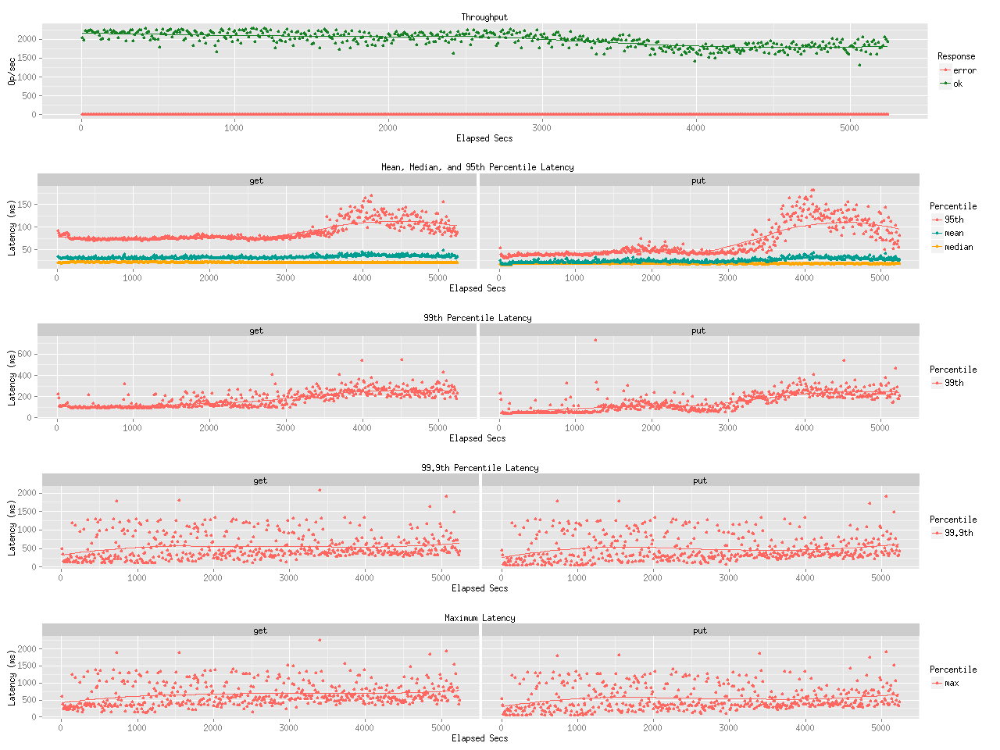
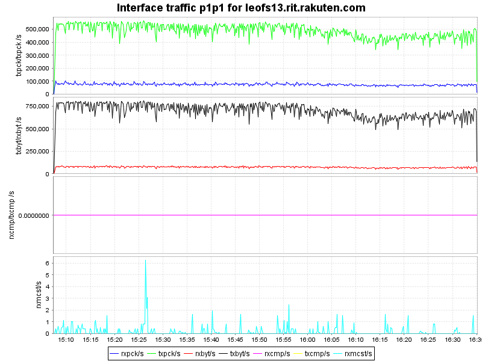
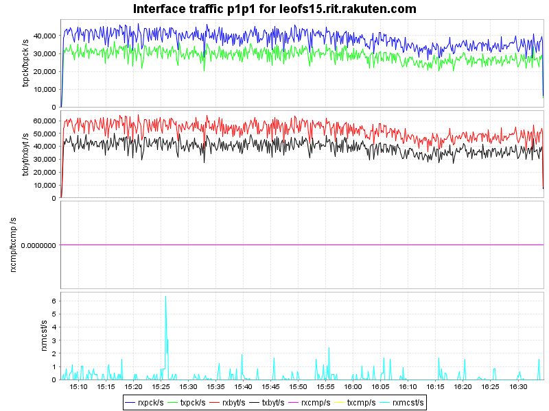

## Benchmark LeoFS v1.0.2 on June 2nd

### Environment

* OS: CentOS release 6.5 (Final)
* Erlang/OTP: R16B03-1
* LeoFS: v1.0.2
* LeoFS cluster settings:

```
[System config]
                System version : 1.0.2
                    Cluster Id : leofs_1
                         DC Id : dc_1
                Total replicas : 3
           # of successes of R : 1
           # of successes of W : 2
           # of successes of D : 2
 # of DC-awareness replicas    : 0
                     ring size : 2^128
             Current ring hash : faa4b283
                Prev ring hash : faa4b283
[Multi DC replication settings]
         max # of joinable DCs : 2
            # of replicas a DC : 1

[Node(s) state]
-------+-----------------------------+--------------+----------------+----------------+----------------------------
 type  |            node             |    state     |  current ring  |   prev ring    |          updated at
-------+-----------------------------+--------------+----------------+----------------+----------------------------
  S    | leofs14@192.168.100.14      | running      | faa4b283       | faa4b283       | 2014-06-03 15:04:01 +0900
  S    | leofs15@192.168.100.15      | running      | faa4b283       | faa4b283       | 2014-06-03 15:04:01 +0900
  S    | leofs16@192.168.100.16      | running      | faa4b283       | faa4b283       | 2014-06-03 15:04:01 +0900
  S    | leofs17@192.168.100.17      | running      | faa4b283       | faa4b283       | 2014-06-03 15:04:01 +0900
  G    | leofs13@192.168.100.13      | running      | faa4b283       | faa4b283       | 2014-06-03 15:04:18 +0900
```

* basho-bench Configuration:
    * Duration: 90 minutes
    * # of concurrent processes: 32
    * # of keys
    * Value size groups(byte):
        *   1024..10240:   24%
        *  10241..102400:  30%
        * 102401..819200:  30%
        * 819201.. 1572864:16%
    * basho_bench driver: [basho_bench_driver_leofs.erl](https://github.com/leo-project/leofs/blob/develop/test/src/basho_bench_driver_leofs.erl)
    * Configuration file: [1m_r9w1_240min.conf](tests/1m_r9w1_ssd/20140603_150724/1m_r9w1_240min.conf)

### OPS and Latency:



### Network Traffic
#### Chart of Each Nodes

* Gateway


* Storage-1


* Storage-2


* Storage-3


* Storage-4


#### Symmary

* Total of network traffic: 8.48Gbps
* Itemized results:

   Node   |Read(MB/s)|Write(MB/s)|Total(MB/s)
----------|---------:|----------:|---------------:
storage_0 |       54 |        34 |       88
storage_1 |       49 |        37 |       86
storage_2 |       49 |        34 |       83
storage_3 |       47 |        31 |       78
gateway_0 |       68 |       683 |      751
total     |      267 |       819 |     1086
