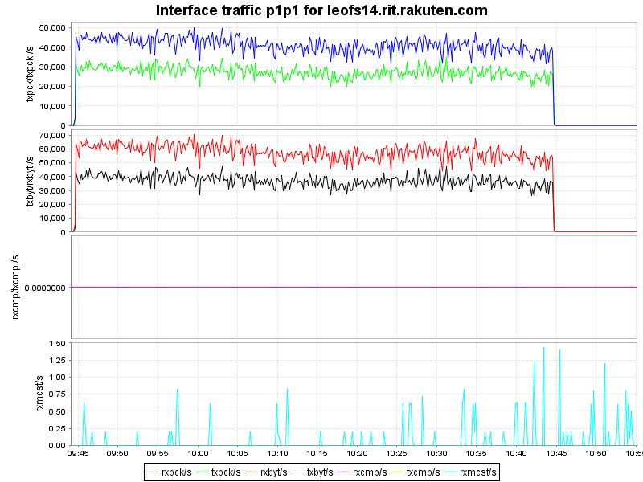
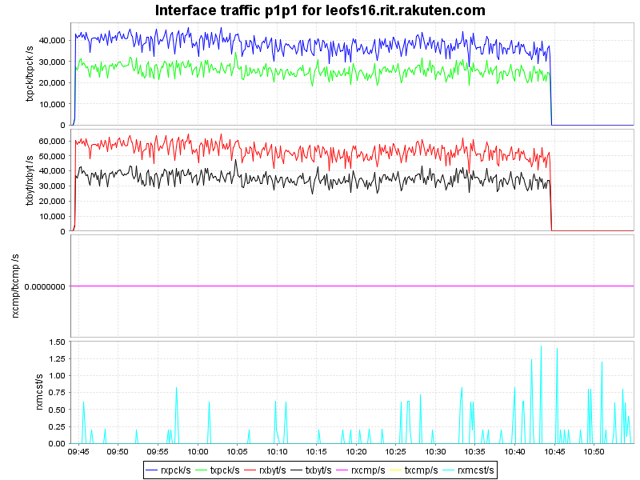
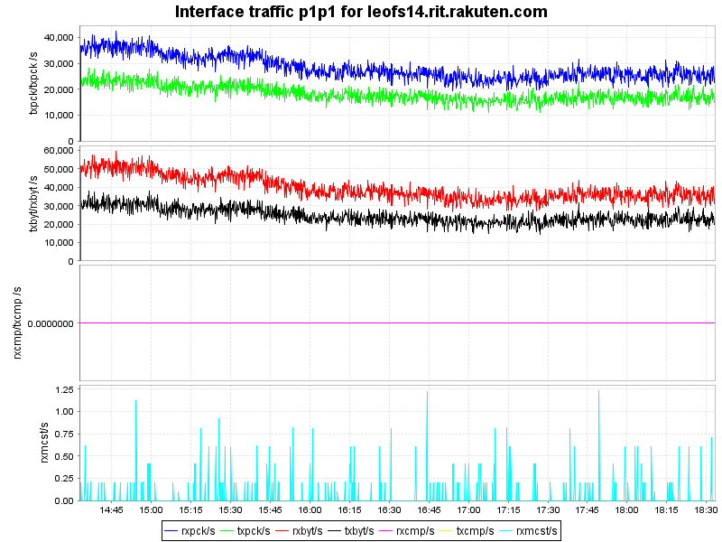
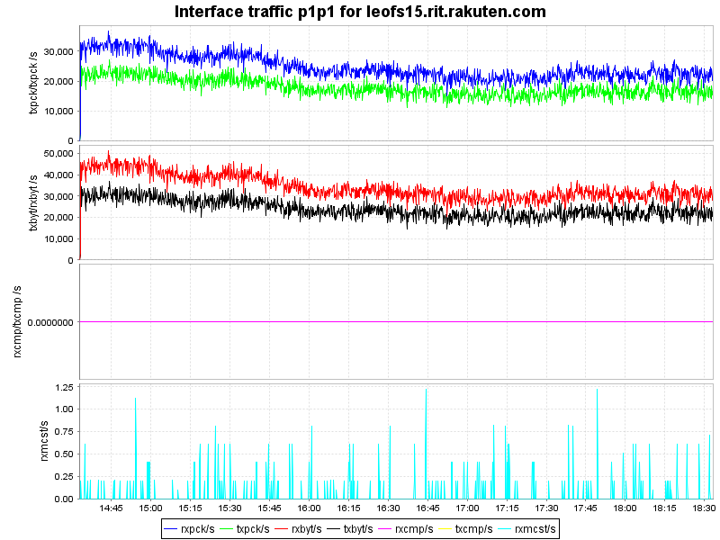
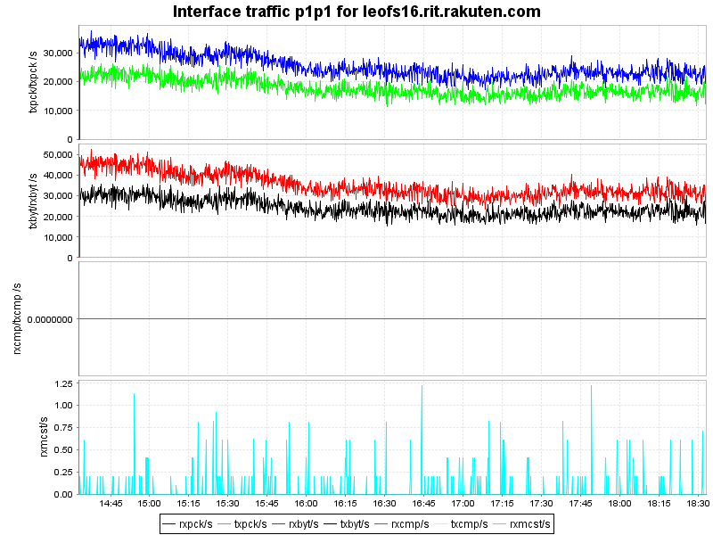
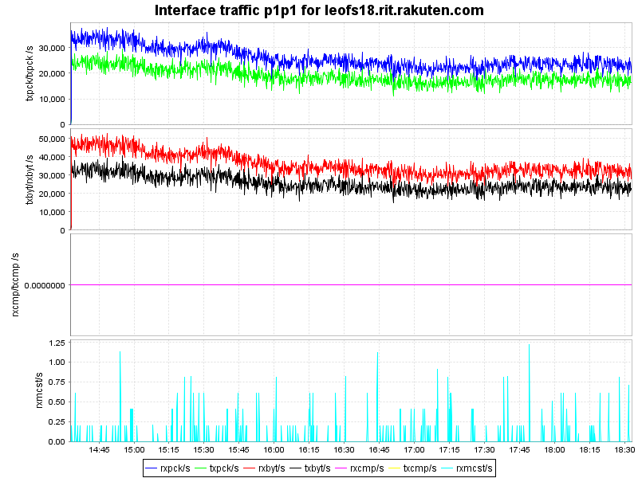

## Benchmark LeoFS v1.0.2 on June 4th

### Environment

* OS: CentOS release 6.5 (Final)
* Erlang/OTP: R16B03-1
* LeoFS: v1.0.2
* LeoFS cluster settings:

```
[System config]
                System version : 1.0.2
                    Cluster Id : leofs_1
                         DC Id : dc_1
                Total replicas : 3
           # of successes of R : 1
           # of successes of W : 2
           # of successes of D : 2
 # of DC-awareness replicas    : 0
                     ring size : 2^128
             Current ring hash : faa4b283
                Prev ring hash : faa4b283
[Multi DC replication settings]
         max # of joinable DCs : 2
            # of replicas a DC : 1

[Node(s) state]
-------+-----------------------------+--------------+----------------+----------------+----------------------------
 type  |            node             |    state     |  current ring  |   prev ring    |          updated at
-------+-----------------------------+--------------+----------------+----------------+----------------------------
  S    | leofs14@192.168.100.14      | running      | faa4b283       | faa4b283       | 2014-06-03 15:04:01 +0900
  S    | leofs15@192.168.100.15      | running      | faa4b283       | faa4b283       | 2014-06-03 15:04:01 +0900
  S    | leofs16@192.168.100.16      | running      | faa4b283       | faa4b283       | 2014-06-03 15:04:01 +0900
  S    | leofs17@192.168.100.17      | running      | faa4b283       | faa4b283       | 2014-06-03 15:04:01 +0900
  G    | leofs13@192.168.100.13      | running      | faa4b283       | faa4b283       | 2014-06-03 15:04:18 +0900
```

* basho-bench Configuration:
    * Duration: 90 minutes
    * # of concurrent processes: 64
    * # of keys
    * Value size groups(byte):
        *   1024..10240:   24%
        *  10241..102400:  30%
        * 102401..819200:  30%
        * 819201.. 1572864:16%
    * basho_bench driver: [basho_bench_driver_leofs.erl](https://github.com/leo-project/leofs/blob/develop/test/src/basho_bench_driver_leofs.erl)
    * Configuration file: [1m_r9w1_60min.conf](tests/1m_r9w1_60min/20140604_094456/1m_r9w1_60min.conf)

### OPS and Latency:


### Network Traffic
#### Chart of Each Nodes

* Gateway


* Storage-1


* Storage-2


* Storage-3


* Storage-4


#### Symmary

* Total of network traffic: 8.52Gbps
* Itemized results:

   Node   |Read(MB/s)|Write(MB/s)|Total(MB/s)
----------|---------:|----------:|---------------:
storage_0 |       55 |        36 |        91 
storage_1 |       51 |        38 |        89
storage_2 |       51 |        33 |        84
storage_3 |       51 |        32 |        83
gateway_0 |       70 |       674 |       744
total     |      278 |       813 |      1091

### Environment

* OS: CentOS release 6.5 (Final)
* Erlang/OTP: R16B03-1
* LeoFS: v1.0.2
* LeoFS cluster settings:

```
[System config]
                System version : 1.0.2
                    Cluster Id : leofs_1
                         DC Id : dc_1
                Total replicas : 3
           # of successes of R : 1
           # of successes of W : 2
           # of successes of D : 2
 # of DC-awareness replicas    : 0
                     ring size : 2^128
             Current ring hash : faa4b283
                Prev ring hash : faa4b283
[Multi DC replication settings]
         max # of joinable DCs : 2
            # of replicas a DC : 1

[Node(s) state]
-------+-----------------------------+--------------+----------------+----------------+----------------------------
 type  |            node             |    state     |  current ring  |   prev ring    |          updated at
-------+-----------------------------+--------------+----------------+----------------+----------------------------
  S    | leofs14@192.168.100.14      | running      | faa4b283       | faa4b283       | 2014-06-03 15:04:01 +0900
  S    | leofs15@192.168.100.15      | running      | faa4b283       | faa4b283       | 2014-06-03 15:04:01 +0900
  S    | leofs16@192.168.100.16      | running      | faa4b283       | faa4b283       | 2014-06-03 15:04:01 +0900
  S    | leofs17@192.168.100.17      | running      | faa4b283       | faa4b283       | 2014-06-03 15:04:01 +0900
  S    | leofs18@192.168.100.18      | running      | faa4b283       | faa4b283       | 2014-06-03 15:04:01 +0900
  G    | leofs13@192.168.100.13      | running      | faa4b283       | faa4b283       | 2014-06-03 15:04:18 +0900
```

* basho-bench Configuration:
    * Duration: 240 minutes (HDD version)
    * # of concurrent processes: 64
    * # of keys
    * Value size groups(byte):
        *   1024..10240:   24%
        *  10241..102400:  30%
        * 102401..819200:  30%
        * 819201.. 1572864:16%
    * basho_bench driver: [basho_bench_driver_leofs.erl](https://github.com/leo-project/leofs/blob/develop/test/src/basho_bench_driver_leofs.erl)
    * Configuration file: [1m_r9w1_240min.conf](tests/1m_r9w1_240min/20140604_143332/1m_r9w1_240min.conf)

### OPS and Latency:


### Network Traffic
#### Chart of Each Nodes

* Gateway


* Storage-1


* Storage-2


* Storage-3


* Storage-4


* Storage-5



#### Symmary

* Total of network traffic: 6.60Gbps
* Itemized results:

   Node   |Read(MB/s)|Write(MB/s)|Total(MB/s)
----------|---------:|----------:|---------------:
storage_0 |       36 |        22 |        58
storage_1 |       31 |        22 |        53
storage_2 |       31 |        22 |        53
storage_3 |       32 |        22 |        54
storage_4 |       32 |        23 |        55
gateway_0 |       59 |       513 |       572
total     |      221 |       624 |       845

