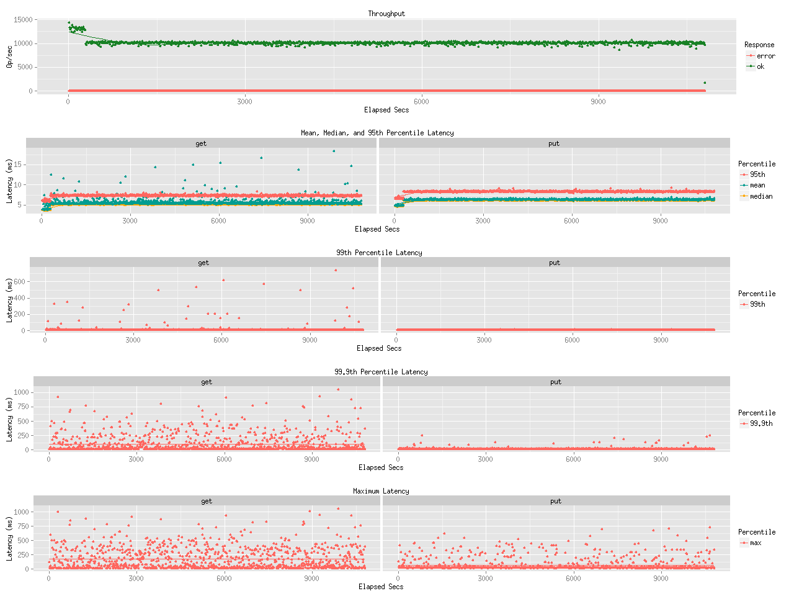
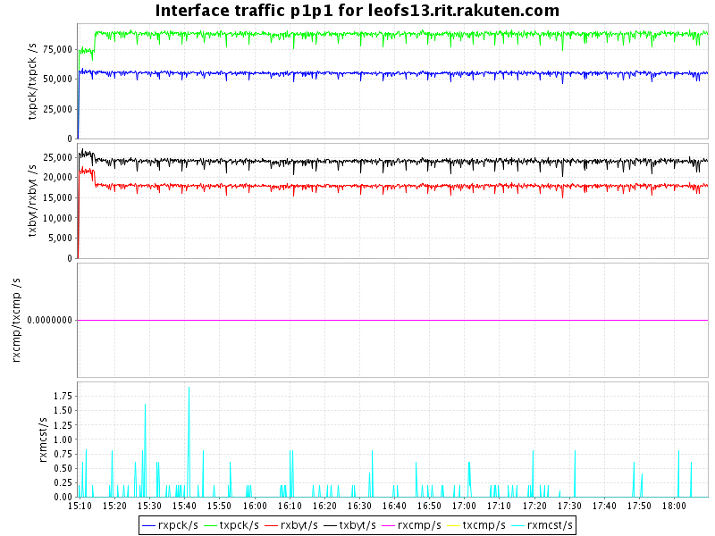
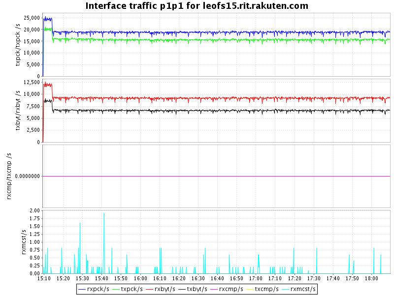
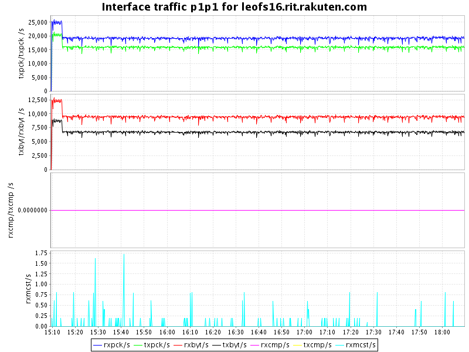
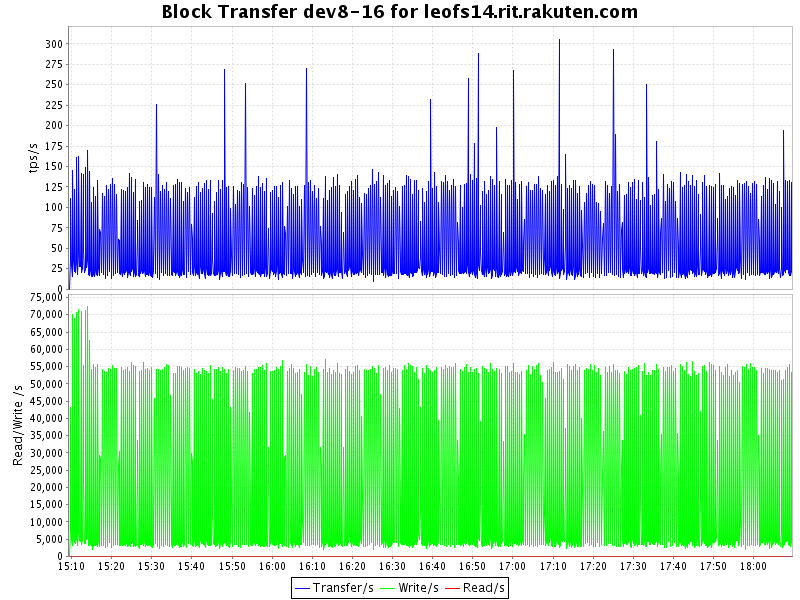
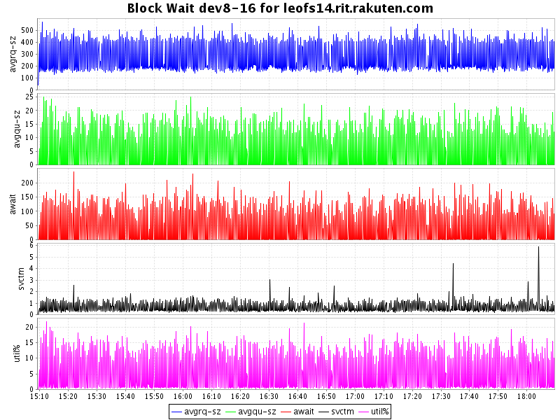
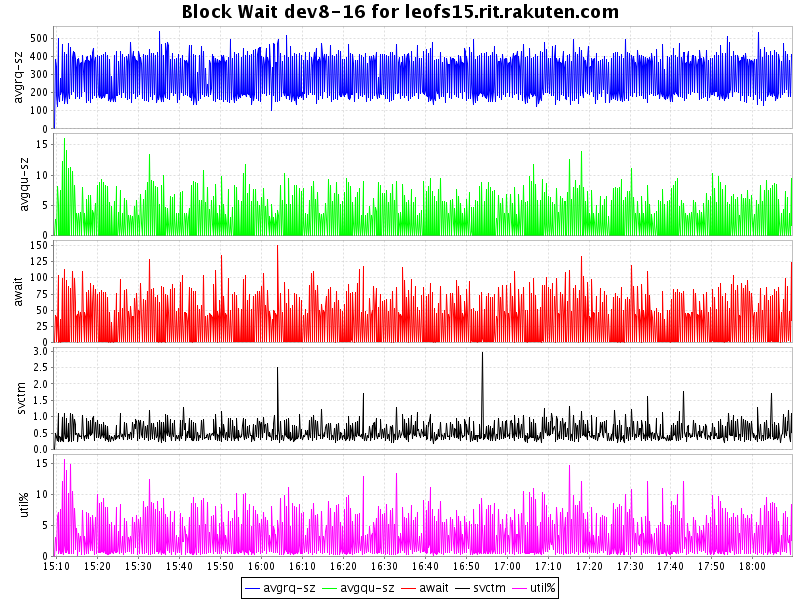
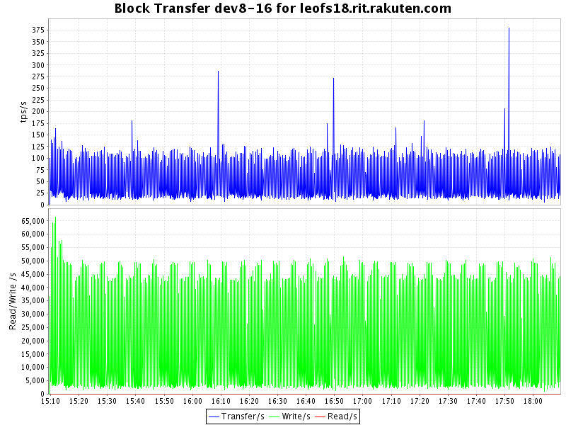
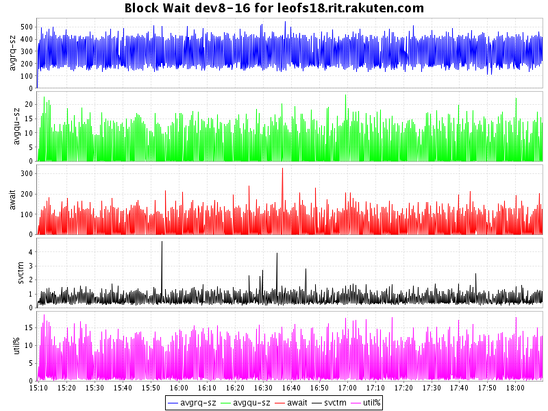

## Benchmark LeoFS v1.1.5

### Environment

* OS: CentOS release 6.5 (Final)
* Erlang/OTP: R16B03-1
* LeoFS: v1.1.5
* LeoFS cluster settings:

```
[System config]
                System version : 1.1.5
                    Cluster Id : leofs_1
                         DC Id : dc_1
                Total replicas : 3
           # of successes of R : 1
           # of successes of W : 2
           # of successes of D : 2
 # of DC-awareness replicas    : 0
                     ring size : 2^128
             Current ring hash : c5961056
                Prev ring hash : c5961056
[Multi DC replication settings]
         max # of joinable DCs : 2
            # of replicas a DC : 1

[Node(s) state]
-------+-----------------------------+--------------+----------------+----------------+----------------------------
 type  |            node             |    state     |  current ring  |   prev ring    |          updated at         
-------+-----------------------------+--------------+----------------+----------------+----------------------------
  S    | leofs14@192.168.100.14      | running      | c5961056       | c5961056       | 2014-10-17 15:08:46 +0900
  S    | leofs15@192.168.100.15      | running      | c5961056       | c5961056       | 2014-10-17 15:08:46 +0900
  S    | leofs16@192.168.100.16      | running      | c5961056       | c5961056       | 2014-10-17 15:08:46 +0900
  S    | leofs17@192.168.100.17      | running      | c5961056       | c5961056       | 2014-10-17 15:08:46 +0900
  S    | leofs18@192.168.100.18      | running      | c5961056       | c5961056       | 2014-10-17 15:08:46 +0900
  G    | leofs13@192.168.100.13      | running      | c5961056       | c5961056       | 2014-10-17 15:08:51 +0900

```

* basho-bench Configuration:
    * Duration: 180 minutes
    * # of concurrent processes: 64
    * # of keys
    * Value size groups(byte):
        *   2560..3584:  25%
        *    384.. 640:  75%
    * basho_bench driver: [basho_bench_driver_leofs.erl](https://github.com/leo-project/leofs/blob/develop/test/src/basho_bench_driver_leofs.erl)
    * Configuration file: [3k_r1w28_180min.conf](20141017_150923/3k_r1w28_180min.conf)

### OPS and Latency:



### Network Traffic
#### Chart of Each Nodes

* Gateway-1


* Storage-1


* Storage-2


* Storage-3


* Storage-4


* Storage-5


### Disk
#### Chart of Each Nodes (Storage)

* Storage-1



* Storage-2



* Storage-3


* Storage-4


* Storage-5




#### Summary

* Total of network traffic: 0.96 Gbps
* Itemized results:

   Node   |Read(MB/s)|Write(MB/s)|Total(MB/s)
----------|---------:|----------:|---------------:
storage_0 |     10.5 |       6.8 |      17.3
storage_1 |      9.1 |       6.5 |      15.6
storage_2 |      9.4 |       6.6 |      16.0
storage_3 |      9.5 |       6.6 |      16.1
storage_4 |      9.6 |       7.1 |      16.7
gateway_0 |     17.8 |      23.7 |      41.5
total     |     65.9 |      57.3 |     123.2
