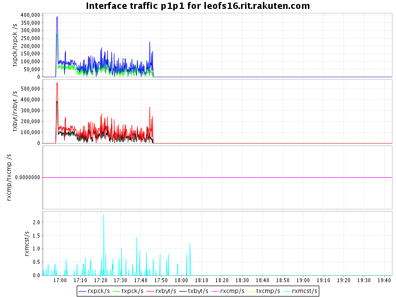
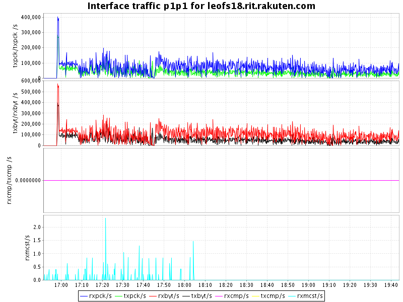
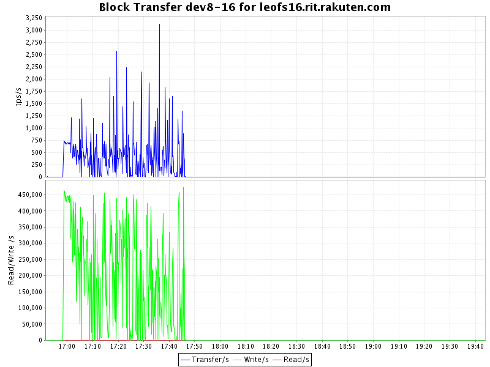

## Benchmark LeoFS v1.2.0-pre1

### Environment

* OS: CentOS release 6.5 (Final)
* Erlang/OTP: R16B03-1
* LeoFS: v1.2.0-pre1
* LeoFS cluster settings:

```
[System config]
                System version : 1.2.0-pre1
                    Cluster Id : leofs_1
                         DC Id : dc_1
                Total replicas : 3
           # of successes of R : 1
           # of successes of W : 2
           # of successes of D : 2
 # of DC-awareness replicas    : 0
                     ring size : 2^128
             Current ring hash : 22ee435b
                Prev ring hash : 22ee435b
[Multi DC replication settings]
         max # of joinable DCs : 2
            # of replicas a DC : 1

[Node(s) state]
-------+-----------------------------+--------------+----------------+----------------+----------------------------
 type  |            node             |    state     |  current ring  |   prev ring    |          updated at         
-------+-----------------------------+--------------+----------------+----------------+----------------------------
  S    | leofs14@192.168.100.14      | stop         |                |                | 2014-10-23 17:45:37 +0900
  S    | leofs15@192.168.100.15      | running      | 22ee435b       | 22ee435b       | 2014-10-23 16:51:31 +0900
  S    | leofs16@192.168.100.16      | stop         |                |                | 2014-10-23 17:45:54 +0900
  S    | leofs17@192.168.100.17      | running      | 22ee435b       | 22ee435b       | 2014-10-23 16:51:31 +0900
  S    | leofs18@192.168.100.18      | running      | 22ee435b       | 22ee435b       | 2014-10-23 19:11:47 +0900
  G    | leofs13@192.168.100.13      | running      | 22ee435b       | 22ee435b       | 2014-10-23 16:51:36 +0900

```

* basho-bench Configuration:
    * Duration: ? minutes
    * # of concurrent processes: 64
    * # of keys
    * Value size groups(byte):
        * 52428800..104857600: 100%
    * basho_bench driver: [basho_bench_driver_leofs.erl](https://github.com/leo-project/leofs/blob/develop/test/src/basho_bench_driver_leofs.erl)
    * Configuration file: [100m_load.conf](20141023_165140/100m_load.conf)

### OPS and Latency:


### Network Traffic
#### Chart of Each Nodes

* Gateway-1


* Storage-1


* Storage-2


* Storage-3


* Storage-4


* Storage-5



### Disk
#### Chart of Each Nodes (Storage)

* Storage-1


* Storage-2


* Storage-3



* Storage-4


* Storage-5


#### Summary

* Total of network traffic:  .  Gbps
* Itemized results:

   Node   |Read(MB/s)|Write(MB/s)|Total(MB/s)
----------|---------:|----------:|---------------:
          |          |           |
total     |          |           |
