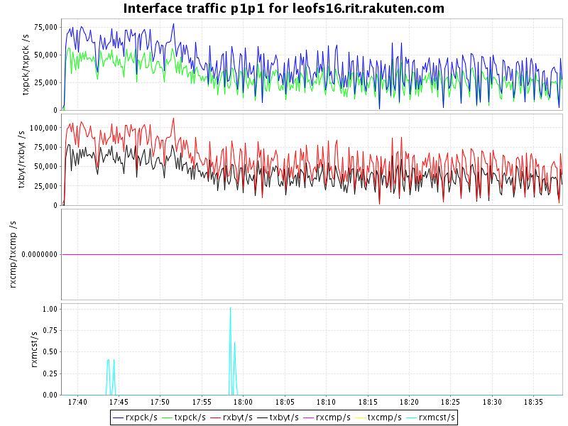
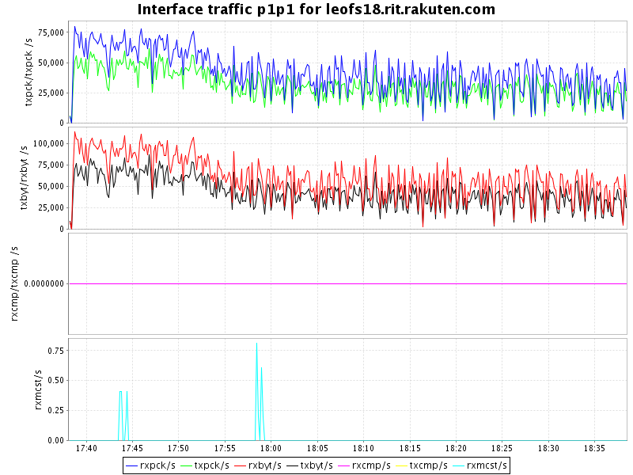
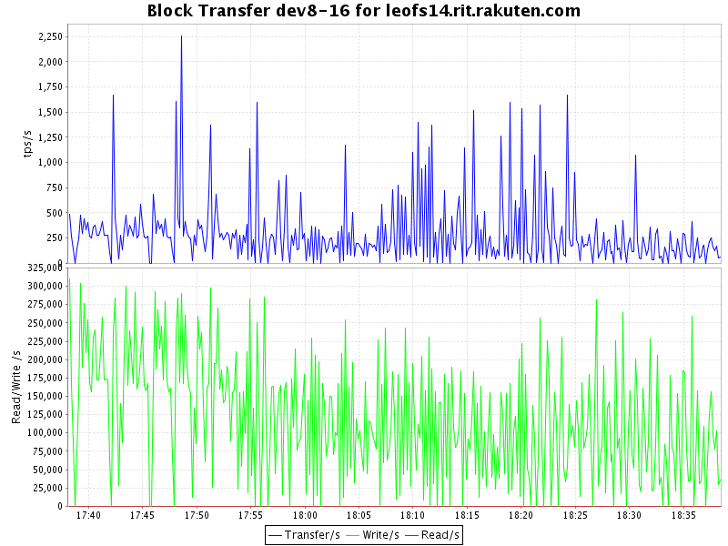
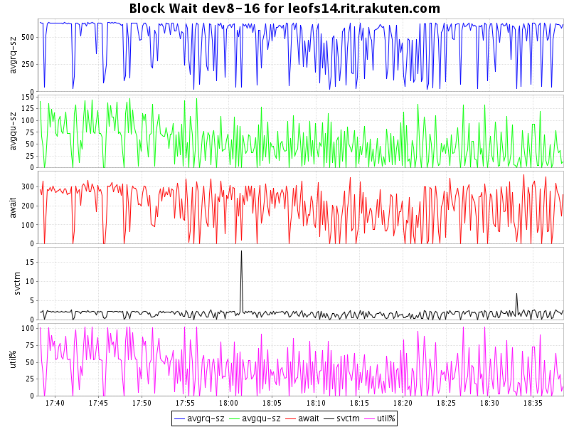

## Benchmark LeoFS v1.2.0 with watchdog

### Environment

* OS: CentOS release 6.5 (Final)
* Erlang/OTP: R16B03-1
* LeoFS: v1.2.0
* LeoFS cluster settings:

```
[System config]
                System version : 1.2.0
                    Cluster Id : leofs_1
                         DC Id : dc_1
                Total replicas : 3
           # of successes of R : 1
           # of successes of W : 2
           # of successes of D : 2
 # of DC-awareness replicas    : 0
                     ring size : 2^128
             Current ring hash : 2b797648
                Prev ring hash : 2b797648
[Multi DC replication settings]
         max # of joinable DCs : 2
            # of replicas a DC : 1

[Node(s) state]
-------+-----------------------------+--------------+----------------+----------------+----------------------------
 type  |            node             |    state     |  current ring  |   prev ring    |          updated at         
-------+-----------------------------+--------------+----------------+----------------+----------------------------
  S    | leofs14@192.168.100.14      | running      | 2b797648       | 2b797648       | 2014-11-06 17:35:10 +0900
  S    | leofs15@192.168.100.15      | running      | 2b797648       | 2b797648       | 2014-11-06 17:35:10 +0900
  S    | leofs16@192.168.100.16      | running      | 2b797648       | 2b797648       | 2014-11-06 17:35:10 +0900
  S    | leofs17@192.168.100.17      | running      | 2b797648       | 2b797648       | 2014-11-06 17:35:10 +0900
  S    | leofs18@192.168.100.18      | running      | 2b797648       | 2b797648       | 2014-11-06 17:35:10 +0900
  G    | leofs13@192.168.100.13      | running      | 2b797648       | 2b797648       | 2014-11-06 17:35:16 +0900

```

* basho-bench Configuration:
    * Duration: 60 minutes
    * # of concurrent processes: 64
    * # of keys: 100000
    * Value size groups(byte):
        *   1024..10240:   24%
        *  10241..102400:  30%
        * 102401..819200:  30%
        * 819201.. 1572864:16%
    * basho_bench driver: [basho_bench_driver_leofs.erl](https://github.com/leo-project/leofs/blob/develop/test/src/basho_bench_driver_leofs.erl)
    * Configuration file: [1m_r8w2_60min.conf](20141106_173807/1m_r8w2_60min.conf)

### OPS and Latency:


### Network Traffic
#### Chart of Each Nodes

* Gateway-1


* Storage-1


* Storage-2


* Storage-3


* Storage-4


* Storage-5



### Disk
#### Chart of Each Nodes (Storage)

* Storage-1



* Storage-2


* Storage-3


* Storage-4


* Storage-5


#### Summary

* Total of network traffic: 7.60 Gbps
* Itemized results:

   Node   |Read(MB/s)|Write(MB/s)|Total(MB/s)
----------|---------:|----------:|---------------:
storage_0 |     58.6 |      34.1 |      92.7
storage_1 |     48.8 |      36.6 |      85.4
storage_2 |     48.8 |      34.1 |      82.9
storage_3 |     48.8 |      34.7 |      83.5
storage_4 |     48.8 |      34.1 |      82.9
gateway_0 |     95.7 |     449.2 |     544.9
total     |    349.5 |     622.8 |     972.3
