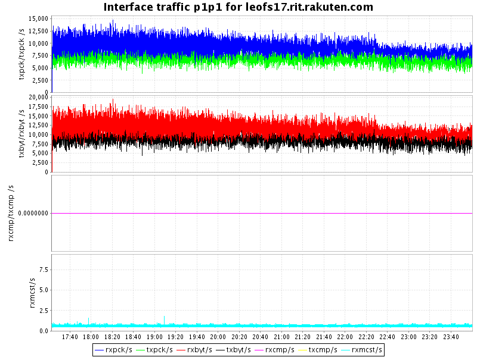
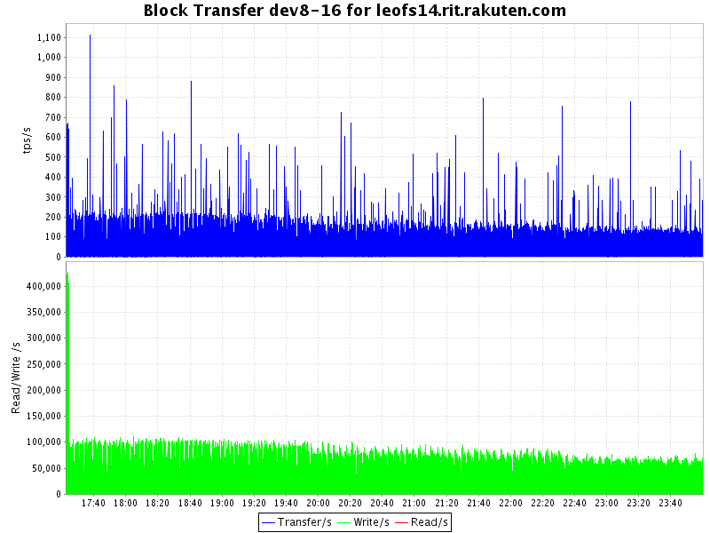
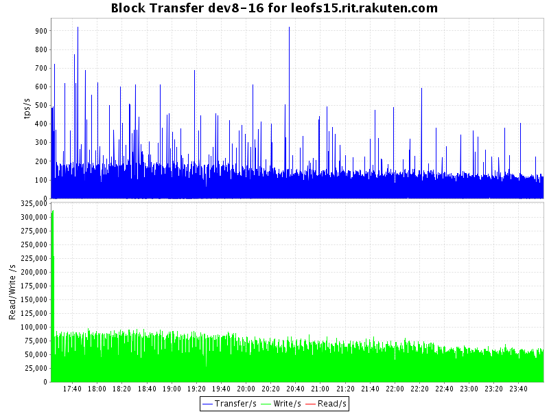
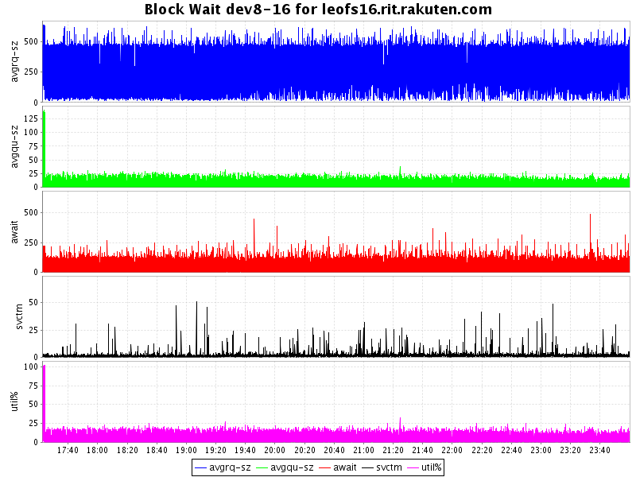
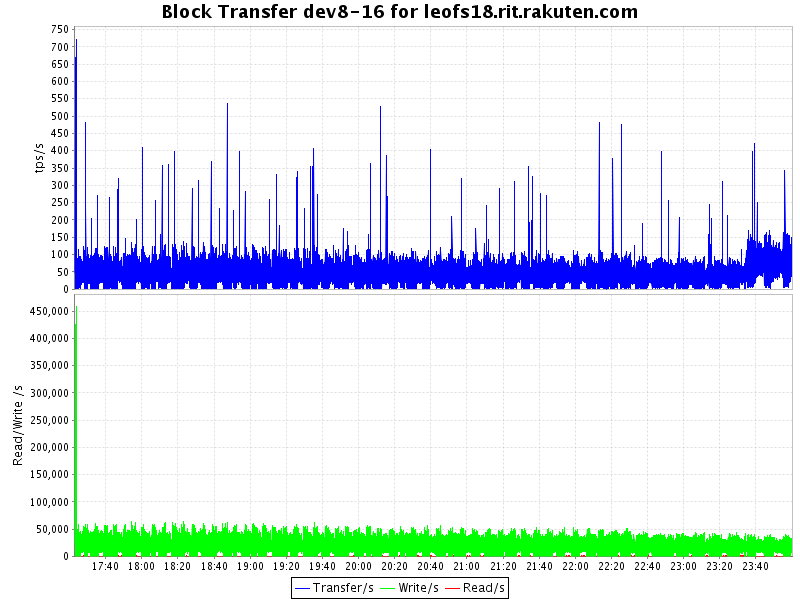

## Benchmark LeoFS v1.2.3 Long run test

### Environment

* OS: CentOS release 6.5 (Final)
* Erlang/OTP: R16B03-1
* LeoFS: v1.2.3
* LeoFS cluster settings:

```
 [System Confiuration]
---------------------------------+----------
 Item                            | Value    
---------------------------------+----------
 Basic/Consistency level
---------------------------------+----------
                  system version | 1.2.3
                      cluster Id | leofs_1
                           DC Id | dc_1
                  Total replicas | 3
        number of successes of R | 1
        number of successes of W | 2
        number of successes of D | 2
 number of DC-awareness replicas | 0
                       ring size | 2^128
---------------------------------+----------
 Multi DC replication settings
---------------------------------+----------
      max number of joinable DCs | 2
         number of replicas a DC | 1
---------------------------------+----------
 Manager RING hash
---------------------------------+----------
               current ring-hash | c74716e2
              previous ring-hash | c74716e2
---------------------------------+----------

 [State of Node(s)]
-------+-----------------------------+--------------+----------------+----------------+----------------------------
 type  |            node             |    state     |  current ring  |   prev ring    |          updated at         
-------+-----------------------------+--------------+----------------+----------------+----------------------------
  S    | leofs14@192.168.100.14      | running      | c74716e2       | c74716e2       | 2015-01-14 17:21:37 +0900
  S    | leofs15@192.168.100.15      | running      | c74716e2       | c74716e2       | 2015-01-14 17:21:37 +0900
  S    | leofs16@192.168.100.16      | running      | c74716e2       | c74716e2       | 2015-01-14 17:21:37 +0900
  S    | leofs17@192.168.100.17      | running      | c74716e2       | c74716e2       | 2015-01-14 17:21:37 +0900
  S    | leofs18@192.168.100.18      | running      | c74716e2       | c74716e2       | 2015-01-14 17:21:37 +0900
  G    | leofs13@192.168.100.13      | running      | c74716e2       | c74716e2       | 2015-01-14 17:21:44 +0900
-------+-----------------------------+--------------+----------------+----------------+----------------------------

```

* basho-bench Configuration:
    * Duration: 2694 minutes
    * # of concurrent processes: 64
    * # of keys: 100000
    * Value size groups(byte):
        *   1024..  10240: 24%
        *  10241.. 102400: 30%
        * 102401.. 819200: 30%
        * 819201..1572864: 16%
    * basho_bench driver: [basho_bench_driver_leofs.erl](https://github.com/leo-project/leofs/blob/develop/test/src/basho_bench_driver_leofs.erl)
    * Configuration file: [1m_r29w1_9999min.conf](20150114_172258/1m_r29w1_9999min.conf)

### OPS and Latency:


### Network Traffic
#### Chart of Each Nodes

* Gateway-1


* Storage-1


* Storage-2


* Storage-3


* Storage-4


* Storage-5


### Disk
#### Chart of Each Nodes (Storage)

* Storage-1



* Storage-2



* Storage-3



* Storage-4


* Storage-5



