## Benchmark LeoFS v1.2.8-dev (Multi Data Center Replication Test)

### Purpose
We've checked Multi Data Center Replication of LeoFS v1.2.8-dev.(develop/enable_connection_pool version)

### Master Environment

* OS: CentOS release 6.5 (Final)
* Erlang/OTP: 17.4
* LeoFS: v1.2.8-dev
* LeoFS cluster settings:

```
 [System Confiuration]
-----------------------------------+----------
 Item                              | Value    
-----------------------------------+----------
 Basic/Consistency level
-----------------------------------+----------
                    system version | 1.2.7
                        cluster Id | leofs_1
                             DC Id | dc_1
                    Total replicas | 3
          number of successes of R | 1
          number of successes of W | 2
          number of successes of D | 2
 number of rack-awareness replicas | 0
                         ring size | 2^128
-----------------------------------+----------
 Multi DC replication settings
-----------------------------------+----------
        max number of joinable DCs | 2
           number of replicas a DC | 1
-----------------------------------+----------
 Manager RING hash
-----------------------------------+----------
                 current ring-hash | 2b468816
                previous ring-hash | 2b468816
-----------------------------------+----------

 [State of Node(s)]
-------+-----------------------------+--------------+----------------+----------------+----------------------------
 type  |            node             |    state     |  current ring  |   prev ring    |          updated at         
-------+-----------------------------+--------------+----------------+----------------+----------------------------
  S    | leofs14@192.168.100.14      | running      | 2b468816       | 2b468816       | 2015-04-07 16:32:07 +0900
  S    | leofs15@192.168.100.15      | running      | 2b468816       | 2b468816       | 2015-04-07 16:32:07 +0900
  S    | leofs16@192.168.100.16      | running      | 2b468816       | 2b468816       | 2015-04-07 16:32:07 +0900
  S    | leofs17@192.168.100.17      | running      | 2b468816       | 2b468816       | 2015-04-07 16:32:07 +0900
  S    | leofs18@192.168.100.18      | running      | 2b468816       | 2b468816       | 2015-04-07 16:32:07 +0900
  G    | leofs13@192.168.100.13      | running      | 2b468816       | 2b468816       | 2015-04-07 16:32:16 +0900
-------+-----------------------------+--------------+----------------+----------------+----------------------------

```

* basho-bench Configuration:
    * Duration: 97 minutes
    * # of concurrent processes: 64
    * # of keys: 50000
    * Value size groups(byte):
        *   1024..  10240: 24%
        *  10241.. 102400: 30%
        * 102401.. 819200: 30%
        * 819201..1572864: 16%
    * basho_bench driver: [basho_bench_driver_leofs.erl](https://github.com/leo-project/leofs/blob/develop/test/src/basho_bench_driver_leofs.erl)
    * Configuration file: [1m_load.conf](20150407_170745/1m_load.conf)

### OPS and Latency:


### Network Traffic
#### Chart of Every Nodes

* Gateway-1


* Storage-1


* Storage-2


* Storage-3
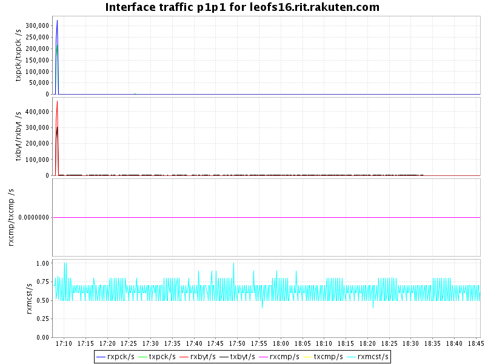

* Storage-4
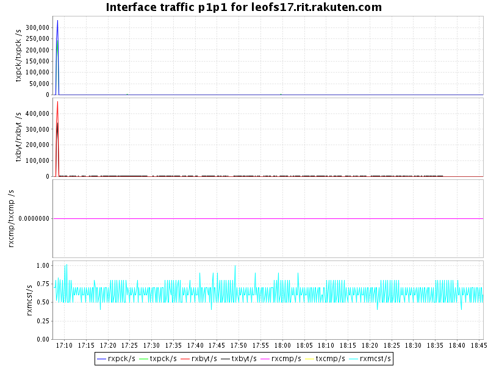

* Storage-5
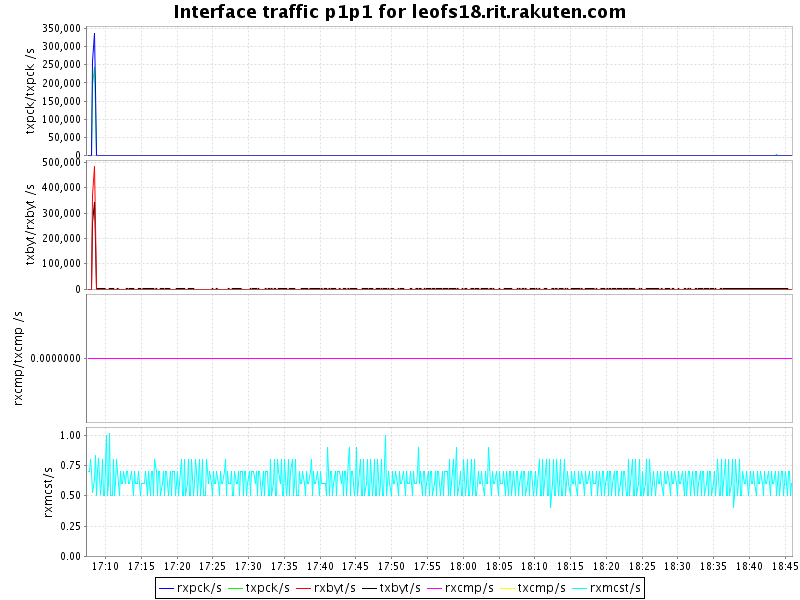


### Disk
#### Chart of Every Nodes (Storage)

* Storage-1
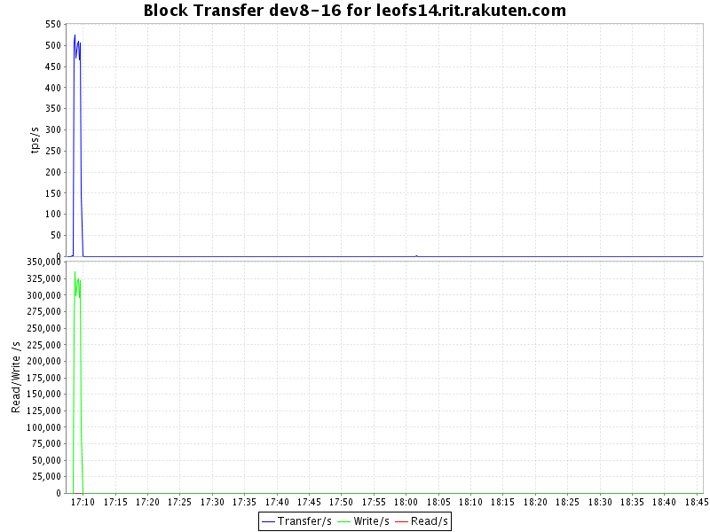


* Storage-2

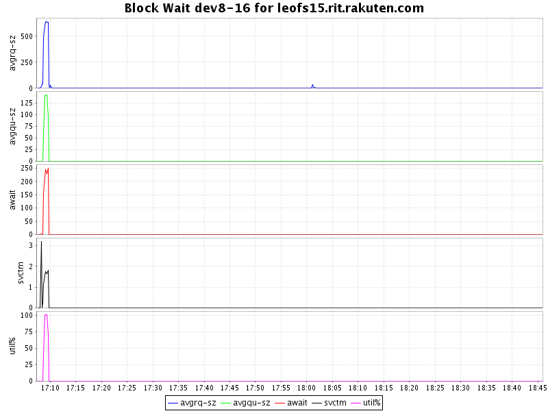

* Storage-3


* Storage-4
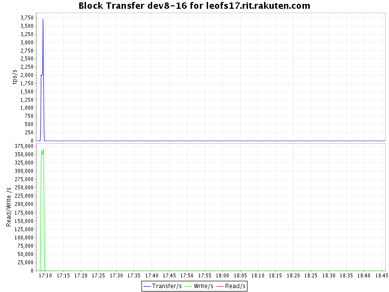


* Storage-5


### Slave Environment

* OS: CentOS release 6.5 (Final)
* Erlang/OTP: 17.4
* LeoFS: v1.2.7
* LeoFS cluster settings:

```
 [System Confiuration]
-----------------------------------+----------
 Item                              | Value    
-----------------------------------+----------
 Basic/Consistency level
-----------------------------------+----------
                    system version | 1.2.7
                        cluster Id | leofs_2
                             DC Id | dc_2
                    Total replicas | 3
          number of successes of R | 1
          number of successes of W | 2
          number of successes of D | 2
 number of rack-awareness replicas | 0
                         ring size | 2^128
-----------------------------------+----------
 Multi DC replication settings
-----------------------------------+----------
        max number of joinable DCs | 2
           number of replicas a DC | 1
-----------------------------------+----------
 Manager RING hash
-----------------------------------+----------
                 current ring-hash | 2f41986f
                previous ring-hash | 2f41986f
-----------------------------------+----------

 [State of Node(s)]
-------+--------------------------------+--------------+----------------+----------------+----------------------------
 type  |              node              |    state     |  current ring  |   prev ring    |          updated at         
-------+--------------------------------+--------------+----------------+----------------+----------------------------
  S    | leofs1303@192.168.101.133      | running      | 2f41986f       | 2f41986f       | 2015-04-07 16:32:09 +0900
  S    | leofs1304@192.168.101.134      | running      | 2f41986f       | 2f41986f       | 2015-04-07 16:32:09 +0900
  S    | leofs1305@192.168.101.135      | running      | 2f41986f       | 2f41986f       | 2015-04-07 16:32:09 +0900
  S    | leofs1306@192.168.101.136      | running      | 2f41986f       | 2f41986f       | 2015-04-07 16:32:09 +0900
  S    | leofs1307@192.168.101.137      | running      | 2f41986f       | 2f41986f       | 2015-04-07 16:32:09 +0900
  G    | leofs1302@192.168.101.132      | running      | 2f41986f       | 2f41986f       | 2015-04-07 16:32:19 +0900
-------+--------------------------------+--------------+----------------+----------------+----------------------------

```

### Network Traffic
#### Chart of Every Nodes

* Gateway-1
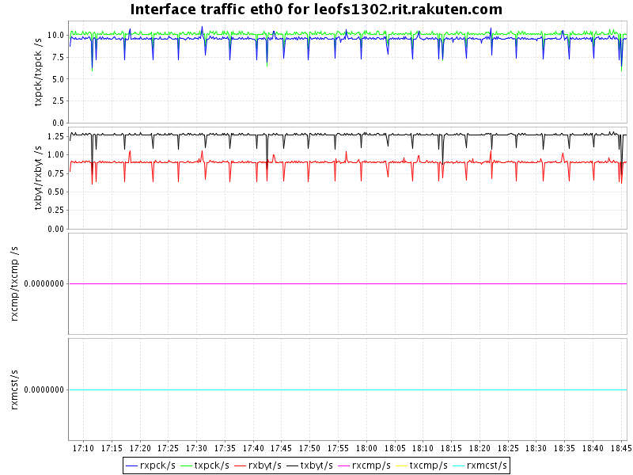

* Storage-1
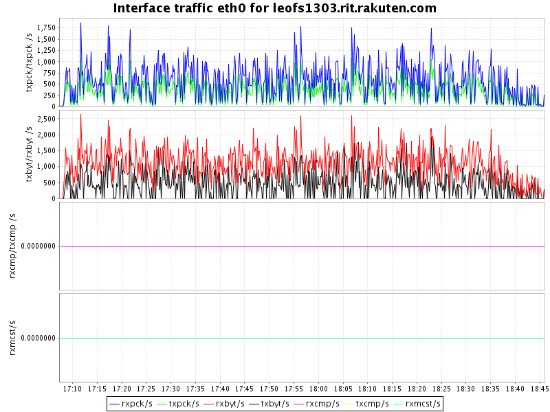

* Storage-2
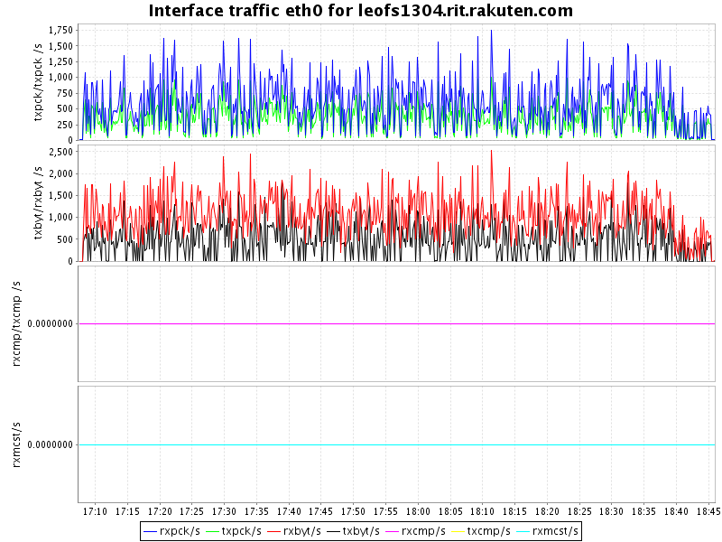

* Storage-3


* Storage-4
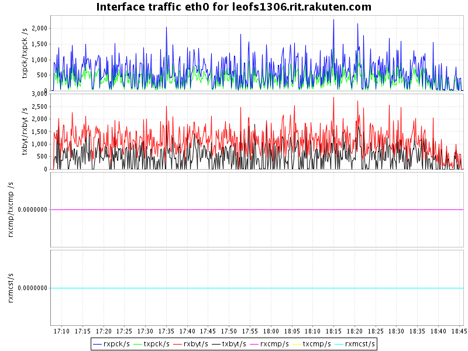

* Storage-5


### Disk
#### Chart of Every Nodes (Storage)

* Storage-1


* Storage-2


* Storage-3
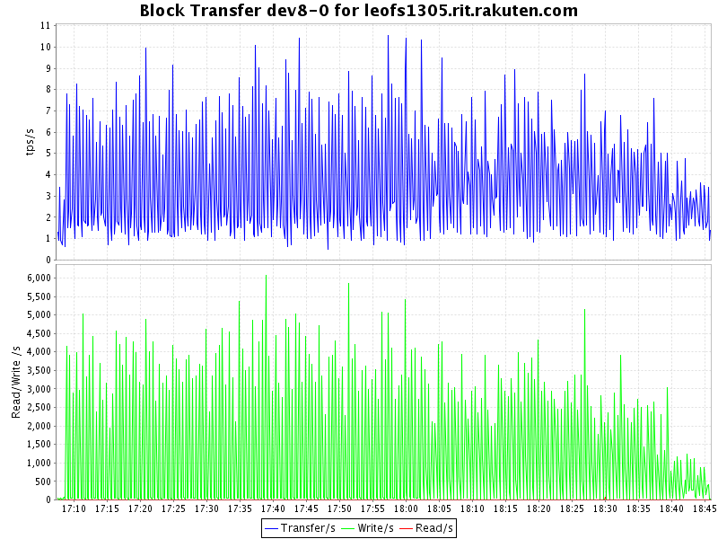


* Storage-4


* Storage-5


