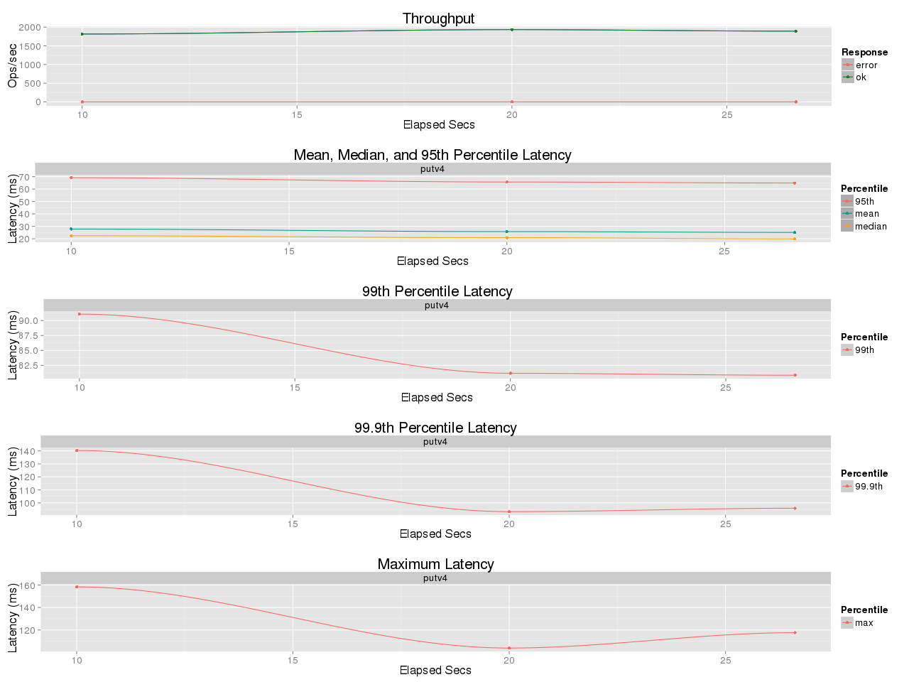
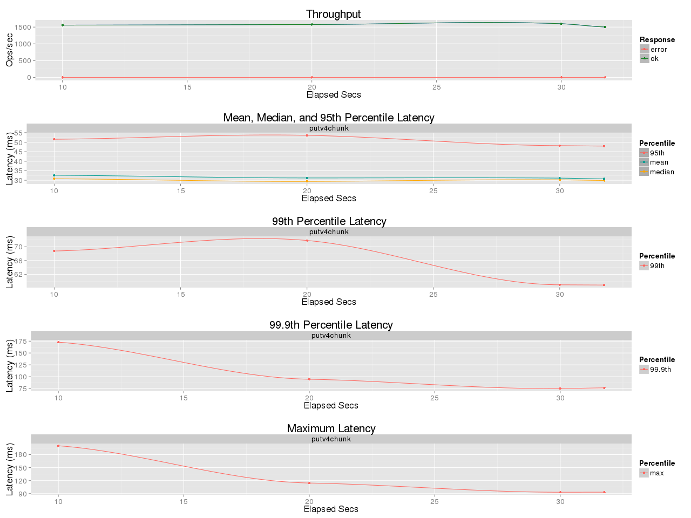

## Benchmark LeoFS 1.4-pre1

### Purpose
Compare the overhead of AWS Signature V2/V4 authentication

## Test Cases
* v2: AWS Signature V2
* v4: AWS Signature V4 (Authorization Header, Precomputed SHA-256)
* v4chunk: AWS Signature V4 (aws-chunked, online SHA-256, chunk verification)
* v4chunk-nohash: AWS Signature V4 (aws-chunked, no SHA-256, no chunk verification)

### Enviroment
* OS: CentOS release 6.5 (Final)
* Erlang/OTP: 17.5
* LeoFS: v1.4-pre1
* LeoFS cluster settings:
```
 [System Confiuration]
-----------------------------------+----------
 Item                              | Value    
-----------------------------------+----------
 Basic/Consistency level
-----------------------------------+----------
                    system version | 1.2.11
                        cluster Id | leofs_1
                             DC Id | dc_1
                    Total replicas | 2
          number of successes of R | 1
          number of successes of W | 1
          number of successes of D | 1
 number of rack-awareness replicas | 0
                         ring size | 2^128
-----------------------------------+----------
 Multi DC replication settings
-----------------------------------+----------
        max number of joinable DCs | 2
           number of replicas a DC | 1
-----------------------------------+----------
 Manager RING hash
-----------------------------------+----------
                 current ring-hash | e375cac4
                previous ring-hash | e375cac4
-----------------------------------+----------

 [State of Node(s)]
-------+-------------------------------+--------------+----------------+----------------+----------------------------
 type  |             node              |    state     |  current ring  |   prev ring    |          updated at         
-------+-------------------------------+--------------+----------------+----------------+----------------------------
  S    | storage_0@192.168.100.11      | running      | e375cac4       | e375cac4       | 2015-07-09 10:24:07 +0900
  S    | storage_1@192.168.100.11      | running      | e375cac4       | e375cac4       | 2015-07-09 10:24:07 +0900
  S    | storage_2@192.168.100.11      | running      | e375cac4       | e375cac4       | 2015-07-09 10:24:07 +0900
  S    | storage_3@192.168.100.11      | running      | e375cac4       | e375cac4       | 2015-07-09 10:24:07 +0900
  G    | gateway_0@192.168.100.11      | running      | e375cac4       | e375cac4       | 2015-07-09 10:24:13 +0900
-------+-------------------------------+--------------+----------------+----------------+----------------------------
```

* basho-bench Configuration:
    * # of concurrent processes: 50
    * # of keys: 50000
    * Value size groups(byte):
        * 131072..262144: 100%
    * basho_bench driver: [basho_bench_driver_leofs.erl](https://github.com/windkit/leofs/blob/add147a7038d077c05e2c91a679c682a0b67c764/test/src/basho_bench_driver_leofs.erl)
    * Configuration file:
      * [v2.conf](v2/leofs_128K-256K_PUT20K.config)
      * [v4.conf](v4/leofs_128K-256K_PUT20K_v4.config)
      * [v4chunk.conf](v4chunk/leofs_128K-256K_PUT20K_v4chunk.config)
      * [v4chunk_nohash.conf](v4chunk_hash/leofs_128K-256K_PUT20K_v4chunk.config)

### OPS and Latency:
* v2

* v4

* v4chunk

* v4chunk-nohash

