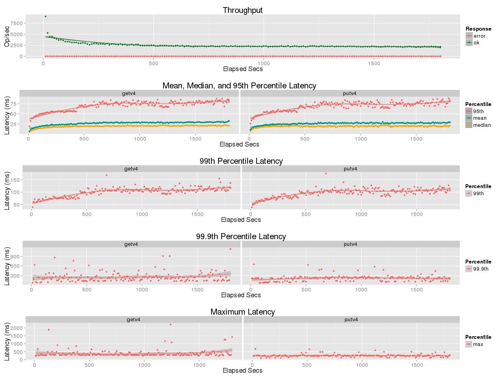

## Benchmark LeoFS v1.4.0-pre2

### Purpose
We've checked LeoFS v1.4.0-pre2 with different Erlang build options

### Environment

* OS: CentOS release 6.5 (Final)
* Erlang/OTP: 17.5
* LeoFS: v1.4.0-pre2
* LeoFS cluster settings:

```
 [System Confiuration]
-----------------------------------+----------
 Item                              | Value    
-----------------------------------+----------
 Basic/Consistency level
-----------------------------------+----------
                    system version | 1.4.0-pre.2
                        cluster Id | leofs_1
                             DC Id | dc_1
                    Total replicas | 2
          number of successes of R | 1
          number of successes of W | 1
          number of successes of D | 1
 number of rack-awareness replicas | 0
                         ring size | 2^128
-----------------------------------+----------
 Multi DC replication settings
-----------------------------------+----------
        max number of joinable DCs | 2
           number of replicas a DC | 1
-----------------------------------+----------
 Manager RING hash
-----------------------------------+----------
                 current ring-hash | 3d0294e7
                previous ring-hash | 3d0294e7
-----------------------------------+----------

 [State of Node(s)]
-------+---------------------------------+--------------+----------------+----------------+----------------------------
 type  |              node               |    state     |  current ring  |   prev ring    |          updated at         
-------+---------------------------------+--------------+----------------+----------------+----------------------------
  S    | storage_w_0@192.168.100.14      | running      | 3d0294e7       | 3d0294e7       | 2015-11-19 09:26:20 +0900
  S    | storage_w_1@192.168.100.15      | running      | 3d0294e7       | 3d0294e7       | 2015-11-19 09:26:21 +0900
  S    | storage_w_2@192.168.100.16      | running      | 3d0294e7       | 3d0294e7       | 2015-11-19 09:26:21 +0900
  S    | storage_w_3@192.168.100.17      | running      | 3d0294e7       | 3d0294e7       | 2015-11-19 09:26:21 +0900
  G    | gateway_w_0@192.168.100.13      | running      | 3d0294e7       | 3d0294e7       | 2015-11-19 09:26:27 +0900
-------+---------------------------------+--------------+----------------+----------------+----------------------------
```

* basho-bench Configuration:
    * Duration: 180 minutes
    * # of concurrent processes: 64
    * # of keys: 100000
    * Value size groups(byte):
        *   1024..  10240: 24%
        *  10241.. 102400: 30%
        * 102401.. 819200: 30%
        * 819201..1572864: 16%
    * basho_bench driver: [basho_bench_driver_leofs.erl](https://github.com/leo-project/basho_bench/blob/master/src/basho_bench_driver_leofs.erl)
    * Configuration file: [1m_r95w5_30min.conf](1m_r95w5_30min.conf)

* LeoFS Configuration:
    * Manager_0: [leo_manager_0.conf](conf/leo_manager_0.conf)
    * Manager_1: [leo_manager_1.conf](conf/leo_manager_1.conf)
    * Gateway  : [leo_gateway.conf](conf/leo_gateway.conf)
    * Storage  : [leo_storage.conf](conf/leo_storage.conf)

### OPS and Latency:
#### Default Options

#### Configure Options (--enable-smp-support --enable-m64-build --enable-halfword-emulator --enable-kernel-poll --without-javac --disable-native-libs --disable-hipe --disable-sctp --enable-threads)

