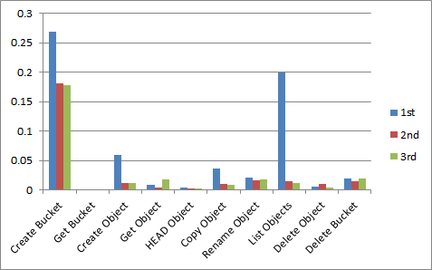

Title
=====

Compare response time on different num of buckets and objects.

Env
===

* LeoFS
    * OS: CentOS release 6.5 (Final)
    * Kernel: Linux localhost.localdomain 2.6.32-431.el6.x86_64 #1 SMP Fri Nov 22 03:15:09 UTC 2013 x86_64 x86_64 x86_64 GNU/Linux
    * Erlang: R16B03-1
    * LeoFS:  1.0.0

* LeoFS cluster settings

```
[System config]
                System version : 1.0.0
                    Cluster Id : leofs_1
                         DC Id : dc_1
                Total replicas : 2
           # of successes of R : 1
           # of successes of W : 1
           # of successes of D : 1
 # of DC-awareness replicas    : 0
                     ring size : 2^128
             Current ring hash : 4c1e97f6
                Prev ring hash : 4c1e97f6
[Multi DC replication settings]
         max # of joinable DCs : 2
            # of replicas a DC : 1

[Node(s) state]
-------+--------------------------+--------------+----------------+----------------+----------------------------
 type  |           node           |    state     |  current ring  |   prev ring    |          updated at
-------+--------------------------+--------------+----------------+----------------+----------------------------
  S    | storage_0@127.0.0.1      | running      | 4c1e97f6       | 4c1e97f6       | 2014-04-08 07:18:23 +0900
  S    | storage_1@127.0.0.1      | running      | 4c1e97f6       | 4c1e97f6       | 2014-04-08 07:18:23 +0900
  S    | storage_2@127.0.0.1      | running      | 4c1e97f6       | 4c1e97f6       | 2014-04-08 07:18:23 +0900
  S    | storage_3@127.0.0.1      | running      | 4c1e97f6       | 4c1e97f6       | 2014-04-08 07:18:23 +0900
  G    | gateway_0@127.0.0.1      | running      | 4c1e97f6       | 4c1e97f6       | 2014-04-08 07:18:24 +0900
```

Results
=======

The vertical axis of each graphs show response time in seconds.

 **different num of buckets cases**
* 1000 buckets x 100 objects
  
* 5000 buckets x 100 objects
  
* 10000 buckets x 100 objects
  

 **different num of objects cases**
* 1000 buckets x 100 objects
  
* 1000 buckets x 500 objects
  
* 1000 buckets x 1000 objects
  

 **compare medians**
* compare medians with different num of objects case
  
* compare medians with different num of buckets case
  

Conclusion
==========

* The number of buckets in the cluster effect to the response time of "create bucket".
* The number of objects in the cluster effect to the response time of "delete bucket".
* Other factors are not effect to actions on other buckets.
