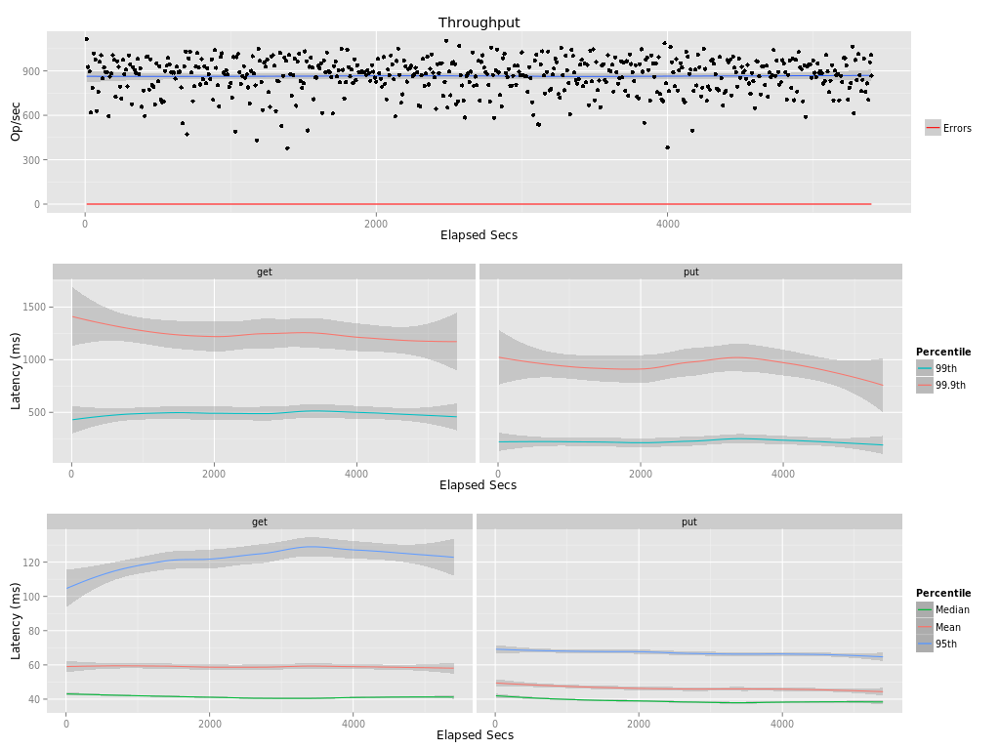

## Benchmark LeoFS v1.1.2rc

### Environment

* OS: Ubuntu 12.04LTS
* Erlang/OTP: R16B03-1
* LeoFS: v1.1.2rc
* LeoFS cluster settings:

```
[System config]
                System version : 1.1.1
                    Cluster Id : leofs_1
                         DC Id : dc_1
                Total replicas : 3
           # of successes of R : 1
           # of successes of W : 2
           # of successes of D : 2
 # of DC-awareness replicas    : 0
                     ring size : 2^128
             Current ring hash : 553778d9
                Prev ring hash : 553778d9
[Multi DC replication settings]
         max # of joinable DCs : 2
            # of replicas a DC : 1

[Node(s) state]
-------+-------------------------------+--------------+----------------+----------------+----------------------------
 type  |             node              |    state     |  current ring  |   prev ring    |          updated at         
-------+-------------------------------+--------------+----------------+----------------+----------------------------
  S    | storage_0@10.132.144.200      | running      | 553778d9       | 553778d9       | 2014-09-04 02:13:35 +0000
  S    | storage_0@10.132.151.143      | running      | 553778d9       | 553778d9       | 2014-09-04 02:13:35 +0000
  S    | storage_0@10.132.166.7        | running      | 553778d9       | 553778d9       | 2014-09-04 02:13:35 +0000
  S    | storage_0@10.132.181.14       | running      | 553778d9       | 553778d9       | 2014-09-04 02:13:35 +0000
  G    | gateway_0@10.132.172.119      | running      | 553778d9       | 553778d9       | 2014-09-04 02:13:35 +0000

```

* basho-bench Configuration:
    * Duration: 180 minutes
    * # of concurrent processes: 48
    * # of keys
    * Value size groups(byte): uniform_int(65536, 131072)
    * basho_bench driver: [basho_bench_driver_leofs.erl](https://github.com/leo-project/leofs/blob/develop/test/src/basho_bench_driver_leofs.erl)
    * Configuration file: [128k_r8w2.conf](20140904_022357/128k_r8w2.conf)

### Basho Bench Result



#### Summary

* Total of network traffic: 1Gbps
(AWS limit)
