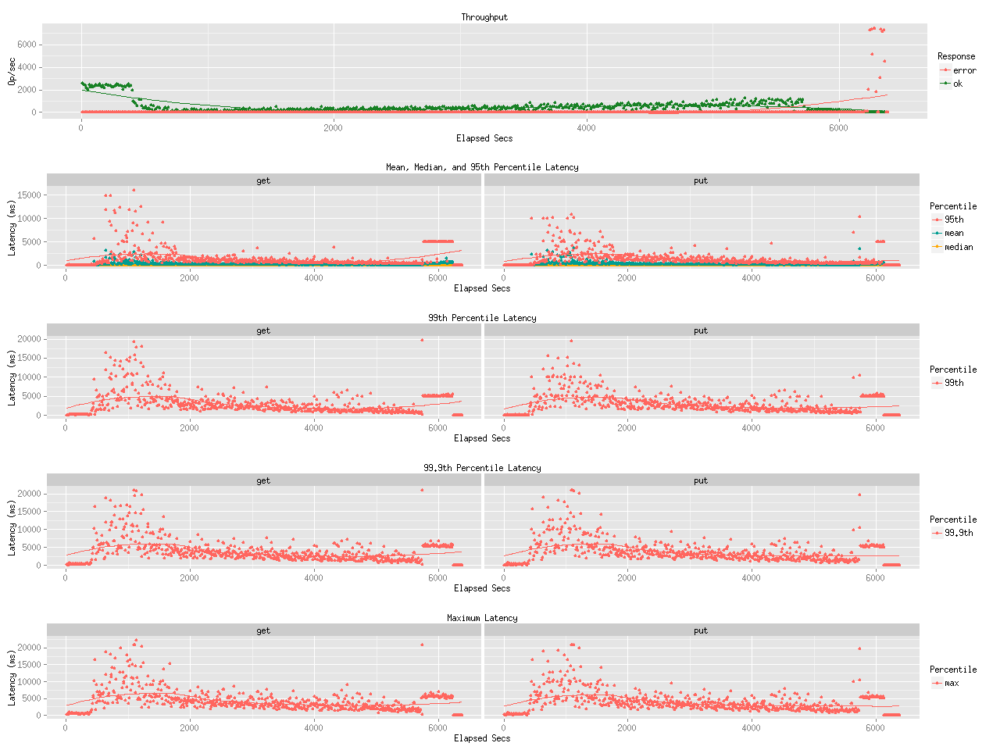
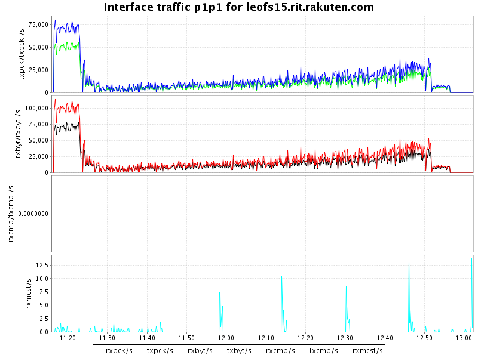
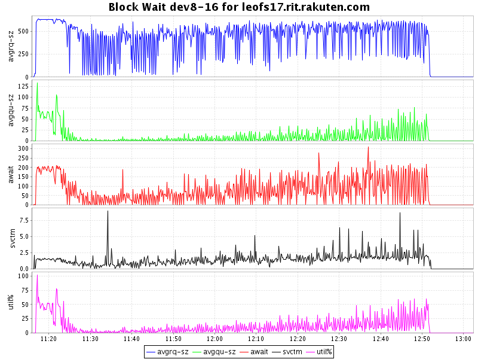
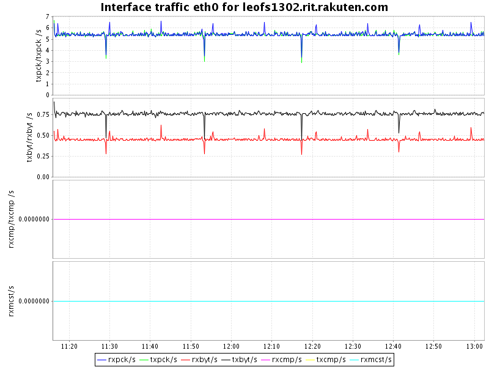
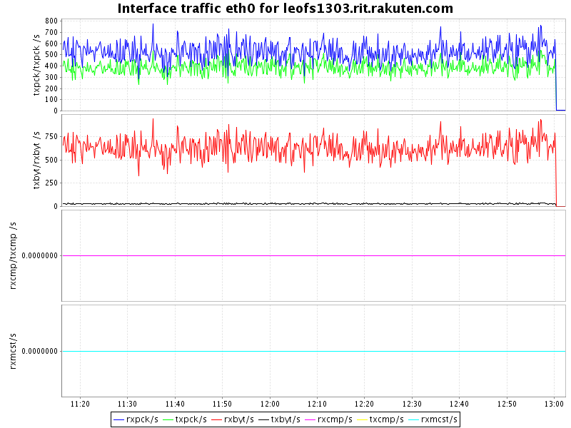
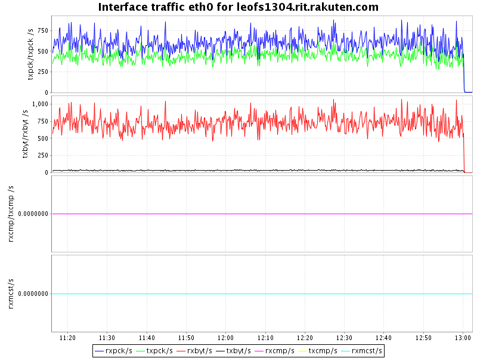
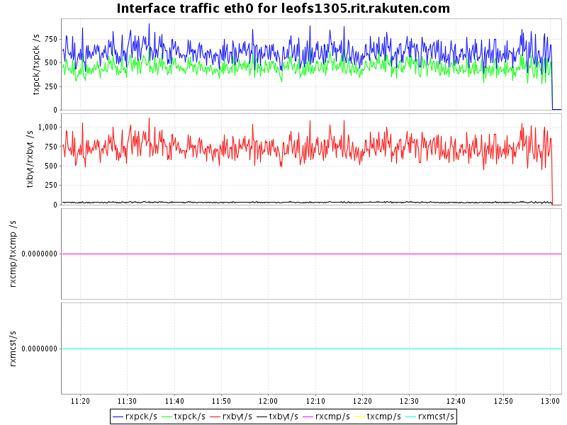
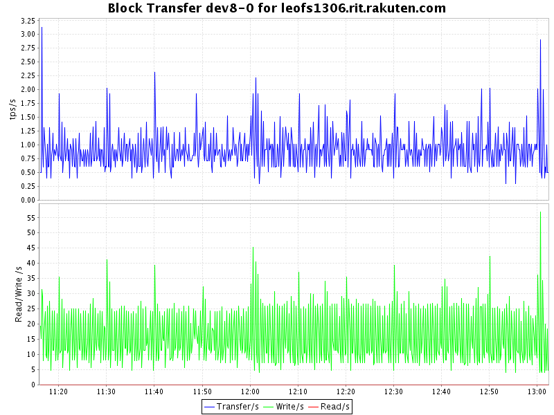

## Benchmark LeoFS v1.1.1

### Master Environment

* OS: CentOS release 6.5 (Final)
* Erlang/OTP: R16B03-1
* LeoFS: v1.1.1
* LeoFS cluster settings:

```
[System config]
                System version : 1.1.1
                    Cluster Id : leofs_1
                         DC Id : dc_1
                Total replicas : 3
           # of successes of R : 1
           # of successes of W : 2
           # of successes of D : 2
 # of DC-awareness replicas    : 0
                     ring size : 2^128
             Current ring hash : 43c3a5b8
                Prev ring hash : 43c3a5b8
[Multi DC replication settings]
         max # of joinable DCs : 2
            # of replicas a DC : 1

[Node(s) state]
-------+-----------------------------+--------------+----------------+----------------+----------------------------
 type  |            node             |    state     |  current ring  |   prev ring    |          updated at         
-------+-----------------------------+--------------+----------------+----------------+----------------------------
  S    | leofs14@192.168.100.14      | stop         |                |                | 2014-09-04 13:00:07 +0900
  S    | leofs15@192.168.100.15      | stop         |                |                | 2014-09-04 12:56:27 +0900
  S    | leofs16@192.168.100.16      | stop         |                |                | 2014-09-04 12:58:29 +0900
  S    | leofs17@192.168.100.17      | stop         |                |                | 2014-09-04 12:51:53 +0900
  S    | leofs18@192.168.100.18      | stop         |                |                | 2014-09-04 12:50:16 +0900
  G    | leofs13@192.168.100.13      | running      | 43c3a5b8       | 43c3a5b8       | 2014-09-04 11:12:51 +0900

```

* basho-bench Configuration:
    * Duration: 180 minutes
    * # of concurrent processes: 64
    * # of keys
    * Value size groups(byte):
        *   1024..10240:   24%
        *  10241..102400:  30%
        * 102401..819200:  30%
        * 819201.. 1572864:16%
    * basho_bench driver: [basho_bench_driver_leofs.erl](https://github.com/leo-project/leofs/blob/develop/test/src/basho_bench_driver_leofs.erl)
    * Configuration file: [1m_r8w2_180min.conf](20140904_111610/1m_r8w2_180min.conf)

### OPS and Latency:



### Network Traffic
#### Chart of Each Nodes

* Gateway-1


* Storage-1


* Storage-2


* Storage-3


* Storage-4


* Storage-5


### Disk
#### Chart of Each Nodes (Storage)

* Storage-1


* Storage-2


* Storage-3


* Storage-4



* Storage-5


### Slave Environment

* OS: CentOS release 6.5 (Final)
* Erlang/OTP: R16B03-1
* LeoFS: v1.1.1
* LeoFS cluster settings:

```
[System config]
                System version : 1.1.1
                    Cluster Id : leofs_2
                         DC Id : dc_2
                Total replicas : 3
           # of successes of R : 1
           # of successes of W : 2
           # of successes of D : 2
 # of DC-awareness replicas    : 0
                     ring size : 2^128
             Current ring hash : 480c2235
                Prev ring hash : 480c2235
[Multi DC replication settings]
         max # of joinable DCs : 2
            # of replicas a DC : 1

[Node(s) state]
-------+--------------------------------+--------------+----------------+----------------+----------------------------
 type  |              node              |    state     |  current ring  |   prev ring    |          updated at         
-------+--------------------------------+--------------+----------------+----------------+----------------------------
  S    | leofs1303@192.168.101.133      | running      | 480c2235       | 480c2235       | 2014-09-04 11:12:45 +0900
  S    | leofs1304@192.168.101.134      | running      | 480c2235       | 480c2235       | 2014-09-04 11:12:45 +0900
  S    | leofs1305@192.168.101.135      | running      | 480c2235       | 480c2235       | 2014-09-04 11:12:45 +0900
  S    | leofs1306@192.168.101.136      | running      | 480c2235       | 480c2235       | 2014-09-04 11:12:45 +0900
  S    | leofs1307@192.168.101.137      | running      | 480c2235       | 480c2235       | 2014-09-04 11:12:45 +0900
  G    | leofs1302@192.168.101.132      | running      | 480c2235       | 480c2235       | 2014-09-04 11:12:53 +0900

```

### Network Traffic
#### Chart of Each Nodes

* Gateway-1


* Storage-1


* Storage-2


* Storage-3


* Storage-4


* Storage-5


### Disk
#### Chart of Each Nodes (Storage)

* Storage-1


* Storage-2


* Storage-3


* Storage-4



* Storage-5


#### Summary

* Total of network traffic:  .  Gbps
* Itemized results:

   Node   |Read(MB/s)|Write(MB/s)|Total(MB/s)
----------|---------:|----------:|---------------:
          |          |           |
total     |          |           |
