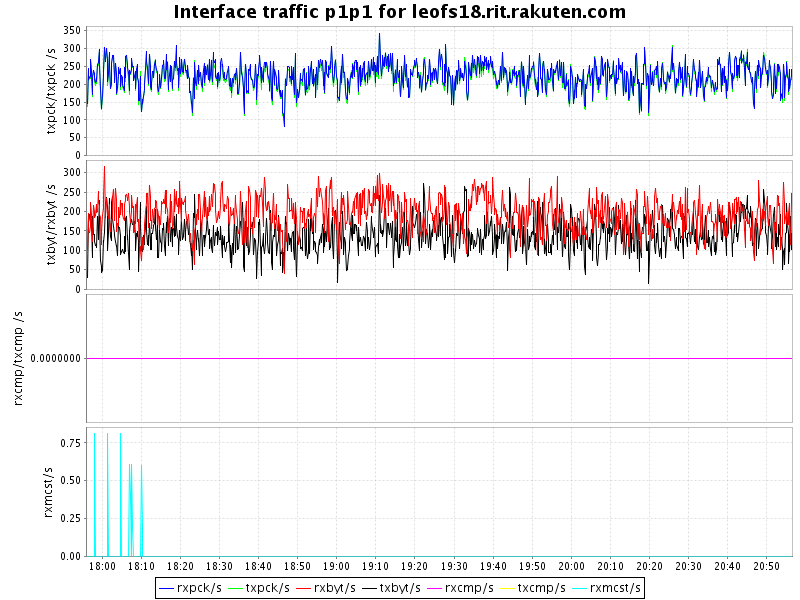

## Benchmark LeoFS v1.2.1 with watchdog and restricting network traffic

### Reference

* [Sometimes Kill -9 Isn't Enough](http://www.bravenewgeek.com/sometimes-kill-9-isnt-enough/)

### Environment

* OS: CentOS release 6.5 (Final)
* Erlang/OTP: R16B03-1
* LeoFS: v1.2.1
* LeoFS cluster settings:

```
[System config]
                System version : 1.2.1
                    Cluster Id : leofs_1
                         DC Id : dc_1
                Total replicas : 3
           # of successes of R : 1
           # of successes of W : 2
           # of successes of D : 2
 # of DC-awareness replicas    : 0
                     ring size : 2^128
             Current ring hash : 19671e61
                Prev ring hash : 19671e61
[Multi DC replication settings]
         max # of joinable DCs : 2
            # of replicas a DC : 1

[Node(s) state]
-------+-----------------------------+--------------+----------------+----------------+----------------------------
 type  |            node             |    state     |  current ring  |   prev ring    |          updated at         
-------+-----------------------------+--------------+----------------+----------------+----------------------------
  S    | leofs14@192.168.100.14      | running      | 19671e61       | 19671e61       | 2014-11-14 17:53:12 +0900
  S    | leofs15@192.168.100.15      | running      | 19671e61       | 19671e61       | 2014-11-14 17:53:12 +0900
  S    | leofs16@192.168.100.16      | running      | 19671e61       | 19671e61       | 2014-11-14 17:53:12 +0900
  S    | leofs17@192.168.100.17      | running      | 19671e61       | 19671e61       | 2014-11-14 17:53:12 +0900
  S    | leofs18@192.168.100.18      | running      | 19671e61       | 19671e61       | 2014-11-14 17:53:12 +0900
  G    | leofs13@192.168.100.13      | running      | 19671e61       | 19671e61       | 2014-11-14 17:53:19 +0900

```
* tc cmdline applied

```
tc qdisc add dev p1p1 root handle 1: tbf limit 1Mb buffer 200Kb rate 1Gbit
tc qdisc add dev p1p1 parent 1: netem delay 50ms 5ms loss 10% distribution normal
```

* basho-bench Configuration:
    * Duration: 180 minutes
    * # of concurrent processes: 64
    * # of keys: 100000
    * Value size groups(byte):
        *   1024..10240:   24%
        *  10241..102400:  30%
        * 102401..819200:  30%
        * 819201.. 1572864:16%
    * basho_bench driver: [basho_bench_driver_leofs.erl](https://github.com/leo-project/leofs/blob/develop/test/src/basho_bench_driver_leofs.erl)
    * Configuration file: [1m_r8w2_180min_loss.conf](20141114_175609/1m_r8w2_180min_loss.conf)

### OPS and Latency:


### Network Traffic
#### Chart of Each Nodes

* Gateway-1


* Storage-1


* Storage-2


* Storage-3


* Storage-4


* Storage-5



### Disk
#### Chart of Each Nodes (Storage)

* Storage-1


* Storage-2


* Storage-3


* Storage-4


* Storage-5


#### Summary

* Total of network traffic: 15.76 Mbps
* Itemized results:

   Node   |Read(MB/s)|Write(MB/s)|Total(MB/s)
----------|---------:|----------:|---------------:
storage_0 |     0.20 |      0.13 |      0.33
storage_1 |     0.16 |      0.13 |      0.29
storage_2 |     0.17 |      0.13 |      0.30
storage_3 |     0.19 |      0.09 |      0.28
storage_4 |     0.19 |      0.14 |      0.33
gateway_0 |     0.17 |      0.27 |      0.44
total     |     1.08 |      0.89 |      1.97
