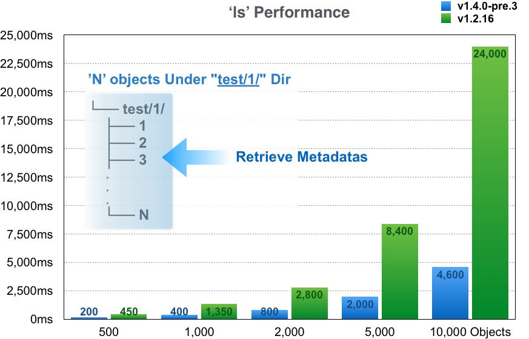

# LeoFS ls-command benchmark
## Environment
* AWS EC2 C3.2XLarge 8-Core
* Memory: 16GB
* LeoFS: v1.2.16 / v1.4.0-pre.3
* Erlang: 17.5
* LeoFS Cluster: Manager x 2, Gateway x 1, Storage x 4
* Client: s3cmd v1.1

## Result


### Raw Data
#### LeoFS v1.4-pre.3 (dev)
##### 500
```bash
$ time s3cmd ls s3://test/1/ > /dev/null
real	0m0.203s
user	0m0.155s
sys	0m0.012s

$ time s3cmd ls s3://test/1/ > /dev/null
real	0m0.199s
user	0m0.135s
sys	0m0.028s

$ time s3cmd ls s3://test/1/ > /dev/null
real	0m0.207s
user	0m0.154s
sys	0m0.016s

$ time s3cmd ls s3://test/1/ > /dev/null
real	0m0.204s
user	0m0.154s
sys	0m0.016s

$ time s3cmd ls s3://test/1/ > /dev/null
real	0m0.201s
user	0m0.140s
sys	0m0.024s
```

##### 1000
```bash
$ time s3cmd ls s3://test/1/ > /dev/null
real	0m0.408s
user	0m0.262s
sys	0m0.016s

$ time s3cmd ls s3://test/1/ > /dev/null
real	0m0.397s
user	0m0.275s
sys	0m0.004s

$ time s3cmd ls s3://test/1/ > /dev/null
real	0m0.402s
user	0m0.265s
sys	0m0.016s

$ time s3cmd ls s3://test/1/ > /dev/null
real	0m0.399s
user	0m0.270s
sys	0m0.012s

$ time s3cmd ls s3://test/1/ > /dev/null
real	0m0.419s
user	0m0.273s
sys	0m0.016s
```

##### 2000
```bash
$ time s3cmd ls s3://test/1/ > /dev/null
real	0m0.819s
user	0m0.492s
sys	0m0.016s

$ time s3cmd ls s3://test/1/ > /dev/null
real	0m0.781s
user	0m0.486s
sys	0m0.028s

$ time s3cmd ls s3://test/1/ > /dev/null
real	0m0.802s
user	0m0.482s
sys	0m0.028s

$ time s3cmd ls s3://test/1/ > /dev/null
real	0m0.784s
user	0m0.490s
sys	0m0.020s

$ time s3cmd ls s3://test/1/ > /dev/null
real	0m0.738s
user	0m0.501s
sys	0m0.020s
```

##### 5000
```bash
$ time s3cmd ls s3://test/1/ > /dev/null
real	0m1.964s
user	0m1.167s
sys	0m0.020s

$ time s3cmd ls s3://test/1/ > /dev/null
real	0m2.040s
user	0m1.164s
sys	0m0.040s

$ time s3cmd ls s3://test/1/ > /dev/null
real	0m2.012s
user	0m1.180s
sys	0m0.016s

$ time s3cmd ls s3://test/1/ > /dev/null
real	0m2.055s
user	0m1.179s
sys	0m0.016s

$ time s3cmd ls s3://test/1/ > /dev/null
real	0m1.969s
user	0m1.159s
sys	0m0.028s
```

##### 10000
```bash
$ time s3cmd ls s3://test/1/ > /dev/null
real	0m4.513s
user	0m2.338s
sys	0m0.052s

$ time s3cmd ls s3://test/1/ > /dev/null
real	0m4.700s
user	0m2.347s
sys	0m0.048s

$ time s3cmd ls s3://test/1/ > /dev/null
real	0m4.606s
user	0m2.363s
sys	0m0.032s

$ time s3cmd ls s3://test/1/ > /dev/null
real	0m4.643s
user	0m2.348s
sys	0m0.044s

$ time s3cmd ls s3://test/1/ > /dev/null
real	0m4.625s
user	0m2.407s
sys	0m0.056s
```


#### LeoFS v1.2.16
##### 500
```bash
$ time s3cmd ls s3://test/1/ > /dev/null
real	0m0.438s
user	0m0.159s
sys	0m0.008s

$ time s3cmd ls s3://test/1/ > /dev/null
real	0m0.442s
user	0m0.156s
sys	0m0.008s

$ time s3cmd ls s3://test/1/ > /dev/null
real	0m0.439s
user	0m0.157s
sys	0m0.008s

$ time s3cmd ls s3://test/1/ > /dev/null
real	0m0.441s
user	0m0.149s
sys	0m0.016s

$ time s3cmd ls s3://test/1/ > /dev/null
real	0m0.446s
user	0m0.152s
sys	0m0.019s
```

##### 1000
```bash
$ time s3cmd ls s3://test/1/ > /dev/null
real	0m1.351s
user	0m0.262s
sys	0m0.020s

$ time s3cmd ls s3://test/1/ > /dev/null
real	0m1.340s
user	0m0.269s
sys	0m0.009s

$ time s3cmd ls s3://test/1/ > /dev/null
real	0m1.352s
user	0m0.269s
sys	0m0.016s

$ time s3cmd ls s3://test/1/ > /dev/null
real	0m1.341s
user	0m0.270s
sys	0m0.008s

$ time s3cmd ls s3://test/1/ > /dev/null
real	0m1.356s
user	0m0.253s
```

##### 2000
```bash
$ time s3cmd ls s3://test/1/ > /dev/null
real	0m2.759s
user	0m0.484s
sys	0m0.028s

$ time s3cmd ls s3://test/1/ > /dev/null
real	0m2.775s
user	0m0.487s
sys	0m0.016s

$ time s3cmd ls s3://test/1/ > /dev/null
real	0m2.747s
user	0m0.489s
sys	0m0.016s

$ time s3cmd ls s3://test/1/ > /dev/null
real	0m2.758s
user	0m0.491s
sys	0m0.012s

$ time s3cmd ls s3://test/1/ > /dev/null
real	0m2.777s
user	0m0.499s
sys	0m0.020s
```

##### 5000
```bash
$ time s3cmd ls s3://test/1/ > /dev/null
real	0m8.324s
user	0m1.203s
sys	0m0.032s

$ time s3cmd ls s3://test/1/ > /dev/null
real	0m8.355s
user	0m1.199s
sys	0m0.008s

$ time s3cmd ls s3://test/1/ > /dev/null
real	0m8.405s
user	0m1.172s
sys	0m0.036s

$ time s3cmd ls s3://test/1/ > /dev/null
real	0m8.434s
user	0m1.183s
sys	0m0.036s

$ time s3cmd ls s3://test/1/ > /dev/null
real	0m8.441s
user	0m1.181s
sys	0m0.052s
$
```

##### 10000
```bash
$ time s3cmd ls s3://test/1/ > /dev/null
real	0m24.634s
user	0m2.366s
sys	0m0.028s

$ time s3cmd ls s3://test/1/ > /dev/null
real	0m24.641s
user	0m2.339s
sys	0m0.064s

$ time s3cmd ls s3://test/1/ > /dev/null
real	0m24.622s
user	0m2.361s
sys	0m0.048s

$ time s3cmd ls s3://test/1/ > /dev/null
real	0m24.673s
user	0m2.322s
sys	0m0.064s

$ time s3cmd ls s3://test/1/ > /dev/null
real	0m24.549s
user	0m2.321s
sys	0m0.052s

$ time s3cmd ls s3://test/1/ > /dev/null

real	0m24.430s
user	0m2.388s
sys	0m0.044s
```