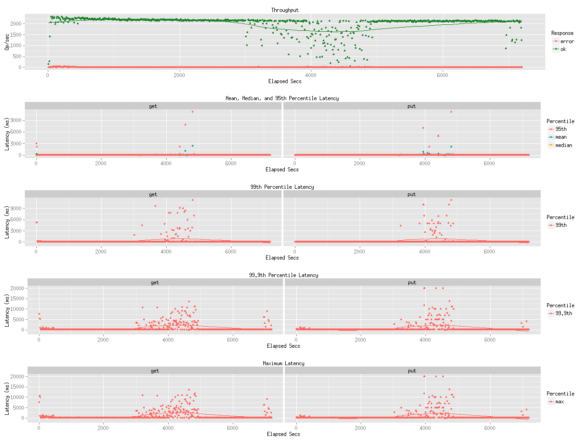
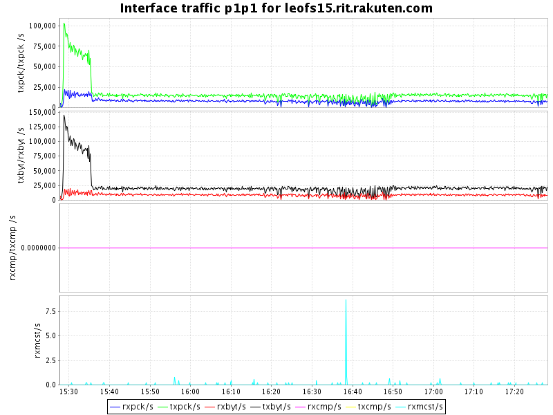
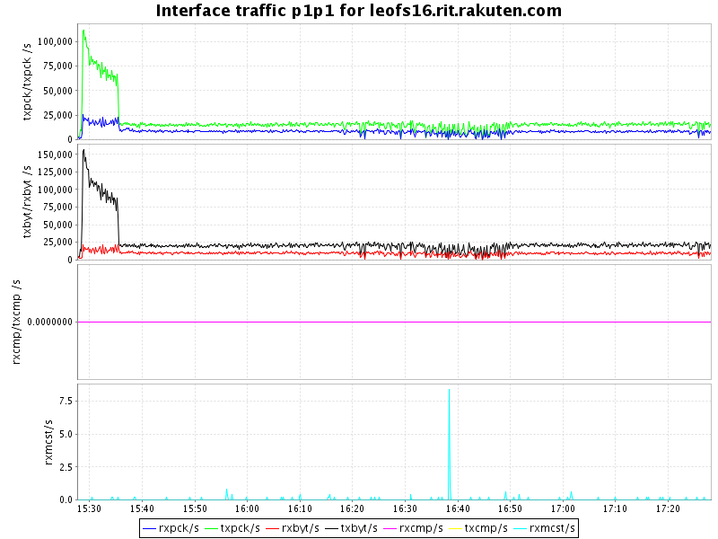
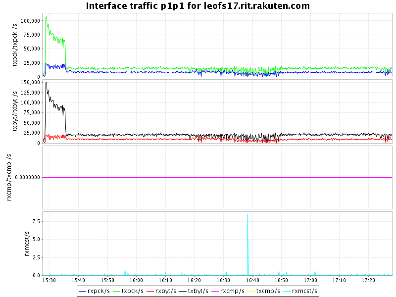
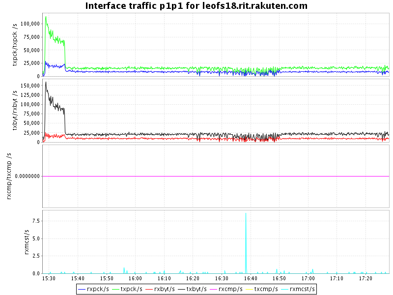
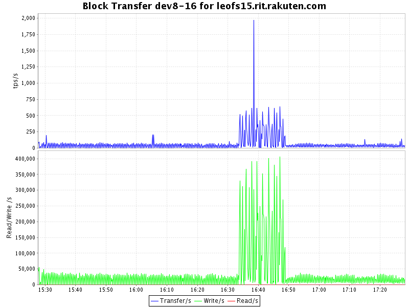
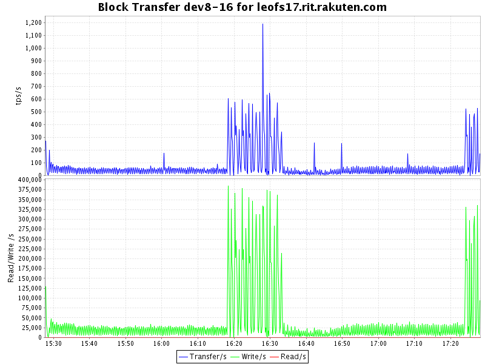
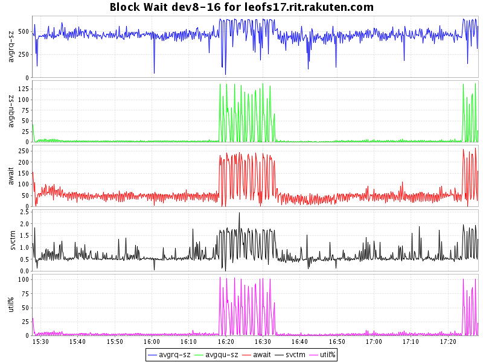
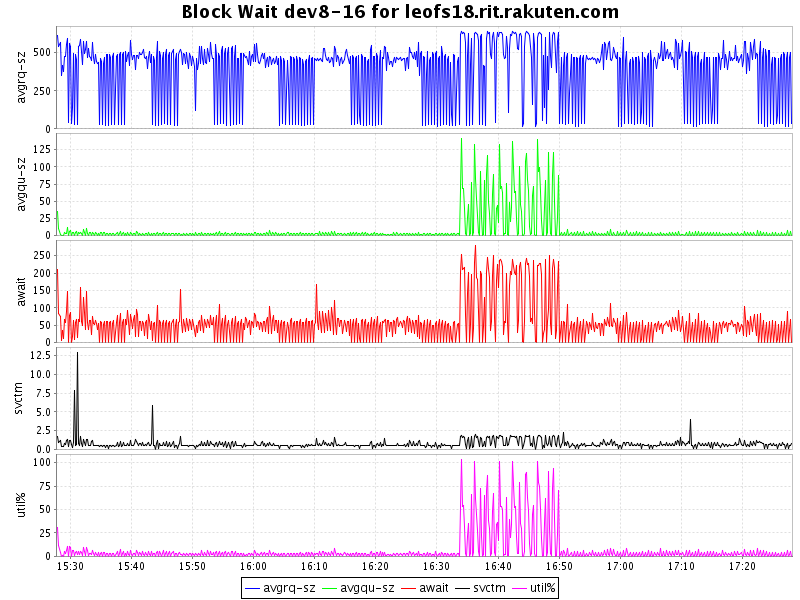

## Benchmark LeoFS v1.2.11-dev10

### Purpose
We've checked LeoFS v1.2.11-dev10 w/watchdog + auto-compaction mechanism during 'recover-node command' to find issues.

### Environment

* OS: CentOS release 6.5 (Final)
* Erlang/OTP: 17.5
* LeoFS: v1.2.11-dev10
* LeoFS cluster settings:

```
 [System Confiuration]
-----------------------------------+----------
 Item                              | Value    
-----------------------------------+----------
 Basic/Consistency level
-----------------------------------+----------
                    system version | 1.2.11
                        cluster Id | leofs_1
                             DC Id | dc_1
                    Total replicas | 3
          number of successes of R | 1
          number of successes of W | 2
          number of successes of D | 2
 number of rack-awareness replicas | 0
                         ring size | 2^128
-----------------------------------+----------
 Multi DC replication settings
-----------------------------------+----------
        max number of joinable DCs | 2
           number of replicas a DC | 1
-----------------------------------+----------
 Manager RING hash
-----------------------------------+----------
                 current ring-hash | 2b468816
                previous ring-hash | 2b468816
-----------------------------------+----------

 [State of Node(s)]
-------+-----------------------------+--------------+----------------+----------------+----------------------------
 type  |            node             |    state     |  current ring  |   prev ring    |          updated at         
-------+-----------------------------+--------------+----------------+----------------+----------------------------
  S    | leofs14@192.168.100.14      | running      | 2b468816       | 2b468816       | 2015-06-26 15:27:22 +0900
  S    | leofs15@192.168.100.15      | running      | 2b468816       | 2b468816       | 2015-06-26 15:19:26 +0900
  S    | leofs16@192.168.100.16      | running      | 2b468816       | 2b468816       | 2015-06-26 15:19:25 +0900
  S    | leofs17@192.168.100.17      | running      | 2b468816       | 2b468816       | 2015-06-26 15:19:25 +0900
  S    | leofs18@192.168.100.18      | running      | 2b468816       | 2b468816       | 2015-06-26 15:19:25 +0900
  G    | leofs13@192.168.100.13      | running      | 2b468816       | 2b468816       | 2015-06-26 15:19:34 +0900
-------+-----------------------------+--------------+----------------+----------------+----------------------------

```

* basho-bench Configuration:
    * Duration: 120 minutes
    * Recover node time: 10.01 minutes
    * # of concurrent processes: 64
    * # of keys: 300000
    * Value size groups(byte):
        *   1024..  10240: 24%
        *  10241.. 102400: 30%
        * 102401.. 819200: 30%
        * 819201..1572864: 16%
    * basho_bench driver: [basho_bench_driver_leofs.erl](https://github.com/leo-project/leofs/blob/develop/test/src/basho_bench_driver_leofs.erl)
    * Configuration file: [1m_r29w1_120min.conf](20150626_152748/1m_r29w1_120min.conf)

* LeoFS Configuration:
    * Manager_0: [leo_manager_0.conf](conf/leo_manager_0.conf)
    * Manager_1: [leo_manager_1.conf](conf/leo_manager_1.conf)
    * Gateway  : [leo_gateway.conf](conf/leo_gateway.conf)
    * Storage  : [leo_storage.conf](conf/leo_storage.conf)

* 'du' status file: [du.log](du.log)

### OPS and Latency:



### Network Traffic
#### Chart of Every Nodes

* Gateway-1


* Storage-1


* Storage-2


* Storage-3


* Storage-4


* Storage-5



### Disk
#### Chart of Every Nodes (Storage)

* Storage-1


* Storage-2



* Storage-3


* Storage-4



* Storage-5




## Compaction Report Summary
### Compaction's order

* storage_3_1: [2015-06-26 10:53:53 +0900 - 2015-06-26 11:08:42 +0900]
* duplicated:
    * storage_1_1: [2015-06-26 11:05:37 +0900 - 2015-06-26 11:19:35 +0900]
    * storage_2_1: [2015-06-26 11:05:37 +0900 - 2015-06-26 11:20:02 +0900]
    * storage_4_1: [2015-06-26 11:05:37 +0900 - 2015-06-26 11:20:11 +0900]
* storage_0_1: [2015-06-26 11:20:13 +0900 - 2015-06-26 11:36:58 +0900]
* storage_3_2: [2015-06-26 12:04:03 +0900 - 2015-06-26 12:18:04 +0900]


### storage_0:
* [2015-06-26 11:20:13 +0900 - 2015-06-26 11:36:58 +0900 (16'45")]
```
[0]
{file_path,"/data/object/0.avs_63602504413"}.
{avs_ver,<<"LeoFS AVS-2.4">>}.
{num_of_active_objs,22494}.
{size_of_active_objs,7734486877}.
{total_num_of_objs,22494}.
{total_size_of_objs,7734486877}.
{start_datetime,"2015-06-26 11:20:13 +0900"}.
{end_datetime,"2015-06-26 11:22:11 +0900"}.
{errors,[]}.
{duration,118}.
{result,success}.

[7]
{file_path,"/data/object/7.avs_63602505295"}.
{avs_ver,<<"LeoFS AVS-2.4">>}.
{num_of_active_objs,22725}.
{size_of_active_objs,7795408822}.
{total_num_of_objs,22725}.
{total_size_of_objs,7795408822}.
{start_datetime,"2015-06-26 11:34:55 +0900"}.
{end_datetime,"2015-06-26 11:36:58 +0900"}.
{errors,[]}.
{duration,123}.
{result,success}.
```

### storage_1:
* [2015-06-26 11:05:37 +0900 - 2015-06-26 11:19:35 +0900 (13'58")]
```
[0]
{file_path,"/data/object/0.avs_63602503537"}.
{avs_ver,<<"LeoFS AVS-2.4">>}.
{num_of_active_objs,19423}.
{size_of_active_objs,6715890340}.
{total_num_of_objs,19423}.
{total_size_of_objs,6715890340}.
{start_datetime,"2015-06-26 11:05:37 +0900"}.
{end_datetime,"2015-06-26 11:07:12 +0900"}.
{errors,[]}.
{duration,95}.
{result,success}.

[7]
{file_path,"/data/object/7.avs_63602504262"}.
{avs_ver,<<"LeoFS AVS-2.4">>}.
{num_of_active_objs,19554}.
{size_of_active_objs,6830762572}.
{total_num_of_objs,19554}.
{total_size_of_objs,6830762572}.
{start_datetime,"2015-06-26 11:17:42 +0900"}.
{end_datetime,"2015-06-26 11:19:35 +0900"}.
{errors,[]}.
{duration,113}.
{result,success}.
```

### storage_2:
* [2015-06-26 11:05:37 +0900 - 2015-06-26 11:20:02 +0900 (14'35")]
```
[0]
{file_path,"/data/object/0.avs_63602503537"}.
{avs_ver,<<"LeoFS AVS-2.4">>}.
{num_of_active_objs,20244}.
{size_of_active_objs,6877567434}.
{total_num_of_objs,20244}.
{total_size_of_objs,6877567434}.
{start_datetime,"2015-06-26 11:05:37 +0900"}.
{end_datetime,"2015-06-26 11:07:23 +0900"}.
{errors,[]}.
{duration,106}.
{result,success}.

[7]
{file_path,"/data/object/7.avs_63602504292"}.
{avs_ver,<<"LeoFS AVS-2.4">>}.
{num_of_active_objs,20222}.
{size_of_active_objs,7028587217}.
{total_num_of_objs,20222}.
{total_size_of_objs,7028587217}.
{start_datetime,"2015-06-26 11:18:12 +0900"}.
{end_datetime,"2015-06-26 11:20:02 +0900"}.
{errors,[]}.
{duration,110}.
{result,success}.
```

### storage_3:
* [2015-06-26 10:53:53 +0900 - 2015-06-26 11:08:42 +0900 (14'49")]
* [2015-06-26 12:04:03 +0900 - 2015-06-26 12:18:04 +0900 (14'01")]
#### 1
```
[0]
{file_path,"/data/object/0.avs_63602502833"}.
{avs_ver,<<"LeoFS AVS-2.4">>}.
{num_of_active_objs,19936}.
{size_of_active_objs,6889206894}.
{total_num_of_objs,19936}.
{total_size_of_objs,6889206894}.
{start_datetime,"2015-06-26 10:53:53 +0900"}.
{end_datetime,"2015-06-26 10:55:32 +0900"}.
{errors,[]}.
{duration,99}.
{result,success}.

[7]
{file_path,"/data/object/7.avs_63602503614"}.
{avs_ver,<<"LeoFS AVS-2.4">>}.
{num_of_active_objs,20001}.
{size_of_active_objs,6990504831}.
{total_num_of_objs,20001}.
{total_size_of_objs,6990504831}.
{start_datetime,"2015-06-26 11:06:54 +0900"}.
{end_datetime,"2015-06-26 11:08:42 +0900"}.
{errors,[]}.
{duration,108}.
{result,success}.
```

#### 2
```
[0]
{file_path,"/data/object/0.avs_63602507043"}.
{avs_ver,<<"LeoFS AVS-2.4">>}.
{num_of_active_objs,20484}.
{size_of_active_objs,7055143428}.
{total_num_of_objs,20484}.
{total_size_of_objs,7055143428}.
{start_datetime,"2015-06-26 12:04:03 +0900"}.
{end_datetime,"2015-06-26 12:05:59 +0900"}.
{errors,[]}.
{duration,116}.
{result,success}.

[7]
{file_path,"/data/object/7.avs_63602507788"}.
{avs_ver,<<"LeoFS AVS-2.4">>}.
{num_of_active_objs,20430}.
{size_of_active_objs,7083254135}.
{total_num_of_objs,20430}.
{total_size_of_objs,7083254135}.
{start_datetime,"2015-06-26 12:16:28 +0900"}.
{end_datetime,"2015-06-26 12:18:04 +0900"}.
{errors,[]}.
{duration,96}.
{result,success}.
```

### storage_4:
* [2015-06-26 11:05:37 +0900 - 2015-06-26 11:20:11 +0900 (14'34")]
```
[0]
{file_path,"/data/object/0.avs_63602503537"}.
{avs_ver,<<"LeoFS AVS-2.4">>}.
{num_of_active_objs,20348}.
{size_of_active_objs,7001679519}.
{total_num_of_objs,20348}.
{total_size_of_objs,7001679519}.
{start_datetime,"2015-06-26 11:05:37 +0900"}.
{end_datetime,"2015-06-26 11:07:15 +0900"}.
{errors,[]}.
{duration,98}.
{result,success}.

[7]
{file_path,"/data/object/7.avs_63602504310"}.
{avs_ver,<<"LeoFS AVS-2.4">>}.
{num_of_active_objs,20337}.
{size_of_active_objs,7084338710}.
{total_num_of_objs,20337}.
{total_size_of_objs,7084338710}.
{start_datetime,"2015-06-26 11:18:30 +0900"}.
{end_datetime,"2015-06-26 11:20:11 +0900"}.
{errors,[]}.
{duration,101}.
{result,success}.
```
