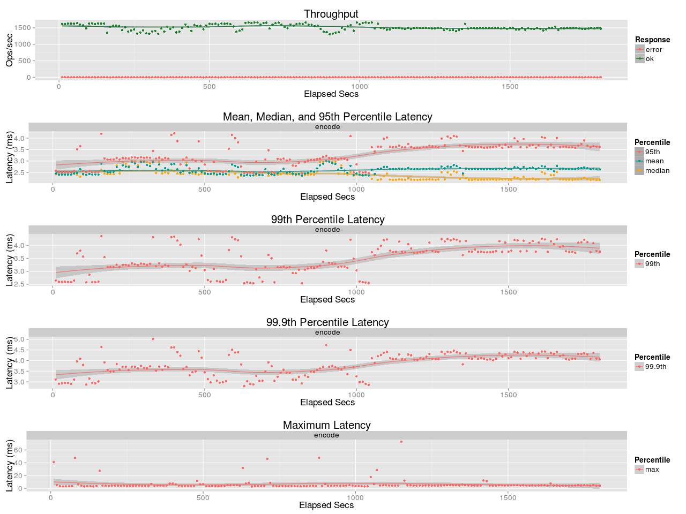
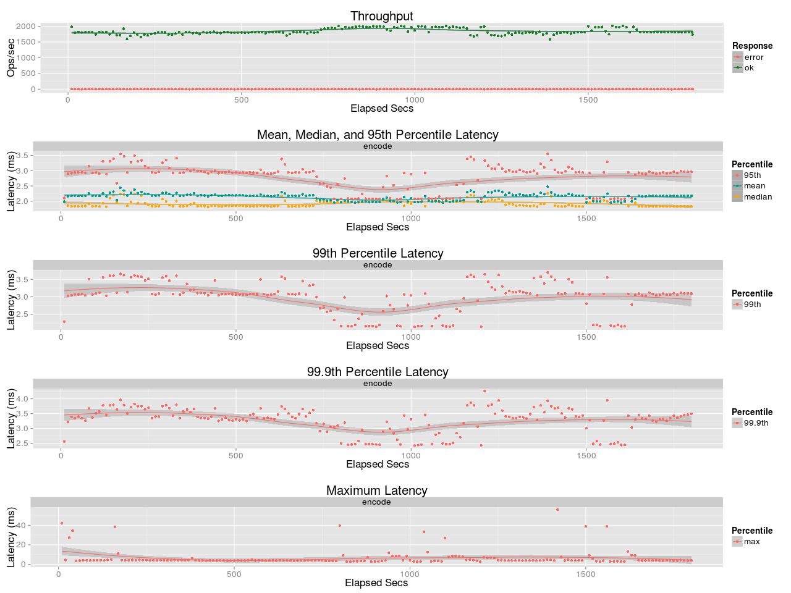
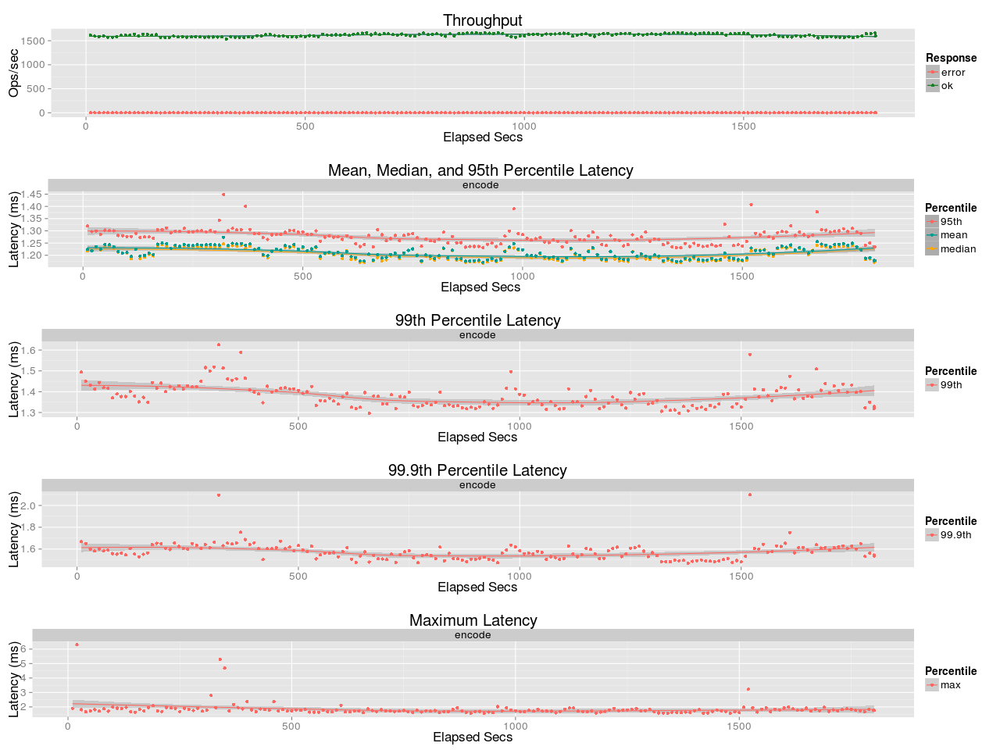
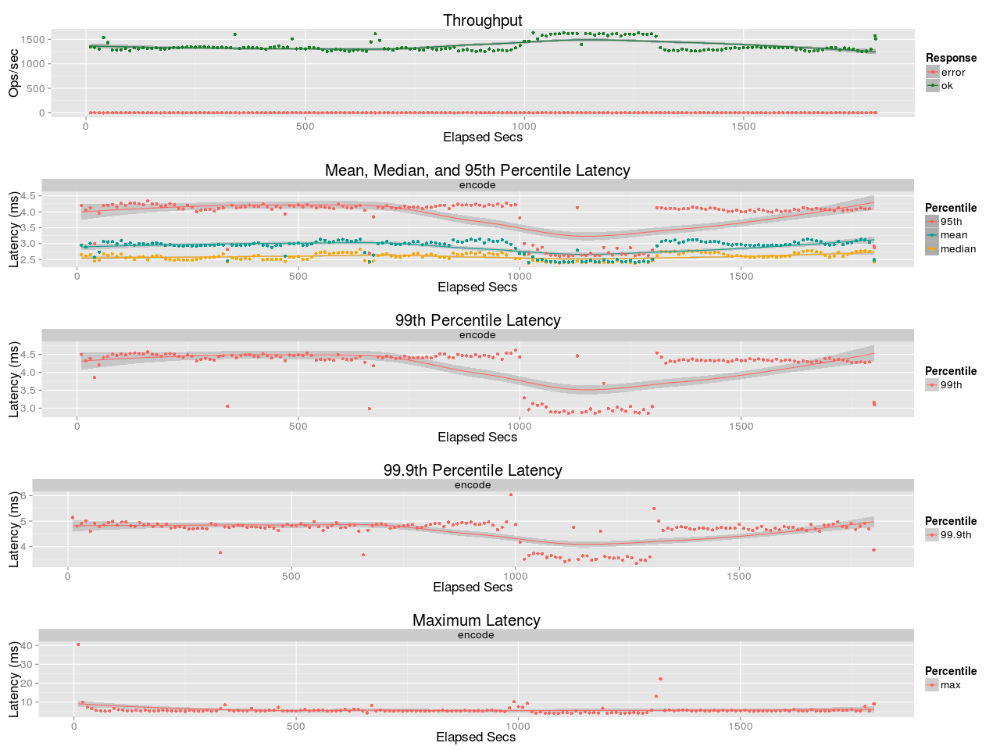

# Benchmark leo_jerasure
## Purpose
Recognize leo_jerasure's encoding performance

## Test Cases
* Encoding
    * Object size: 5MB
    * Encoder: vandrs
    * Encoding Parameters:
       * case-1: [K:10, M:4, W:8](basho_bench_confs/vandrs_10_4_8_5M_w_t4.config)
       * case-2: [K:8, M:3, W:8](basho_bench_confs/vandrs_8_3_8_5M_w_t4.config)
       * case-3: [K:6, M:2, W:8](basho_bench_confs/vandrs_6_2_8_5M_w_t4.config)
       * case-4: [K:4, M:2, W:8](basho_bench_confs/vandrs_4_2_8_5M_w_t4.config)

## Environment
* Machine: Dell Optiplex 7010
* CPU: Intel Core i7-3770 CPU @ 3.40GHz QuadCore
* Memory: 8GB
* OS: Ubuntu 14.04LTS (Linux yosuke-optiplex-7010 3.13.0-61-generic #100-Ubuntu SMP Wed Jul 29 11:21:34 UTC 2015 x86_64 x86_64 x86_64 GNU/Linux)
* Erlang: Erlang/OTP 17.5

## Benchmark results
### case-1:
* date: Aug 18, 2015
* encoder: vandrs
* encoding parameters: [K:10, M:4, W:8](basho_bench_confs/vandrs_10_4_8_5M_w_t4.config)

### case-2:
* date: Aug 18, 2015
* encoder: vandrs
* encoding parameters: [K:8, M:3, W:8](basho_bench_confs/vandrs_8_3_8_5M_w_t4.config)

### case-3:
* date: Aug 17, 2015
* encoder: vandrs
* encoding parameters: [K:6, M:2, W:8](basho_bench_confs/vandrs_6_2_8_5M_w_t4.config)

### case-4:
* date: Aug 17, 2015
* encoder: vandrs
* encoding parameters: [K:4, M:2, W:8](basho_bench_confs/vandrs_4_2_8_5M_w_t4.config)

