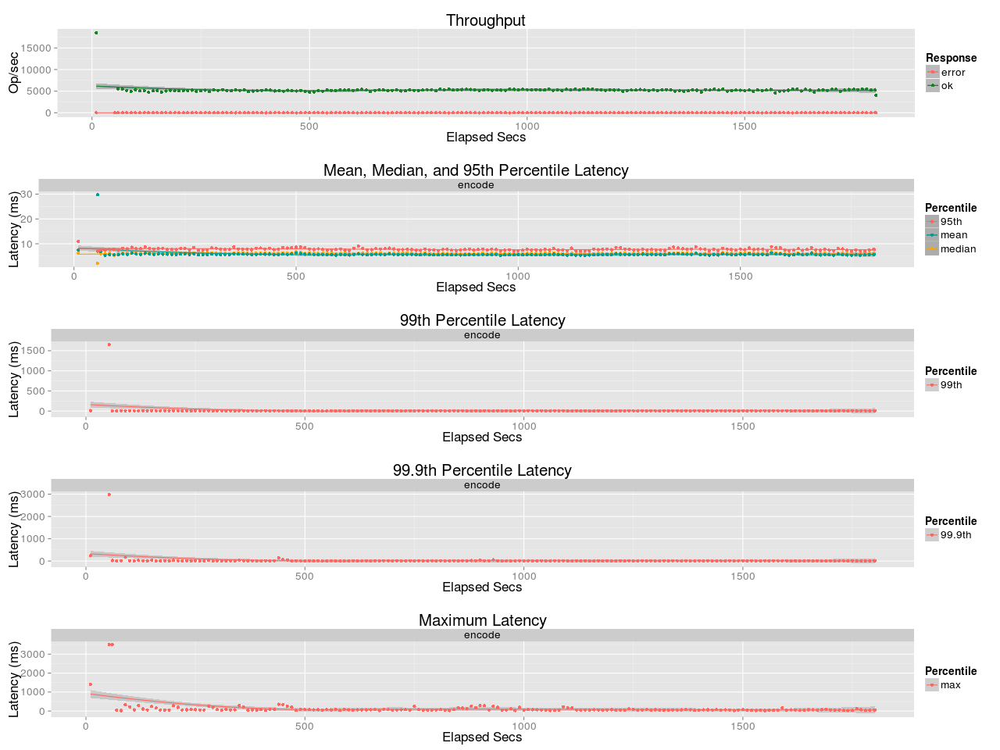
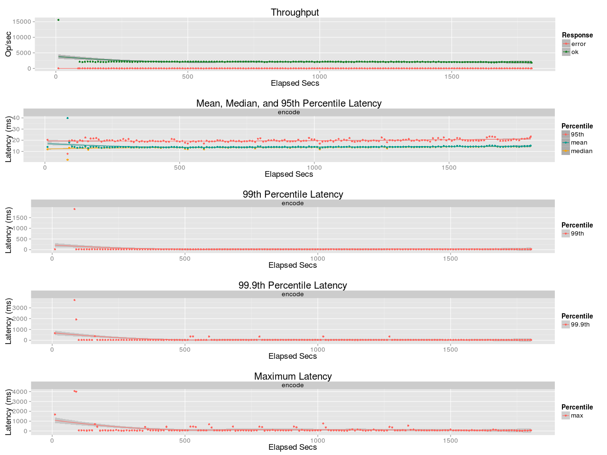

# Benchmark leo_erasure
## Purpose
Compare Encoding Throughput of RS (10,4,8) between ISA-L and JErasure

## Test Cases
* ISA-L (v2.14.0)
    * [https://01.org/intel®-storage-acceleration-library-open-source-version]()
* JErasure (2.0)
    * [https://github.com/leo-project/jerasure.git]()
* Encoding
    * Object size: 5MB
    * Coding: Reed-Solomon Code [K:10, M:4, W:8]
    * Concurrency: 30

## Environment
* Setup Server (`ser2`)
    * CPU: 2x [Intel Xeon E5-2470 v2](http://ark.intel.com/products/64623/Intel-Xeon-Processor-E5-2470-20M-Cache-2_30-GHz-8_00-GTs-Intel-QPI)
* Erlang: Erlang/OTP 17.5

## Benchmark results
### Server
#### ISA-L

#### JErasure

