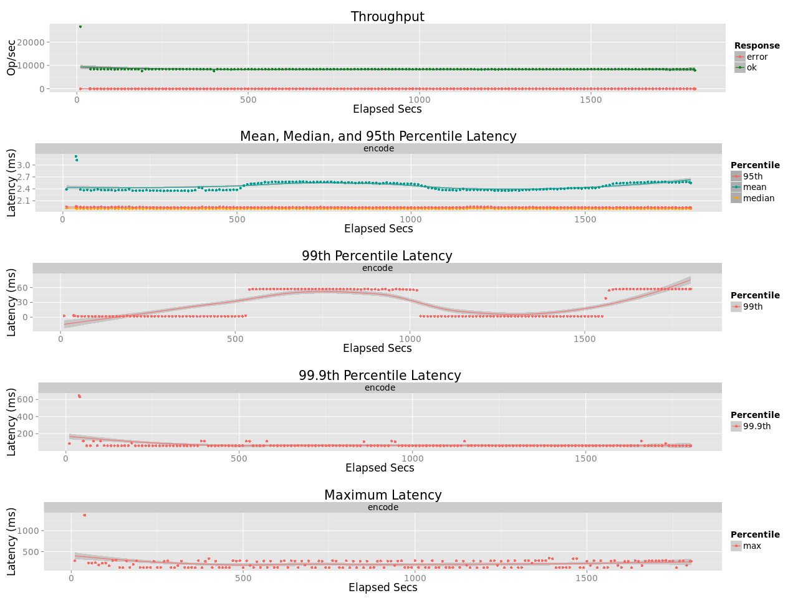
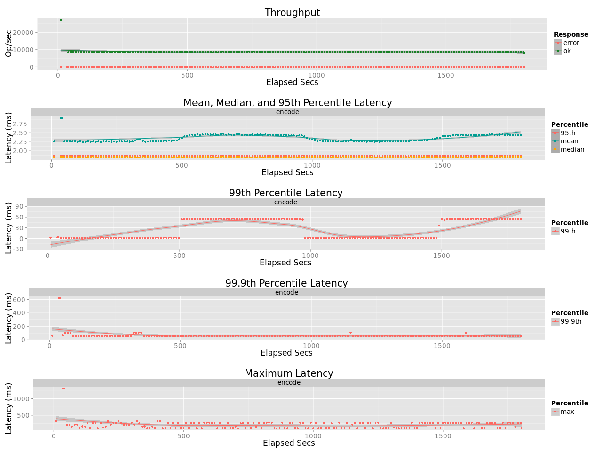

# Benchmark leo_erasure
## Purpose
Comapre Encoding Throughput of Cauchy-RS (10,4,8) before and after noallo design and with different stack size (+sss) 

## Test Cases
* Encoding
    * Object size: 1MB
    * Coding: Cauchy Reed-Solomon Code [K:10, M:4, W:8]
    * Concurrency: 32
* Stack Size
    * `+sss n` = n kilowords
    * `+sss 64` = 64 kilowords = 512 KB
    * `+sss 1024` = 1024 kilowords = 8 MB

## Environment
* Server (`leofs-ubuntu1404-node01`)
    * CPU: Intel Xeon E5-2630 v3
* Erlang: Erlang/OTP 17.5
* OS: Ubuntu 14.04.3 LTS

## Benchmark results
### Before noalloc (~8350 ops)

### After noalloc (`+sss 64`) (~8700 ops)

### After noalloc (`+sss 1024`) (~8700 ops)

