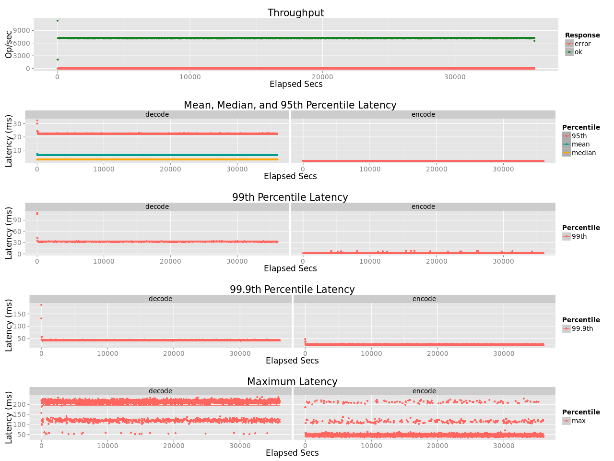

# Long Run Test of leo_erasure
## Purpose
Perform a long run test (10 hours) to verify the stability of the noalloc design

## Test Cases
* Test Parameters
    * Object size: 1MB
    * Coding: Cauchy Reed-Solomon Code [K:10, M:4, W:8]
    * Concurrency: 32
    * Erasure: 1
    * R:W = 1:1

## Environment
* Server (`leofs-ubuntu1404-node01`)
    * CPU: Intel Xeon E5-2630 v3
* Erlang: Erlang/OTP 17.5
* OS: Ubuntu 14.04.3 LTS

## Benchmark results

