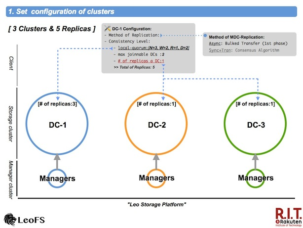
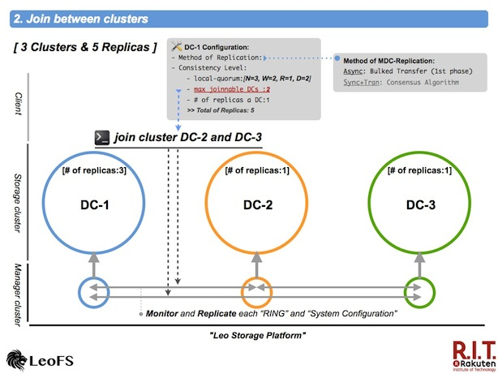
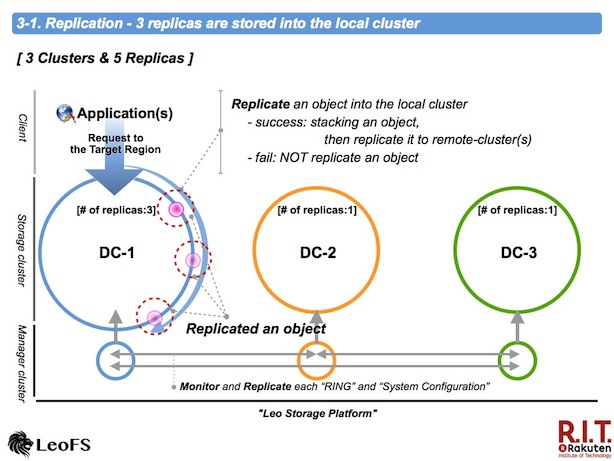
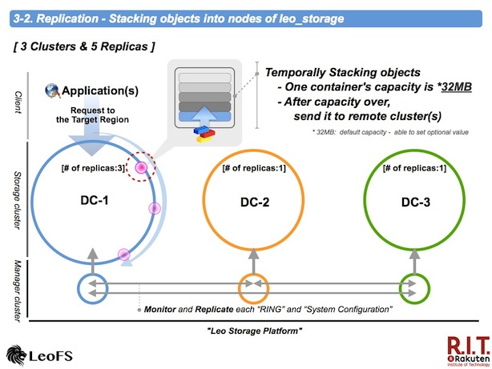
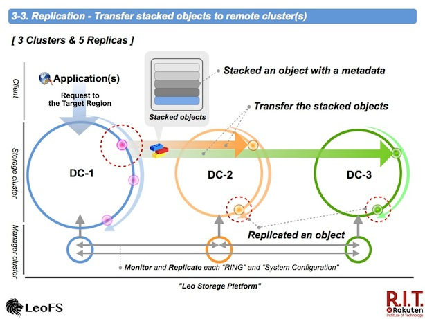
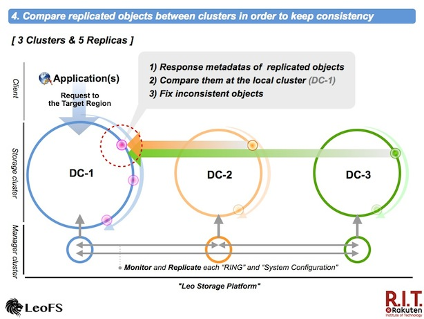

# Multi Data Center Replication (Phase 1)

If you look at the big idea at LeoFS, what we're really focused on is **high scalability**, **high availability** and **high cost performance ratio** because as you know, unstructured data have been exponentially increasing day by day, so we need to build **global scale storage system** at low cost.

I've been considering how to realize LeoFS's multi data center replication more simply without SPOF - *Single Point Of Failure* and degrading the performance.

We designed the multi data center replication as follows.

## Set configuration of clusters

First, it is necessary to [configure](http://leo-project.net/leofs/docs/configuration.html#the-consistency-level) *consistency-level*, *max number of joinable clusters* and *number of replicas a data center* for both the local cluster and the remote cluster(s).

The 1st phase of multi data center replication also supported *asynchronous replication between clusters*

## Join clusters

Next, execute the [join-cluster](http://leo-project.net/leofs/docs/admin_guide.html#join-cluster-communicate-between-the-local-cluster-and-a-remote-cluster) command on the manager-cosole in order to communicate between the clusters. It is necessary to take notice of the configuration - *max number of joinable clusters*. When the set value is exceeded, leo_manager will reject your request.

Finally, confirm whether the preliminary work is complete correctly with the [cluster-status](http://leo-project.net/leofs/docs/admin_guide.html#cluster-status-retrieve-current-status-of-clusters) command.

## Replication - 3 replicas are stored into the local cluster

We adopted **aynchronous-replication**  as the way of to realize the multi data center replication at the 1st phase.

*leo_storage* is prior to replicate an object in the local cluster. If successful that, it is stacked into a container in order to realize *the bulk transfer*. On the other hand the process was fail, it is not stacked.

## Replication - Stacking objects into leo_storage(s)

An object with a metadata is stacked into a container for replication to remote cluster(s).

The default capacity of the stacking object container is [32MB](https://github.com/leo-project/leo_storage/blob/1.0.0/priv/leo_storage.conf#L106). the stacked object is transferred after the capacity over. Also, when not received requests for [30sec](https://github.com/leo-project/leo_storage/blob/1.0.0/priv/leo_storage.conf#L109), the objects in the container by stacked now is transferred. You're able to rewrite both values.

## Replication - Transfer stacked objects to remote cluster(s)

A stacked objects is compressed with LZ4 in order to reduce network traffic. Destination nodes - *primary and secondary* are randomly chosen from nodes of a destination cluster in order to restrict unbalanced requests.

A accepted node uncompresses a received file - *a compressed stacked objects*, then original objects are replicated into its cluster.

## Comapare replicated objects and fix inconsistent objects

The node of the local cluster receives metadatas of trasfered objects, then compare them between clusters in order to find and fix inconsistent objects eventually. Inconsistent objects are stacked into the container, again.

## Wrap up

We designed this mechanism/function without the performance degration and the availability but it is now the 1st phase. So we're going to improve and increase it, going forward.
