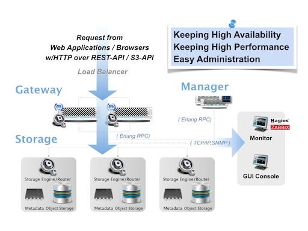

We've been mainly focusing on **High Availability**, **High Scalability** and **High Cost Performance Ratio** since unstructured data such as images, movies, logs and event-data have been exponentially increasing in our services day by day, and we needed to build a cloud storage that can handle all them.

LeoFS consists of 3 core components - [Gateway](leofs-gateway-detail.md), [Storage](leofs-storage-detail.md) and [Manager](leofs-manager-detail.md). The role of each component is clearly defined.

[Gateway](leofs-gateway-detail.md) handles http-requests and http-responses from clients when using REST-API OR S3-API. Also, it has the built-in object-cache system.

[Storage](leofs-storage-detail.md) handles *GET*, *PUT* and *DELETE*, Also it has replicator and recoverer in order to keep running and consistency.

[Manager](leofs-manager-detail.md) always monitors Gateway(s) and Storage(s). Manger monitors node-status and RING(logical routing-table) checksum to keep running and consistency.

Also, what we payed attention when we desined LeoFS are the following 3 things:
* To keep always running and No [SPOF - Single Point Of Failure](http://en.wikipedia.org/wiki/Single_point_of_failure)
* To keep high-performance, regardless of the kind of data and amount data
* To provide easy administration, we already provide LeoFS CUI and GUI console.
