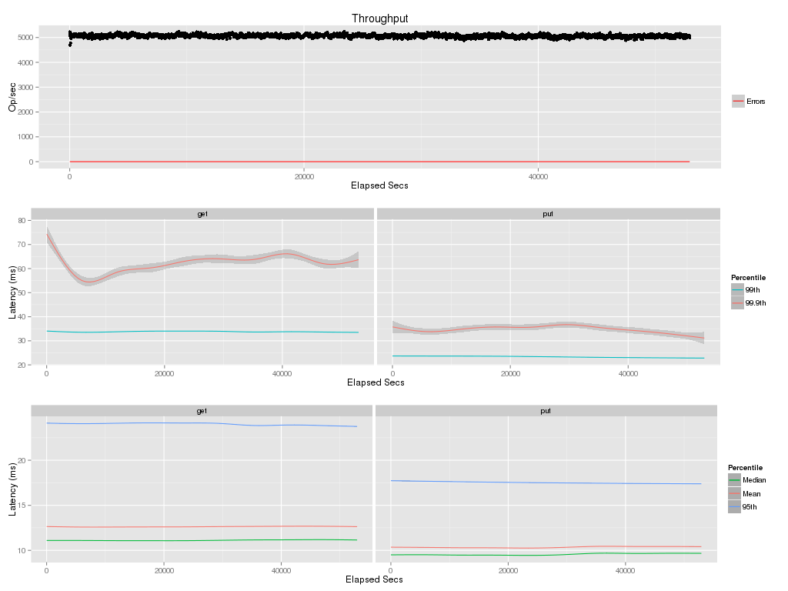

Title
=====
Long running test result for leofs-1.0.0pre3

Env
===
* bacho_bench
 Please refer to files in this dir.

* LeoFS
    * OS: CentOS release 6.4 (Final)
    * Kernel: Linux intel11.rit.rakuten.com 2.6.32-358.6.2.el6.x86_64 #1 SMP Thu May 16 20:59:36 UTC 2013 x86_64 x86_64 x86_64 GNU/Linux
    * Erlang: R16B03-1
    * LeoFS:  1.0.0-pre3

* LeoFS cluster settings


```
    [System config]
                    System version : 1.0.0-pre3
                        Cluster Id : 
                             DC Id : 
                    Total replicas : 3
               # of successes of R : 1
               # of successes of W : 2
               # of successes of D : 1
    # of DC-awareness replicas    : 0
    # of Rack-awareness replicas  : 0
                         ring size : 2^128
                 Current ring hash : 41e0c107
                    Prev ring hash : 41e0c107
    
    [Node(s) state]
    -------+-------------------------------+--------------+----------------+----------------+----------------------------
    type  |             node              |    state     |  current ring  |   prev ring    |          updated at         
    -------+-------------------------------+--------------+----------------+----------------+----------------------------
      S    | intel22@192.168.200.22        | running      | 41e0c107       | 41e0c107       | 2014-02-20 18:04:59 +0900
      S    | intel24@192.168.200.24        | running      | 41e0c107       | 41e0c107       | 2014-02-20 18:04:59 +0900
      S    | intel25@192.168.200.25        | running      | 41e0c107       | 41e0c107       | 2014-02-20 18:04:59 +0900
      S    | intel26@192.168.200.26        | running      | 41e0c107       | 41e0c107       | 2014-02-20 18:04:59 +0900
      G    | gateway_0@192.168.200.12      | running      | 41e0c107       | 41e0c107       | 2014-02-20 18:04:59 +0900
```

Result
======




